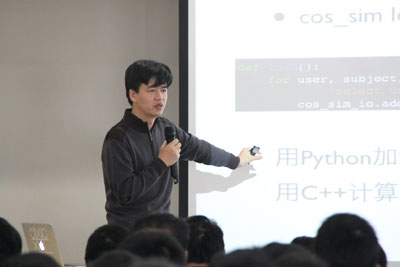
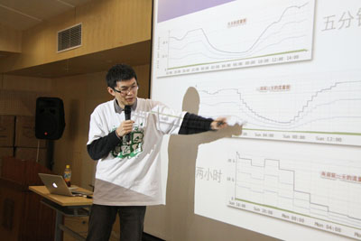
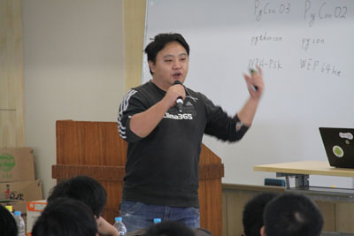
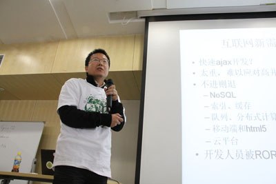

=============================
世界Python爱好者的盛会-PyCon
=============================

Python大会于12月2日在上海正式举行。这个一年一度的盛会PyCon首次在中国举办，是国内鲜有的规格比较高的技术论坛会议.各方技术牛人都出席本次大会，并发表了演讲,包括 `易度云办公 <http://everydo.com>`_ 技术总监潘俊勇，豆瓣首席架构师洪宁强等。Python创始人Guido van Rossum也发来了祝贺视频，一下点燃了会议的气氛。

由Python软件基金会下的PyCon.Org授权中国办第一次PyCon China Conference。本次大会由GTUG（Google的技术爱好者在全球成立的技术交流社区），TopGeek（顶尖极客沙龙），CPyUG（各个城市自发组织的本地Python爱好者的社区）联合举办。

这次大会在业界也受到了广泛的关注和重视，谷歌、土豆、豆瓣、新浪、盛大、金山等知名网络企业都是其中的赞助商，从侧面也看出Pyton也得到了越多越广泛的支持和应用，包括网络社区、视频网站、娱乐游戏甚至是企业日常办公。

豆瓣首席架构师洪宁强 - 《Python在豆瓣的应用》

|

土豆网技术副总裁黄冬

|

网易技术主管林伟 - 《Python游戏开发探索与发现》

|

易度云办公技术总监潘俊勇也发表演讲《易度PaaS云开发平台技术内幕》

|

还有来自google的Damien Hou，新浪研发中心平台架构部工程师陈正等等，相信有幸参加此次盛会的嘉宾一定收获良多。

PyCon.Org是举办Python语言的国际性社区，在世界各地举办Python大会，是Python爱好者的盛会，对推动各地IT网络的发展有深远的影响。

潘总的演讲得到了很多很好的反馈意见，推动着易度云办公的发展，欢迎大家了解Python， `体验试用易度云办公软件 <http://everydo.com/demo.rst>`_ ！

了解大会更多信息可以浏览 http://cn.pycon.org/2011/