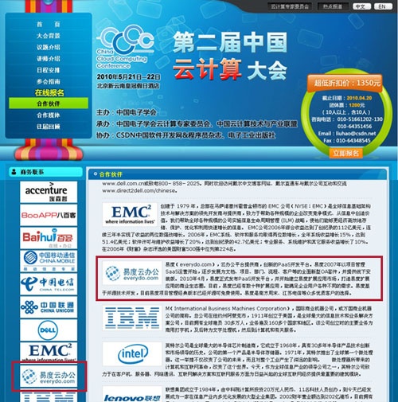

===============================================
易度携手云计算大会，打造互联网新OA
===============================================

将于2010年5月21日—22日在北京举行的第二届中国云计算大会，得到了计算机、互联网和通信行业内的高度关注。云计算代表着整个IT行业的发展大趋势，已经成为目前最受瞩目的中心话题。

作为云计算服务商之一，易度日前正式成为此次云计算大会的参展商。这将是易度在云计算领域三年多不懈努力的一次全面展示，易度正积极为这次参展准备着。

这次云计算大会，可谓华山论剑，各展英姿。易度(everydo.com)将有自己独立的展台，为业界同行展示易度的发展和最近的产品技术。易度将着重展示自己在云办公套件产品和PaaS开发平台方面的最新成就。同时，这次大会上，易度也将与业界同行体验交流和学习，聆听云计算成果，了解最新国内云计算发展。

易度2007年以项目管理SaaS运营开始，逐步发展为文档、项目、部门、流程、客户等的全面新型OA套件，并提供线下安装版。2010年4月，易度正式发布PaaS开发平台，并开始建立易度扩展应用市场，打造易度扩展应用的商业生态圈。目前，易度已经有数十种扩展应用，能满足企业用户各种不同的需求,是南方周末、江苏电信等众多优质客户的选择。

如需了解本次云计算大会的详细情况， 请登录   `云计算大会官网
<http://www.ciecloud.org/2010/>`_.

如需体验易度云办公平台，请登录   `易度云办公平台
<http://www.everydo.com/>`_.

或咨询：020-38055596!

