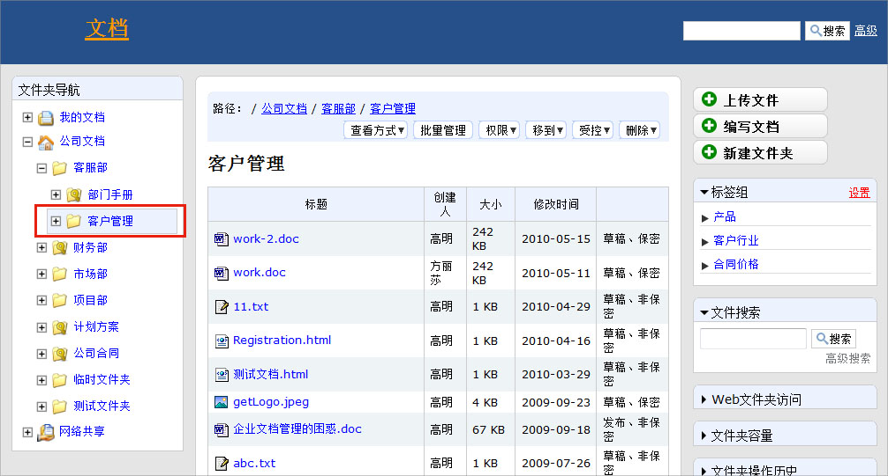
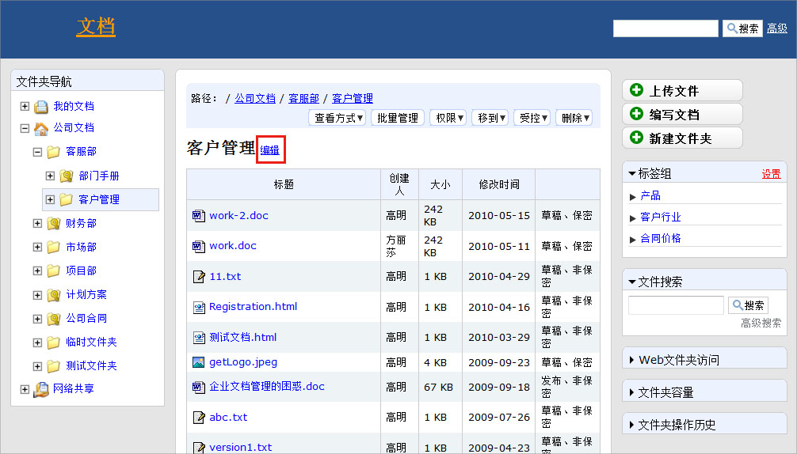
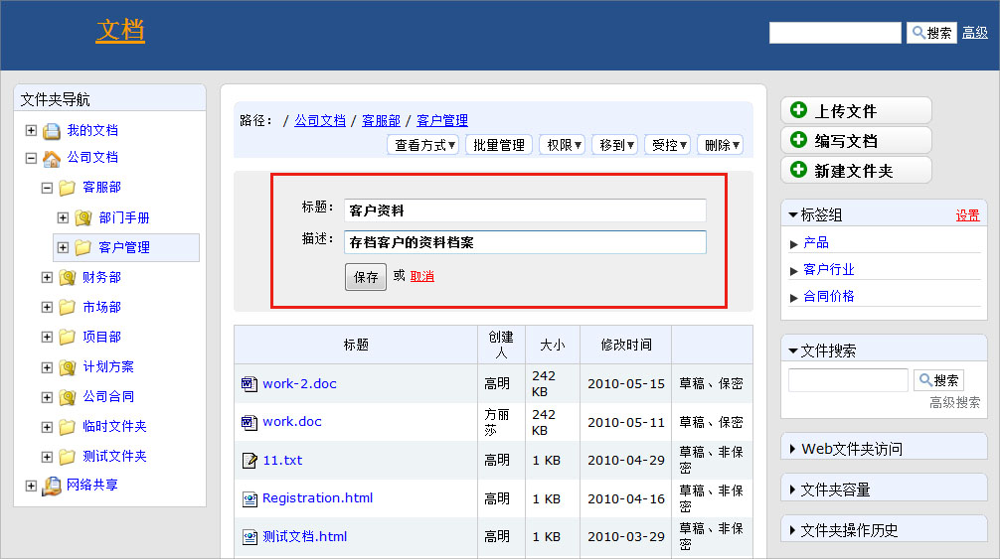

.. Contents::

在左边的文件夹目录树上，点击需要修改名称的文件夹
============================================================

把鼠标移到中间页面的文件夹的黑色字体中，就会出现编辑的蓝色链接。（有权限的情况下）
===============================================================================================

点击编辑链接进入文件夹名称和描述编辑界面，修改后保存即可
===============================================================

相关问题： 

  `1. 如何初始化易度文档管理系统？ <../setup/init.rst>`_
