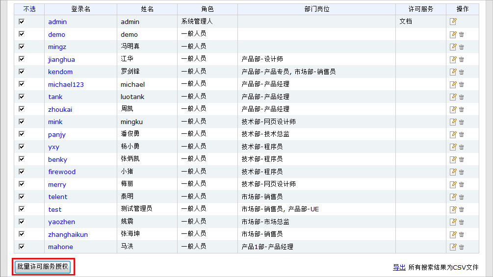
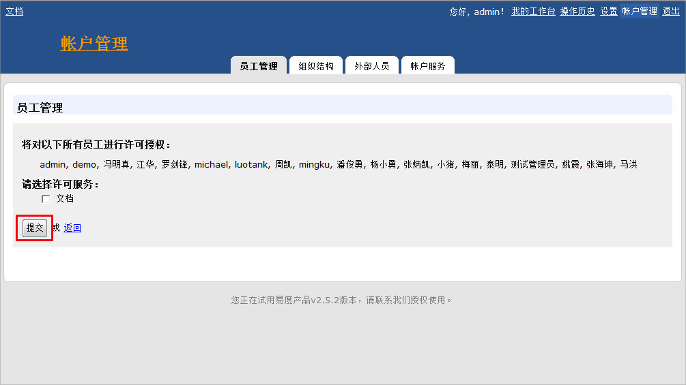
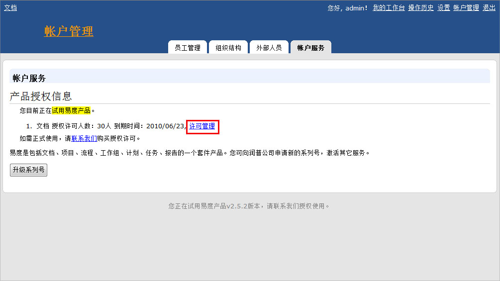
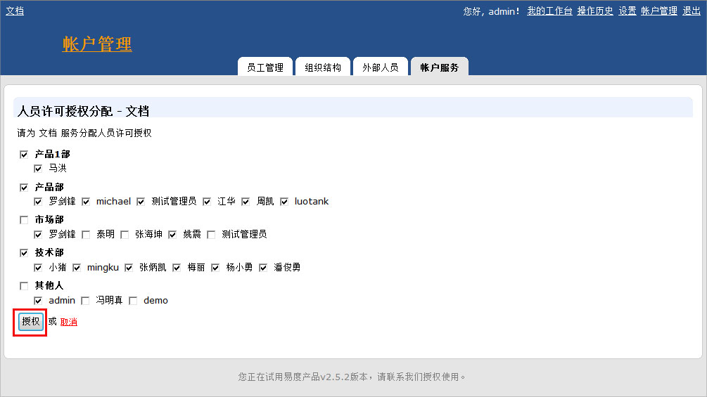
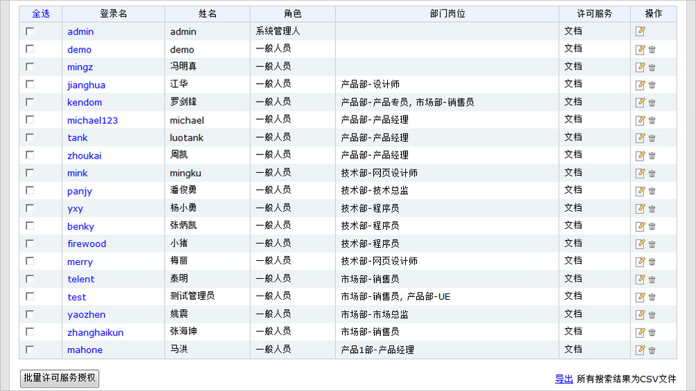

.. Contents::

易度文档管理系统，通过服务许可授权，去控制系统的使用人数。如果您想让员工（用户）可以访问“文档”服务，那么必须先给他们进行许可服务授权

使用系统管理人的身份进行登录系统，进入帐户管理。 

以下,您可以通过两种方式，实现许可服务授权。

方式一：用户批量许可服务授权。
===============================

在员工管理页面，选择需要进行许可授权的用户。

点击下面的按钮：批量许可服务授权。选择文档服务后，确认提交即可。

方式二： 服务授权给批量用户。
==============================

进入帐户服务页面，点击许可管理的蓝色链接。

选择需要使用文档服务的员工（用户），然后点击“授权”按钮进行确认授权即可。

授权成功的信息显示

相关问题：

|    `1. 如何初始化易度文档管理系统？ <../setup/init.rst>`_
|    `2. 如何快速批量创建和导入用户账号？ <howto_adduser.rst>`_
|    `3. 增加使用人数，怎么更新授权序列号？ <../setup/update_sn.rst>`_
|
