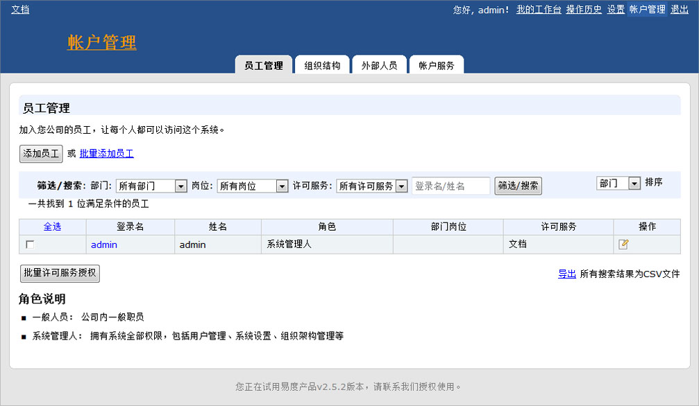
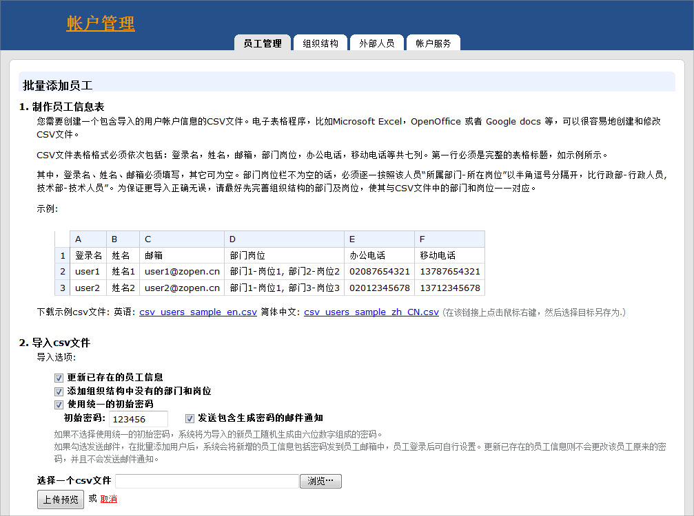
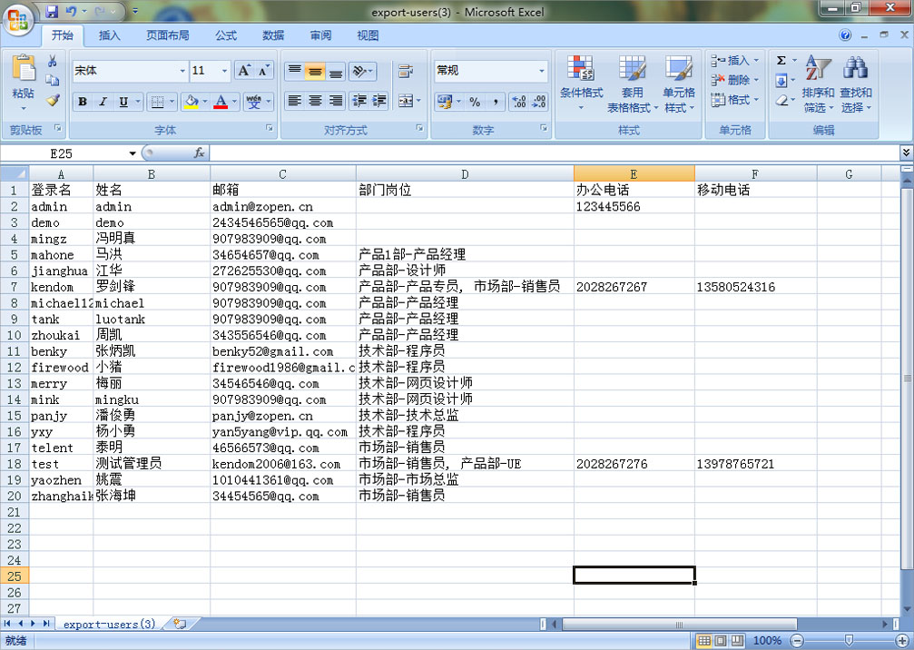
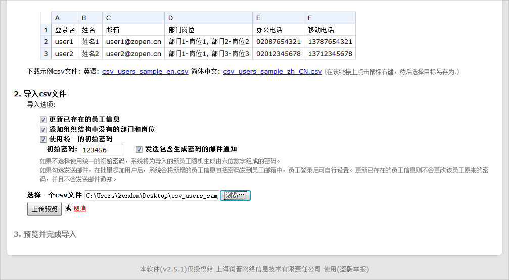
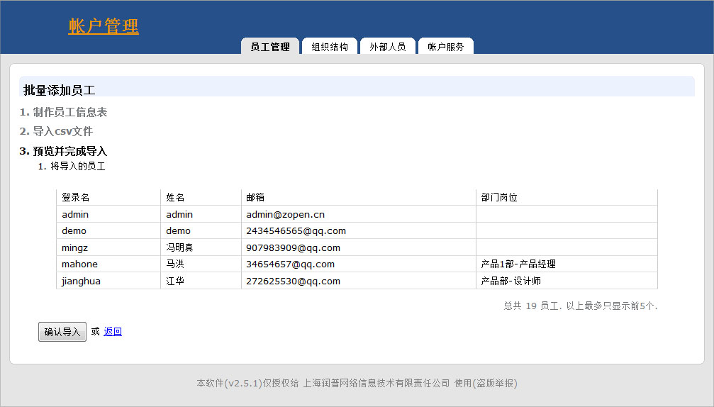
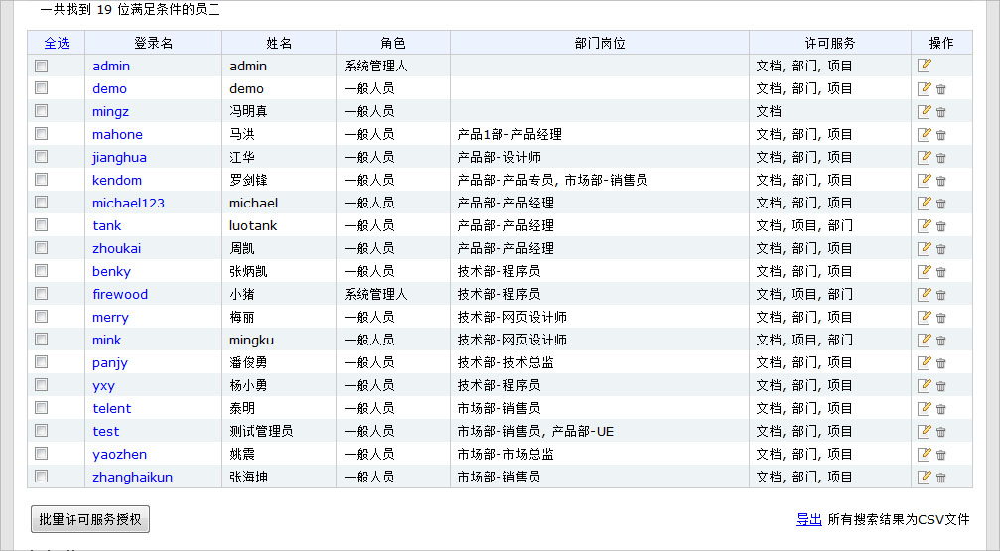

===============================
如何快速批量创建和导入用户帐号
===============================

用户可以使用易度提供的批量添加导入员工（用户）功能，快速地把用户的帐户信息导入至系统中。同时，系统会根据相应的信息，建立帐户信息和公司的组织结构（部门、岗位等）。

**1. 使用系统管理人帐号登录，点击右上角的链接，进入帐户管理页面**

.. image:: ../img/howto_adduser_image1.jpeg

**2 .在帐户管理页面，点击批量添加员工的蓝色链接**

**3.按照图示要求，使用excel制作员工信息表（通讯录）**

注意:

    1).可下载示例的文件，在excel上进行修改。（右键-另存为）

    2).请把制作好的员工信息表保存为csv文件的格式后方可上传。

**4. 上传员工信息表并确认导入信息**

  系统会根据导入信息，自动创建员工帐号信息和公司组织结构

**5.信息导入成功，用户可根据登录名和密码进行访问系统**

.. note::
  提示：
  默认的初始密码是：123456（可修改） 

相关问题： 

   1.如何初始化易度文档管理系统？

   2.怎么设置人员（用户）的服务授权许可？

