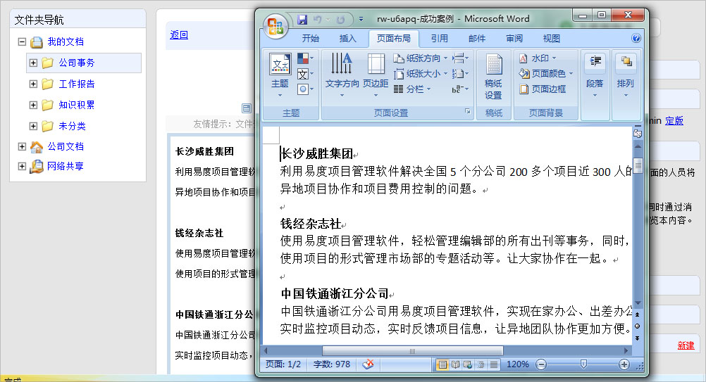

================================
为什么我无法在线编辑Office文档
================================

易度文档管理系统支持在线编辑修改offcie文档。在使用该功能之前，您需要确保满足以下前提条件：

1. 您的电脑上已经安装了相应的MS Office软件。软件的版本需要一致或者兼容。例如需要编辑 docx格式的文档，必须安装了 Office2007版本的工具。

2. 确认已经下载安装了易度的外部编辑器。只有安装了易度的外部编辑器且正确进行编辑操作才可以实现在线编辑。

如果您确保上述前提条件已满足，点击［外部编辑］按钮后，然后点击外部编辑文档链接即可，相应的编辑程序会自动打开。编辑完保存后，会自动保存到服务器中

| 相关问题： 
|   `1. 如何下载安装易度外部编辑器？ <../setup/ol_editor.rst>`_
|   `2. 如何激活openoffice获取更好的文档预览效果？ <../setup/active_ooo.rst>`_

