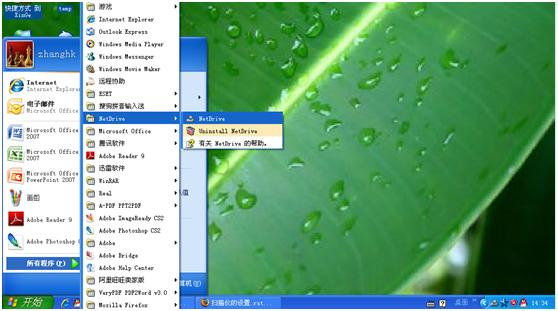
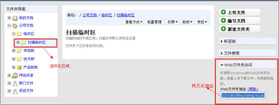
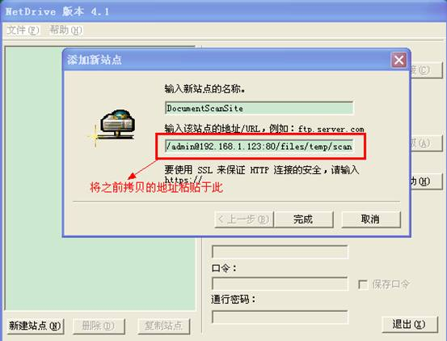
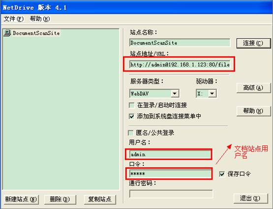
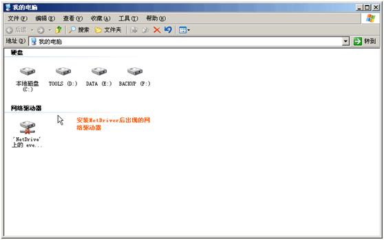
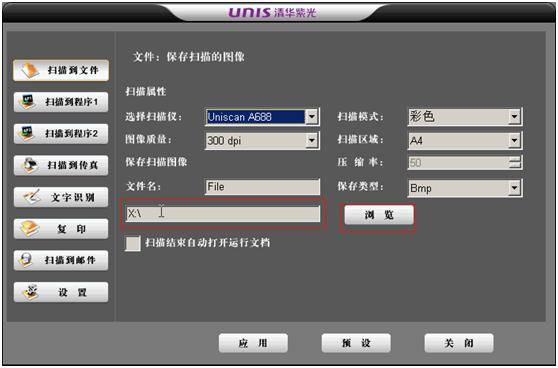

.. Contents::
.. sectnum::

扫描计算机的要求
--------------------------

一台普通的计算机即可，安装windows xp，和扫描仪连接

扫描仪的选型
--------------------------

可根据用户的需求进行选择，在低档扫描仪中，可选择uniscan A688

扫描仪软件的安装和设置
----------------------------

 - 扫描仪自身的驱动和工具

 - HP netdrive 虚拟驱动器 `可在此下载 <http://download.zopen.cn/releases/ndint.exe>`_.

在连有扫描仪的PC上安装NetDrive，安装成功后重启PC
+++++++++++++++++++++++++++++++++++++++++++++++++++++++++++++++

映射网络驱动器，映射“公司->临时区->扫描临时区
+++++++++++++++++++++++++++++++++++++++++++++++++++++++++++++++

- 首先我们需要复制文档管理系统扫描临时区地址，选中临时区下的扫描临时区，找到右侧的web文件夹地址，拷贝此web文件夹地址。

- 启动NetDrive并新建一个站点，粘贴之前复制的临时扫描区地址

- 设置NetDriver并连接

- 连接成功后，可以查看映射的网络驱动器，将扫描后的文件直接存放在此，就可以通过WebDAV的方式上传到文档管理系统

设置将扫描仪生成的文档自动存放至网络驱动器,下面以公司内部的扫描仪为例
++++++++++++++++++++++++++++++++++++++++++++++++++++++++++++++++++++++++++++

如何扫描
----------------------------
1. 将扫描件放置到扫描仪上

2. 在扫描计算机上，点击扫描按钮，此时文件自动上传到刚刚设置好的网络驱动器上，位置为： "公司->临时区->扫描临时区"

3. 在易度文档中，对上传文件进行后处理，包括文件改名、转移，增加标签合并PDF等，纳入正式管理。

| 相关问题： 
|
|     `1). 易度文档系统的硬件配置和软件环境要求？ <../setup/env_dep.rst>`_
|     `2). 怎么把系统映射到自己的电脑吗？ <webdav.rst>`_
|   

