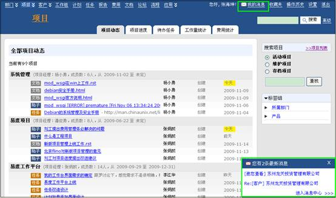
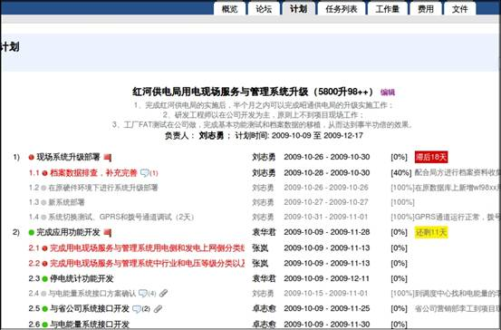
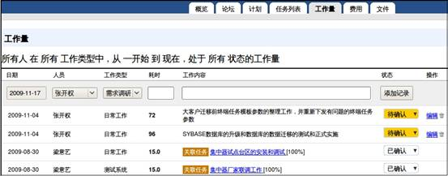
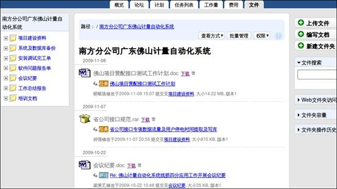
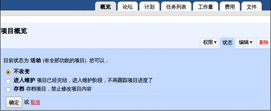
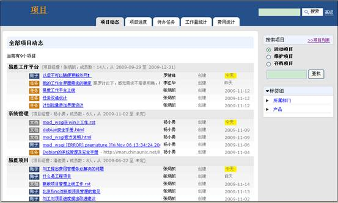

=================================
易度工程项目管理方案
=================================
:版权: 上海润普网络信息技术有限责任公司
:版本: V1.0

.. header:: 易度工程项目管理方案
.. footer:: 上海润普网络信息技术有限责任公司 http://zopen.cn

.. Contents:: 内容索引
   :backlinks: none

.. sectnum::
   :suffix: .

概述
============
对于从事以工程建设为载体的项目（工程项目）的企业，其核心业务都是项目型的,而且企业内往往有多个项目并行启动,每个项目都有一定的复杂性。项目组员要求紧密­沟通,但他们经常分散在多个部门甚至多个分公司。如何加强项目沟通和协作,加强项目的进度监控,确保项目顺­利完成,是项目管理者面临的普遍问题。

本文针对工程项目企业提供一个 **基于项目管理思想的、沟通协作型的项目管理方案** ，帮助企业解决项目管理方面存在的问题。

工程项目的问题和需求
================================
项目复杂，多方异地项目沟通协作存在障碍
---------------------------------------------------
项目周期长，有的项目需要一年甚至更长时间才能完成；项目涉及各部门人员调配，各工种互相配合。工程项目实施过程是多方紧密配合完成的，现场工程人员需要和分公司、总部、客户之间进行大量的沟通和协作。

由于地域距离方面的限制，不同部门甚至不同公司之间的阻隔，项目多方参与者在信息的沟通和传达获取方面存在一定障碍，这给项目进度带来很多不可控因素。

项目经理希望及时了解项目实施人员的工作进展；上层管理部门希望及时了解全部项目的最新进度信息和问题；而工程技术人员，希望得到更有效的配合和支持。

人员参与多个并行项目，需要有效管理和清晰做事情
------------------------------------------------------------------
企业往往多项目并行启动，并行项目数可达几十个甚至更多。执行人员通常参与多个项目，需要在多项目、多任务的情况下清晰知道今天需要做哪些事情，事情处理的优先级；而管理人员通常负责着多个项目，需要随时监控多项目的进展情况。

项目多、人手相对少，需要优化人力资源配置
----------------------------------------------------
工程管理部门希望更准确的了解工程人员的工作量构成，以便更合理的配置人力资源，确保及时完成工程项目。

同时通过了解项目各阶段的工作量构成，也可以作为量化项目成本。

现场工程人员工作量量化方式复杂，同时难以考核
------------------------------------------------
现场工程人员工作繁重，出现工程项目问题经常需要加班加点，但公司人事部门无法及时了解到这部分信息，无法有效的对现场工程人员进行有效的激励考核。企业需要了解到工程现场的实际工作情况，便于辅助年终考核。

同时，部分工程人员是以工作量来计报酬，公司需要统计和分析工程人员的工作量情况。

工程费用操作流程复杂
-------------------------------------
工程费用控制包括项目费用预算、项目费用统计、项目人员费用报销等。费用操作流程异常繁琐，需要占用项目经理大量时间。

企业需要控制工程费用，费用的预支和结算需要严格走工作流程。项目费用需要统计分析，以作为量化项目成本。

工程问题需要进行跟踪处理，尤其是对重大问题需要实时跟踪
---------------------------------------------------------------------
工程实施中会遇到各类问题，包括一般的问题和重大的问题。对工程中碰到的重大问题，需要进行专门的跟踪。

对问题的跟踪内容，包括进展情况、时间和费用的消耗等，以便项目经理进行工作协调和后期分析。

需要方便交付给服务部门维护跟踪
-------------------------------------
项目到维护阶段，由专门的维护部门进行跟踪管理，维护人员需要方便接手维护工作，需要及时了解项目实施过程中的细节，以便更好地做好维护跟踪管理。

项目知识和资料需要统一管理和共享
-----------------------------------------
项目进行过程中或者到项目维护阶段，都需要项目资料的共享，以方便项目人员查阅；项目存档也需要存档项目资料的管理。项目知识和资料的统一管理和共享对企业项目知识和项目经验积累是非常有益的。

易度项目管理软件的解决方案
=======================================

易度项目管理软件是润普公司面向中小企业,针对项目沟通协作中存在的问题,包括项目计划、进度、任务、沟通、工时、文件共享等,开发的一款创新实用的项目管理软件。易度项目­管理软件,是国内第一款租用模式(SaaS)的项目管理软件,是国内用户体验最好的项目管理软件之一,­ 被计世资讯2007年Saas软件评测为国内最优秀的在线协作软件。

提供统一的网上项目工作平台，解决多方沟通协作和进度跟踪问题
---------------------------------------------------------------------------------
易度项目管理平台， **为企业每一个项目建立一个网上的项目工作空间** ，将公司内外的项目成员组织起来。不管成员身处何处，不管在哪个部门，包括公司客户，都可以随时上网在线登录获取项目最新信息，提交相关的项目资料。

系统自动显示项目工程的全局项目动态包括我参与的项目，方便对工程项目进行全局掌控。

.. image:: img/工程_项目.jpg
   :alt: 统一登录
 

在每个项目工作空间中，提供了一组创新实用的工具，方便发布项目消息，管理项目计划和进度，分配、查询、管理任务，以及进行共享文件等。

  
这样：

1. 工程部项目管理者对全部项目的进度可以做到一目了然；
2. 工程项目经理可详细了解到项目最新的进展情况，及时采取应对措施；
3. 工程技术人员可及时了解到自身各个项目的全部任务和项目相关资料，方便获取，做到工作有条不紊；
4. 客户可方便获取到项目的进展情况以及相关资料，并能和工程项目组保持紧密沟通，避免因不知情而导致的客户抱怨现象。

使用项目论坛和消息通知，极大方便协作沟通
--------------------------------------------------
工程项目中存在大量的沟通，这些沟通通常采用电子邮件来进行。但是电子邮件存在个人邮箱中，比较混乱，而且新人加入的时候，不便查阅。易度项目管理平台，提供了“论坛” 模块，通过工程项目论坛，能够很好的在项目团队中传播消息。

.. image:: img/工程_帖子.jpg
   :alt: 项目论坛
   
工程项目论坛提供如下功能：

- 能够很好的在项目团队中传播即时消息
- 可通过系统消息通知、邮件通知、短信通知等多种方式通知
- 分类存放，方便查阅历史沟通记录

同时，易度平台提供“我的消息”模块，系统的消息通知、评注通知、任务的分配下达通知等，都会通知到个人的“我的消息”中，极大方便工程项目成员进行协作沟通。

使用项目计划，进行有效的项目进度监控
--------------------------------------------------
在每个工程项目工作空间中，易度项目管理平台提供了“计划” 模块，工程负责人可制定和分解项目计划。对于即将到期和滞后的里程碑系统提供自动报警，方便对工程项目进行有效的监控。

 
工程项目计划提供如下功能：

1. 项目计划可分解计划中定为项目时间节点的里程碑，里程碑会在日历中显示
2. 项目计划可逐层分解成任务，分配给项目成员
3. 项目计划中的任务执行人员可报告工程项目进度，方便项目人员随时了解项目情况
4. 项目计划会自动报警（以警示颜色标识），表明项目滞后的、即将到来的里程碑
5. 管理人员可跨项目的了解项目计划进度完成情况，分析项目存在的问题

使用任务列表，对各类问题进行跟踪
------------------------------------
工程项目在进行过程中，可能需要大量任务需要执行。口头的分派往往存在沟通不准确、忘记执行、忘记检查等问题。易度项目管理平台，提供了任务列表的功能，使用软件来对任务从下达、执行、到检查进行妥善的管理，每个人能清晰看到自己的任务清单，最终可大大提升工程项目的执行力。

.. image:: img/工程_任务列表.jpg
   :alt: 任务列表
  

任务列表中我们通常可以用以分配临时、突发性任务，它和计划分解出的任务一样是任务，可认为计划中分解的任务是项目立项时项目经理已经可以预测的，而任务列表中用于项目进行中更多、更细的工作，通常可用于对各类问题的跟踪：

1. 为不同类型的任务，分别建立任务清单（组织不同任务的容器）
2. 以任务的形式分派临时工作给工程人员进行处理，通过任务的评注功能，可报告任务的执行情况。
3. 一旦问题处理完成，工程技术人员关闭任务即可。
4. 可直接在问题上报告工作量信息，以便进行时间占用分析。
5. 可直接在问题上报告费用发生情况，以便进行项目费用分析。

提供分类的项目工作记录，为项目工作量分析提供量化依据
------------------------------------------------------------------
易度项目管理平台，提供了工作日志的功能，可方便记录各个项目成员每天工时的消耗情况，同时可进行项目内和跨项目的查询分析

项目经理可对工程人员报告的工作记录进行审核确认；可根据工作记录类型进行查询统计，并可导出为excel格式，以便进行后续分析。

有了工作记录的管理模块，可以帮助工程项目团队：

1. 分析项目工作量构成，以便对项目人员人力配置进行调整
2. 分析每个工程人员的工作量情况，以便进行工作考核和激励

为项目提供项目费用预算和考核功能
-----------------------------------------------------
在每个项目工作空间中，易度项目管理平台提供了“费用” 模块，大大简化项目费用的管理；同时可跨项目的统计项目费用，可了解费用情况及量化项目成本。

.. image:: img/工程_费用.jpg
   :alt: 项目费用
   
我们可为企业做到：

1. 每个项目成员可以申报每月的各类费用计划
2. 项目经理可以进行调整和确认
3. 项目成员可以报告具体各类费用发生的实际明细
4. 项目经理可以对实际费用发生进行调整和确认
5. 系统按月为每个项目提供费用汇总统计

强大的项目文档管理
-----------------------------------------------------
在每个项目工作空间中都有“文件” 模块，相当于一个项目独立的文档管理模块。

  
功能包括：

- 文件上传，包括批量上传
- 文件的版本比较
- 文件的订阅和通知
- 文件的在线预览，包括所有的Office, Pdf等
- 文件的权限控制
- 文件的在线编辑，包括集成桌面编辑
- Pdf转换，合并pdf
- 文件的转移
- 文件的搜索

项目的活动、维护、存档状态
--------------------------
易度项目支持切换项目状态，包括有初始的活动状态，项目维护状态，项目存档状态，便于工程项目企业的管理需要。

  
项目进入维护状态，项目自动屏蔽项目组员操作权限，交付给维护人员维护；项目进入存档状态，项目中所有内容将自动存档，方便以后查阅。

多项目管理
-----------
系统提供多项目的并行管理，项目首页提供有“项目动态”、“项目进度”、“工作量统计”、“费用统计”模块，可跨项目的查看相关信息。

  
通过项目进度，可监控多项目的进度情况、里程碑任务情况及费用情况。

.. image:: img/工程_多项目的进度查看.jpg
   :alt: 多项目的进度查看

典型客户
=============================

长沙威胜仪表集团
   威胜集团是中国领先的能源计量设备、系统和服务的供应商，于2005年12月在香港主板上市（股票代码HK3393），是中国首家在境外上市的能源计量与管理专业集团。威胜集团从09年8月份正式使用易度项目管理软件，主要为工程服务部一百多名分布在全国各大区的工程师使用，已经通过易度项目管理管理着上百个项目。

广州栢越机电设备有限公司
   广州柏越机电设备有限公司是一家以运动控制为主要业务方向的技术服务公司，主要从事自动化咨询，工程与技术支持，机电设备销售，产品维修服务等业务。广州柏越从09年11月份正式使用易度项目管理软件，主要为广州十多名工程师，及经常出差在全国各地的工程人员使用。 

珠江投资股份有限公司
   珠江投资股份有限公司是一家以房地产及相关业务为主业的企业集团。由广州迈向全国，投资版图已拓展到北京、上海、深圳、西安、成都、长沙等各主要中心城市，已成为中国最具实力的房地产开发企业之一。
   珠江投资公司从08年3月份正式使用易度项目管理软件，主要为信息技术部一百多名工程师使用，已经通过易度项目管理管理着上百个项目。

江西长江房地产开发有限公司
   江西长江房地产开发有限公司是一家中外合资企业，主要经营房地产、建材、建筑机械、装璜等业务。江西长江房地产公司从08年9月份正式使用易度项目管理软件，主要为九江几十名工程师，及经常出差在全国各地的工程人员使用。

