=============================================================
易度工作管理
=============================================================

.. sectnum::
   :depth: 1

易度工作管理，是基于PDCA戴明环管理思想，结合企业常用的矩阵管理制度，以计划、任务、报告为核心，落实到个人日常工作的一套工作管理体系和管理软件。

易度工作管理解决方案，帮助企业提升企业执行力，最终达成企业的目标和战略。

.. Contents:: 目录
   :depth: 1

----------------------

方案概述
==============
PDCA戴明环管理思想
-------------------------------
工作管理遵循的主要思想是戴明环的工作管理方法，戴明环的核心思想是PDCA循环，也就是企业工作必须顺序经历的四个阶段。分别包括：计划（Plan）、实施阶段（Do）、检查阶段（Check）、行动阶段（Action）。

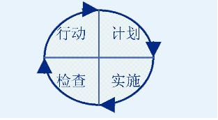

* 计划阶段Plan:明确所要解决的问题或所要实现的目标，并提出实现目标的措施或方法；

* 实施阶段Do:贯彻落实上述措施和方法；

* 检查阶段Check:对照计划方案，检查贯彻落实的情况和效果，及时发现问题和总结经验；

* 行动阶段Action:把成功的经验加以肯定，变成标准，分析失败的原因，吸取教训。

计划任务报告体系
-------------------------------
工作管理的核心是计划、任务、报告。围绕企业的目标和战略，逐层分解为子目标，最终细化为可执行的行动计划和详细任务，在执行过程中逐层反馈和控制，最终达成企业目标。

易度工作管理遵循戴明环的工作管理方法，通过提供全套的计划任务报告体系，来提升企业的执行力，构建企业信息化。

易度计划任务报告体系： 

1. 提供一个计划发布的工具，通过计划，明确要解决的问题和实现的工作目标。 
2. 计划可层层分解为任务，落实到个人，强化实施过程。 
3. 完善的任务执行自动跟踪：提供任务下达、执行、进度反馈、完成检查全套体系，及时发现问题和总结经验。 
4. 提供个人的工作报告管理，包括个人报告和领导评分2部分，加强沟通，对个人任务执行情况进行考核。 

对企业不同角色用户的帮助
---------------------------------
对公司领导的帮助
   管理目标和计划，总揽全局，实时监控、跟踪工作进展情况。

对公司中层的帮助
   根据计划和目标，分配落实任务，检查任务，管理基层员工执行任务，向公司高层汇报。

对公司员工的帮助
   通过清晰的任务工作单，有条不紊的进行工作；通过进度报告反馈机制，向上级汇报工作、反映情况、提出意见或者建议。

----------------------

总体组成
==================================
企业管理主要包括组织结构层面的上下级纵向管理和跨部门协作的横向管理。纵向管理常用管理方式是上级计划、组织、分配、检查任务，下级执行、反馈、完成、汇报任务；而横向管理，会打破部门界限，成立临时以项目经理领导的项目工作小组，高效协作，完成工作。 

易度工作管理利用最新的互联网和软件技术，采用矩阵管理思想为基础，依照企业常用的矩阵管理架构，从部门、项目、个人多个角度全面满足支持企业工作管理的需求。

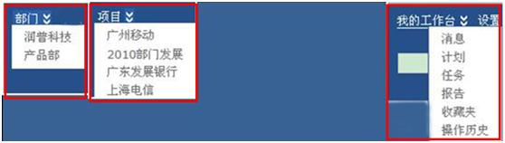

部门管理
---------------
用来支持企业部门内的工作管理。将企业的计划、任务、报告等要素实现体系化、自动化管理，加强领导力和执行力，辅助员工考核，提升企业的管理水平。具体说来，部门上级领导者可在部门管理中轻松指定计划、组织、分配和检查任务；下级员工可执行、反馈、完成、汇报任务。

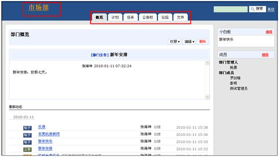

项目管理
----------------
用来进行横向跨部门项目型工作的管理，帮助企业构建融通内外的协作平台。打破部门界限，成立临时以项目经理领导的项目工作小组，通过使用最新的互联网技术，为项目团队构建虚拟的网上工作空间，提供了一组工具用来发布消息、共享文件、分配处理任务、跟踪进度，并通过邮件及时通知相关人员，增强企业团队的沟通和协作，提升团队的整体作战能力。实现了团队成员有效地沟通和协作，最终提升了工作效率，让整个项目过程更加有序。也可以帮助企业做到实时监控项目进度。在系统中，项目的关键节点负责人报告进度信息后，公司上层管理人员可即时查看到公司项目的进度情况、出现的问题、以及计划滞后的原因等，便于后续的决策和调整。
 
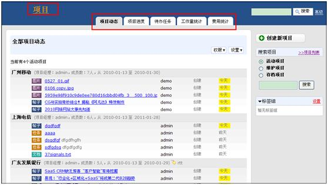

个人工作台
--------------------
以员工个人为中心，汇总部门和项目两方面的所有工作，形成个人工作中心，提供有消息、计划、任务、报告等，帮助员工进行个人管理。

.. image:: img/计划.JPG 

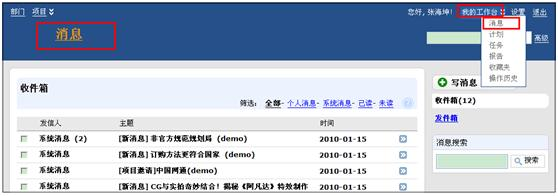

---------------

计划
====================================================

概述
-----------------------------

计划是企业经营管理者在特定时间段内为实现特定目标体系，对要完成特定目标体系而展开的经营活动所做出的统筹性策划安排。简言之公司部门制定的计划就是各个部门一段时间的工作、行动安排，计划会落实到人，一般由中层和基层管理者负责，管理基层员工执行，向公司中层或者高层汇报。

存在的问题
-----------------------------

企业在部门计划管理方面通常存在以下问题：

* 部门领导者若想使各项计划得以实现，就必须加强对计划的控制工作。但是由于缺乏一套有效的计划体系，部门领导对部门工作进度情况及工作中出现的问题、滞后原因等不能有效地进行全局掌控。
* 在部门多个计划实施过程中，不能很好地将工作具体落实到人，难以有效地进行部门计划的细化安排工作，造成计划执行的工作效率低下。
* 计划负责人不能够及时汇报工作进度情况，下级和上级之间难以有效地进行工作沟通，包括及时汇报工作进度情况、工作费用消耗情况及工作量情况等，上层管理人员难以有效地统揽全局，无法保证事后绩效考核的准确性。

认识易度部门计划管理
-----------------------------

易度部门管理下的计划模块，除了自身作为PDCA的一个阶段外，整个计划的体系实现也遵循着PDCA的循环思想，从计划制定、审核 、分解执行以及计划周期结束后的总结报告都遵循一套完整的计划管理循环。具体说来，我们可以根据企业的目标，创建企业的各部门工作计划。计划可逐层分解成任务，分配给部门成员进行执行。某个关键子任务可设置里程碑节点，系统清晰展现滞后、即将完成、已完成的里程碑，而且里程碑负责人可汇报工作进度情况，便于管理者对照计划，检查贯彻落实的情况和效果，及时发现问题和总结经验。同时上层管理人员可统揽全局，即时查看公司各个部门工作进展情况，肯定成功的经验，分析出现的问题、滞后的原因等。真正实现了戴明环中大环套小环，相互促进，不断提升的理念，步步为营，推进企业的工作，真正为企业解决问题，规范企业做事的方式方法。

我们可为企业做到：

* 可分解计划中定为时间节点的里程碑，里程碑会在日历中显示
* 计划可逐层分解成任务，分配给部门成员，某个关键子任务，可设置里程碑节点，着重跟踪
* 计划中的任务执行人员可报告工作进度，方便部门人员随时了解部门工作情况
* 计划会自动报警（以警示颜色标识），表明滞后的、即将到来的里程碑 
* 部门管理人员可了解计划进度完成情况，分析存在的问题 

功能介绍
-----------------------------

用户进入部门管理，选择相应的部门，进入计划模块，界面展现部门最近更新的计划列表，包括计划标题、负责人、计划完成时间及当前计划的进度情况。部门计划会自动报警（以警示颜色标识），表明滞后的、即将到来的里程碑，方便部门管理人员及时了解工作进展情况，分析出现的问题、滞后的原因等。

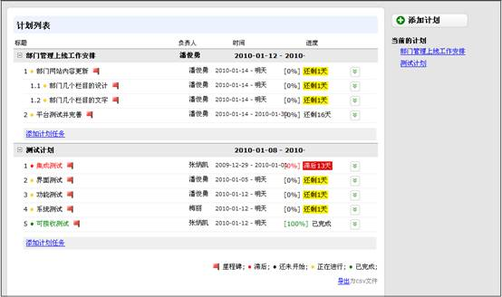

计划的创建
............................................

当各个部门需要作出一段时间的工作、行动安排时，部门经理可以在系统中轻松创建部门计划。

点击窗口右侧的“新建一个计划”按钮，进入创建计划界面，根据具体的工作安排，指定计划的负责人、汇报人、计划截止时间等，成功发布部门计划。

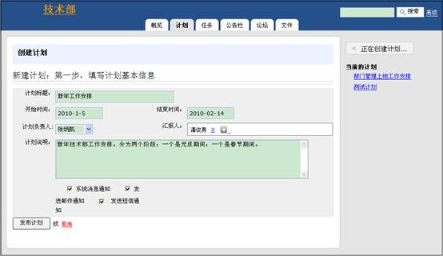

系统除了可以指定计划汇报人进行审核监督外，还提供了通知功能，提供三种通知方式：系统消息通知、邮件通知、短信通知，这样在计划创建的同时可方便快捷地通知相关的人员，保证计划的顺利开展。

计划的执行和汇报
..............................................

为了可以做到对计划执行体系工作效率的管理，系统提供了计划的任务分配功能、任务汇报功能、任务分解及评注等功能，计划可逐层分解成任务，分配给部门成员，员工可以及时汇报工作进度情况。以此保证在计划的执行过程中可以监控工作进度情况，对工作中出现的问题、滞后原因等可以有效地进行全局掌控。

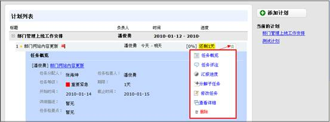

计划的完成和废弃
............................................

经理可能会需要终结计划或者完成、废弃计划，针对企业这个需求，我们可对计划的状态进行修改，包括活动状态、完成状态和废弃状态。活动状态表示计划正处于活动执行中；完成状态可以完成计划并存档，计划中未完成的任务也处于暂停状态。废弃是将计划废弃掉，计划中未完成的任务也处于暂停状态。 

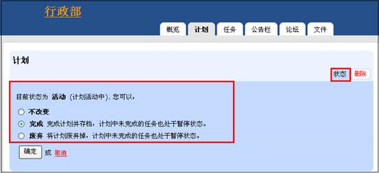

----------------

任务
====================================================

概述
------------------------------------

关于任务
...........................................................

任务是系统的一个基本执行力管控单位，以任务（项目、活动、事宜）过程化管理为核心，实现企事业单位内部管理办公、任务过程追踪、经验知识积累、效能绩效评估，迅速提升“ 执行力”。

企业工作管理过程中需要将计划进行逐层分解成任务，计划分解的任务可具体落实到人。计划和任务的主要区别就是：计划是规范性的，是成体系的。而任务是点状的，是可完全独立的。所以说除了和计划相关联的任务外也包括计划外的任务，即单独的部门任务，用于部门工作管理中发生一些突发、紧急工作，分配给部门成员执行任务。任务本身也可以分解为若干个子任务，层层落实，层层反馈，保证部门工作的有序、顺利进行。

任务流程图
...........................................................

下面是任务的工作流程图，按照以下流程图可以很好地对任务进行过程监控和效果评价

存在的问题
-----------------------------

企业在部门任务管理方面通常存在以下问题：

* 任务的下达、处理、完成到检查缺乏一套完整的体系，部门领导者无法有效监控员工的任务执行情况，难以很好地落实任务和指导部门工作，造成企业的工作效率低下。
* 企业需要了解整个公司各个部门计划内的任务和计划外的任务，保证计划内任务可以有序地开展，同时应对一些突发情况时可以及时安排计划外的任务，保证工作的顺利完成。
* 在多任务的情况下公司员工需要有条不紊地进行工作，清晰知道今天需要做哪些事情，事情处理的优先级；而管理人员通常负责着公司部门人员的多个任务，需要随时监控任务执行的进展情况。
* 对于任务执行过程中出现的各种问题，企业需要有一套任务汇报机制，及时了解任务的执行情况、工作费用消耗情况及工作量情况，否则难以有效地统揽全局，无法保证事后绩效考核的准确性。

认识易度部门任务管理
------------------------------------

易度部门管理下的整个任务的体系实现也遵循着PDCA的循环思想。从任务下达、处理、完成，到任务的检查评分都有一套体系。具体说来我们可以根据企业的目标计划，逐层分解成任务，分配给部门成员执行。系统在计划任务完成后，会自动提醒上级管理人员进行任务的检查，每一个任务必须检查和评分才真正完结；任务执行和完成过程中还提供了报告机制，真正实现了戴明环中大环套小环，相互促进，不断提升的理念，步步为营，推进企业的工作

我们可为企业做到：

* 通过清晰的任务列表，对各类问题进行跟踪，有条不紊地进行工作
* 为不同类型的任务，分别建立任务清单（组织不同任务的容器） 
* 可按任务重要、紧急程度分别建立任务清单，分别包括重要紧急、重要不紧急、紧急不重要、不紧急不重要的任务，以警示颜色进行标识
* 通过任务的评注功能，可报告任务的执行情况
* 一旦问题处理完成，部门人员关闭任务即可
* 可直接在问题上报告工作量信息，以便进行时间占用分析
* 可直接在问题上报告费用发生情况，以便进行费用分析
  

功能介绍
------------------------------------

用户进入部门管理，选择相应的部门，进入任务模块，任务清晰展现人员待办任务清单和待检查任务清单，按照任务的重要性和紧急度进行展示，对于关键节点的里程碑任务以警示颜色进行了标识，待办任务可以帮助部门人员轻松把控工作任务主次，按时有序完成任务。待检查任务可以帮助公司中层管理者及时检查任务，管理基层员工执行任务，保证任务执行体系工作效率的有效管理

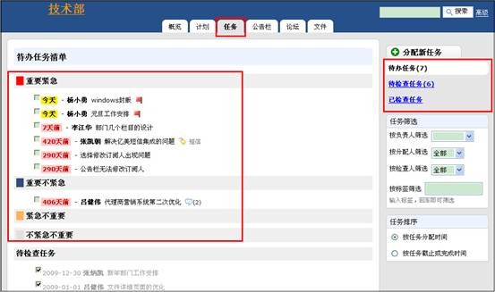

任务的分配
............................................

分为计划内任务的分配和计划外临时任务的分配。

为了保证计划的顺利完成，可将计划分解成任务，分配给部门成员执行。首先选择需要进行分配任务的计划，进入添加计划任务界面

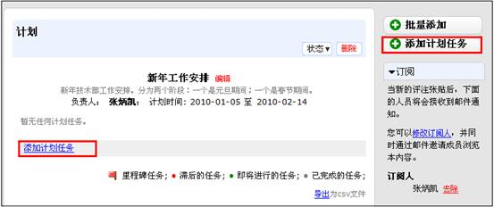

可指定任务标题、描述、任务负责人、截止时间等，并且采取通知方式，无论在何处，可通过短信、电邮或系统消息将任务以及进展情况通知到任务相关人，提高沟通效率。系统融入了80/20时间管理思想区分任务的重要性和紧急度，把任务分为以下四组:1、重要紧急 2、重要不紧急 3、紧急不重要 4、不紧急不重要,帮助所有人员都能轻松把控工作任务主次，保证计划任务执行体系工作效率的有效管理。对于某个关键子任务可设置里程碑节点，系统清晰展现滞后、即将完成、已完成的里程碑。

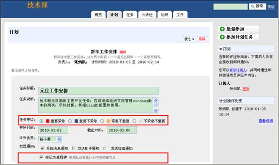

任务还可指定检查点和检查人，任务检查人在任务执行过程中可对任务进行验收和监督，保证计划可以高效地执行。

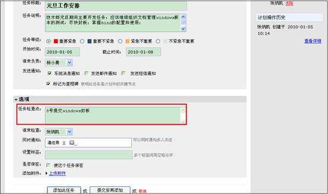

除了计划内的任务，在易度部门管理和项目管理中都单独配有计划外临时任务工具，用于突发情况或紧急情况下任务的分配。另外在用户个人的工作台中也配有任务工具，便于进行任务查找和检查。

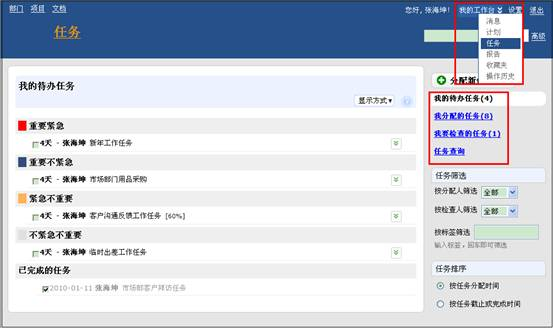

任务的分解
............................................

为了保证计划的任务清晰、有序地完成，可以将任务分解为若干个子任务，层层落实，层层反馈，落实工作。这样部门工作人员就能轻松把控工作任务，有序完成各项任务。

直接在任务上选择分解子任务，进入任务分解界面，添加子任务。

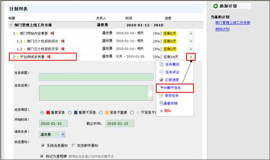

任务的汇报
............................................

任务的负责人可以直接在任务上汇报任务进度，完成后，任务检查人负责对任务验收和评价汇报进度。

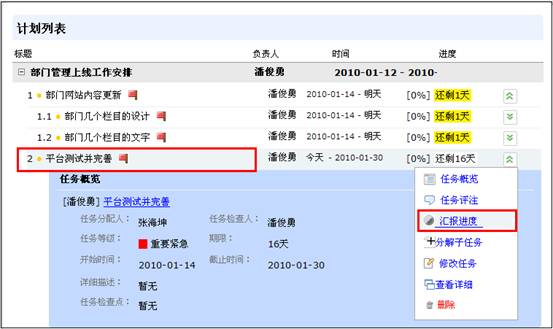

任务的检查
............................................

系统在部门任务完成后会提醒上级管理人员进行任务的检查，每一个任务必须检查和评分才真正完结。

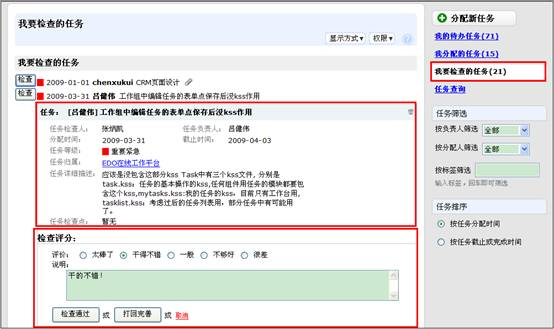

任务团队协作处理
............................................

支持任务通知和订阅机制，形成任务处理团队，沟通讨论，协作完成任务。评注订阅通知机制，是系统的一个基础服务，几乎所有的模块（如目标、计划、任务、报告等）都可以支持。在计划模块里设置好内容的关注人员或群组后，对内容的评注，可使用消息、短信、邮件等多种途径，通知给所有的订阅人。这种评注订阅通知机制，能够很方便的把任务最新消息传播给相关人员，同时能够保持良好的部门人员信息沟通。

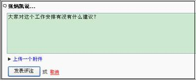

订阅

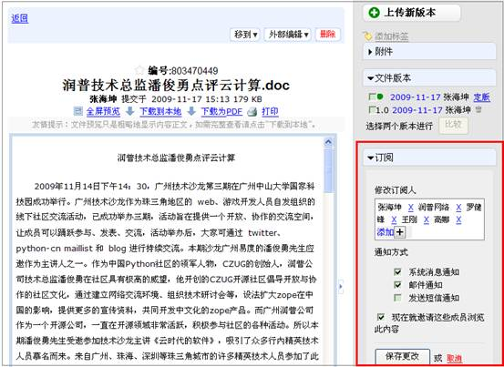

------------------

报告
====================================================

概述
------------------------------------
报告可分为针对计划任务的报告和针对个人的报告。计划、任务都自带了一套进度报告反馈机制，目的在于加强对事的控制。而个人工作报告，是以个人为中心，向上级汇报工作、反映情况、提出意见或者建议。

报告类型可分为日报、周报、月报等。日报可汇总任务的执行情况，目的是沟通；周报的目的主要是总结和知识管理；月报的目的主要是考核和激励。

报告汇报包括两个方面: (1)系统自动记录你负责的计划、任务完成情况；(2)你自己填写的总结和计划。每个员工可以通过日报、周报、月报进行总结汇报，最终又可和考核挂钩。

认识易度部门报告管理
------------------------------------
易度部门管理下的报告体系实现也遵循着PDCA的循环思想，支持报告提交、报告评价反馈机制。

我们可为企业做到：

* 支持日报、周报、月报，日报沟通、周报总结、月报考核，层层衍进 
* 自动汇总计划任务执行情况，员工每天完成的工作，自动汇总进行报告，让报告更有根据
* 日报、周报、月报作为员工工作情况沟通和总结，领导可以对报告进行评价，评价结果，最终影响考核 

功能介绍
------------------------------------

提交报告
............................................

员工可轻松进行提交报告，向上级汇报工作、反映情况、提出意见或者建议。

进入提交报告界面，选择报告类型，进行提交报告。

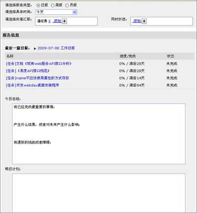

审核报告
............................................

提供报告评价反馈机制，领导可对报告进行审核，评价结果，最终影响员工考核情况。

