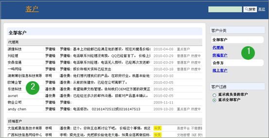
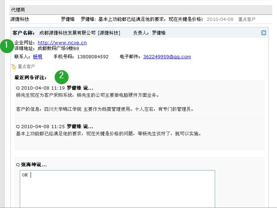
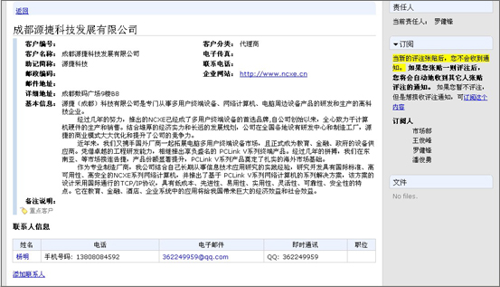

====================
客户
====================

.. sectnum::

易用的CRM系统，科学管理客户资料，把握每一个销售机会，实现销售过程自动化。

全面的客户管理
================================
易度客户管理可对所有客户信息进行全面的管理，提供分组标签分类，可从多个角度对客户进行分类，灵活的客户筛选，方便销售人员进行客户跟踪。

**说明**: 1) 分组标签分类：从多个角度对客户分类，灵活的客户筛选； 2) 显示全部客户信息，方便销售人员进行客户跟踪。

及时的沟通交流
================================
针对具体某个客户，系统提供了评注订阅功能，方便客户与销售人员进行及时沟通交流。同时界面使用流畅，销售人员容易接受。

**说明**: 1) 友好的AJAX界面：用户界面采用最新的AJAX无刷新界面，使用流畅，销售人员容易接受；2). 评注订阅功能:系统提供评注订阅功能，方便客户与销售人员进行及时沟通交流。

详细的客户资料
================================
客户详细资料都会在系统中存档。

