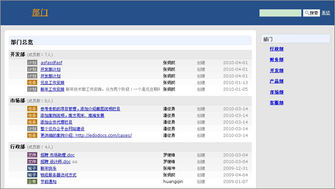
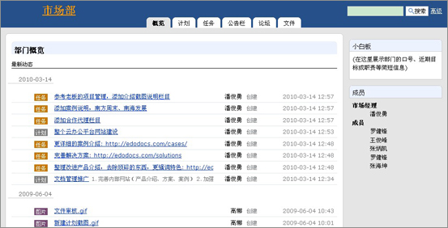
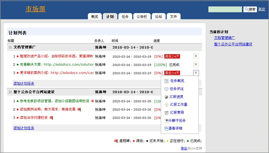
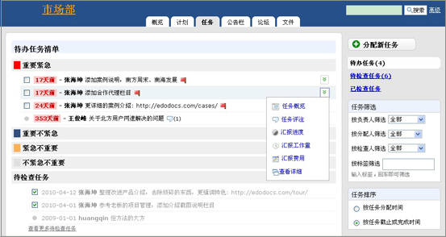
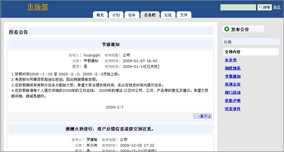
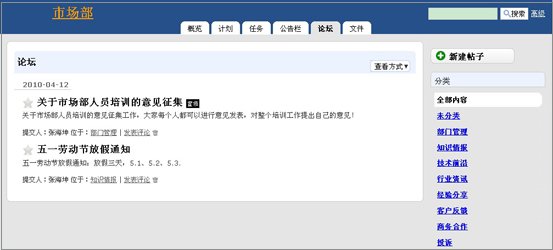
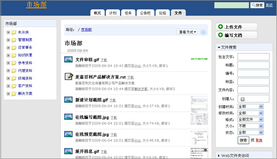

========================
易度部门
========================

功能特点
================

1. 以部门为单位对公司进行管理，首页展示各个部门最新动态和部门任务最新进展情况，便于部门领导总揽全局，对公司进行管理。

2. 为每个部门提供独立的管理空间，包括计划、任务、文档、论坛等。

3. 部门计划

可以根据部门目标，创建各部门工作计划。计划可逐层分解成任务，分配给部门成员执行。

某个关键子任务可设置里程碑节点，系统清晰展现滞后、即将完成、已完成的里程碑，而且里程碑负责人可汇报工作进度情况，便于部门管理者对照计划，检查贯彻落实的情况和效果，及时发现问题和总结经验。

4. 部门任务

可以根据部门的目标计划，逐层分解成任务，分配给部门成员执行。

系统在任务完成后，会自动提醒上级管理人员进行任务的检查，每一个任务必须检查和评分才真正完结；

5. 部门公告

部门的重要信息可以以公告的形式发布，通知部门人员，可设置公告有效期限，部门成员可针对部门公告进行评注沟通。

6.部门论坛

能够很好的在部门中传播即时消息,方便进行部门团队沟通。论坛帖子分类存放，方便查阅历史沟通记录。

7.部门文件

每个部门工作空间分配独立的“文件”模块，提供强大的文档管理功能。包括文档共享、文档上传、下载、权限管理、查找、版本管理等。

