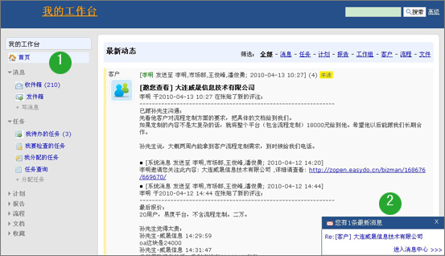
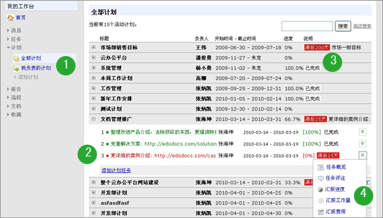
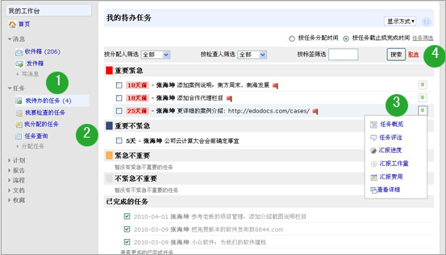
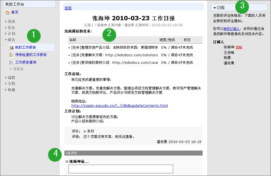
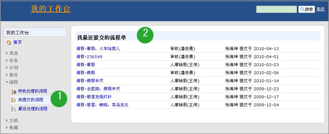
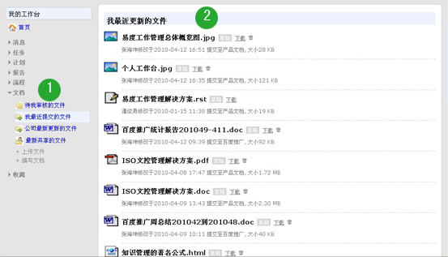
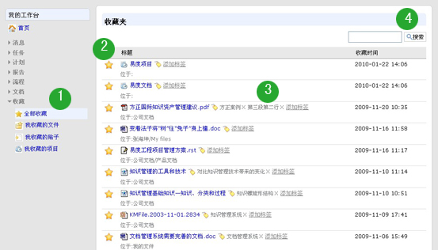

=====================
个人工作台
=====================

.. sectnum::

个人工作台是以个人为核心的工作平台，组织了个人相关的常用资源。不离开个人工作台，用户可进行各种常用的操作。

个人工作台包括事件流首页、消息、文档、流程、计划、任务、报告、收藏等栏目。

工作台首页
-----------------------
首页是一个最新社会化网络的事件流界面，自动推送个人需要关注的消息。

**说明**: 1) 首页提供有个人消息、任务、计划、报告、流程、文档、收藏栏目，用户可进行各种常用的操作；2) 消息通知：系统自动弹出消息通知；

计划
----------
可以根据企业的目标，创建企业的各部门工作计划。计划可逐层分解成任务，分配给部门成员进行执行。某个关键子任务可设置里程碑节点，系统清晰展现滞后、即将完成、已完成的里程碑，而且里程碑负责人可汇报工作进度情况，便于管理者对照计划，检查贯彻落实的情况和效果，及时发现问题和总结经验。

**说明**: 1) 可添加计划、查看个人和全部计划，便于管理； 2) 计划可逐层分解成任务，分配给部门成员执行。某个关键子任务，可设置里程碑节点，着重跟踪；3）计划会自动报警（以警示颜色标识），表明滞后的、即将到来的里程碑；4）计划的任务执行人员可报告工作进度，方便部门人员随时了解部门工作情况

任务
---------
从任务下达、处理、完成，到任务的检查评分都有一套体系，以此来促进企业的执行力。包括可以根据企业的目标计划，逐层分解成任务，分配给部门成员执行。系统在计划任务完成后，会自动提醒上级管理人员进行任务的检查，每一个任务必须检查和评分才真正完结；任务执行和完成过程中还提供了报告机制等。

**说明**: 1) 任务管理，提供任务分配、检查、查询等，通过清晰的任务列表，对个人待办和待检查任务进行跟踪，有条不紊地进行工作； 2) 可按任务重要、紧急程度分别建立任务清单，分别包括重要紧急、重要不紧急、紧急不重要、不紧急不重要的任务，以警示颜色进行标识；3）提供任务的评注功能，报告任务的执行情况。提供任务汇报功能，进行工作量、费用分析；4）提供任务筛选和排序功能，便于进行个人任务管理

报告
----------
个人工作报告，以个人为中心，向上级汇报工作、反映情况、提出意见或者建议。支持日报、周报、月报，日报沟通、周报总结、月报考核，层层衍进，作为员工工作情况沟通和总结，领导可以对报告进行评价，评价结果，最终影响考核。可自动汇总计划任务执行情况。

**说明**: 1) 提供报告填写、查询功能，报告支持日报、周报和月报； 2) 自动汇总计划任务执行情况，员工每天完成的工作，自动汇总进行报告，让报告更有根据；3）提供订阅功能，保证相关人员可及时接收到最新报告信息；4）提供评注功能，针对报告发表意见或看法，及时沟通；

流程
----------
个人工作台提供有个人流程栏目，涵盖了个人涉及的所有流程，包括待我处理的流程、我提交的流程和最近处理的流程，在工作台上简化工作、增加流程透明度、提高工作效率。

**说明**: 1) 包括待我处理的流程、我提交的流程、最近处理的流程； 2) 详细的流程单，包括流程单发起的时间、审核人、流程详细信息。

文档
----------
个人工作台文档栏目涉及用户个人相关的文档，包括待我审核的文件、我最近提交的文件、公司最新更新的文件和最新共享的文件，方便个人进行自我知识管理，同时可在工作平台进行上传文件和编写文档操作，简化用户操作，方便用户进行个人文档管理。

**说明**: 1) 可查看待我审核的文件、我最新提交的文件、公司最新更新的文件、最新共享的文件；可上传文件和在线编写文档；2) 详细的文档清单，方便用户进行个人知识查找和管理。

收藏
----------

每个人可在自己的个人区，将常用的文档、帖子、项目进行收藏，可对自己的收藏进行分类管理。这样，对庞大的企业文档库，每个人可方便的建立针对自己的小型的管理库，更方便查找，便于用户进行自我知识的管理。

**说明**: 1) 包括我收藏的文件、帖子和项目；2) 可对收藏进行自由管理，去除收藏；3) 收藏的内容可自定义标签，方便用户查找和统一管理；4) 可对收藏进行搜索。

