===============================================
易度基础办公套件
===============================================

.. sectnum::
   :depth: 1

易度工作平台包括一组精心设计的基础办公套件，包括文档、部门、项目、流程、客户、个人工作台等模块，满足企业日常的办公需求。

-------------------------------

部门
==============
以部门为单位对公司进行管理，为每个部门提供独立的管理空间，包括公告、论坛、计划任务和文档管理功能等

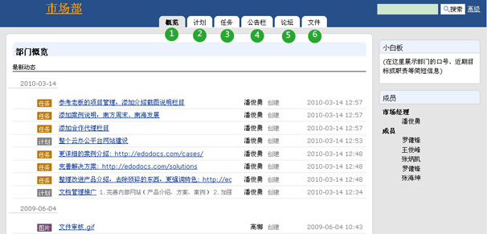

**说明**: 1) 部门概览，查看部门最新动向； 2) 计划，了解部门最新工作计划；3) 部门任务，有条不紊开展部门工作；4）部门的重要信息可以以公告的形式发布，设置有效期限，通知部门人员。5）部门论坛，及时进行信息沟通；6）文件，提供部门文档管理

-------------------------------

项目
=======================
项目为跨部门的工作提供了协作和管理的途径。项目和部门在一起，为企业矩阵架构管理提供全面的支持。

项目中心
-------------------
项目中心是所有项目的汇集区，可跨项目的查看项目进展等相关信息，做到多项目的统筹管理。

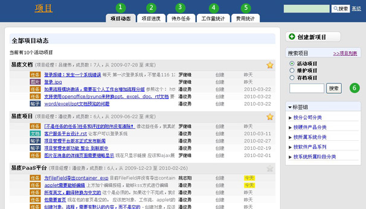

**说明**: 1) 项目动态，可以清晰了解所有项目的最新活动情况； 2) 项目进度，可以帮助实时监控、跟踪项目进度情况；3）待办任务，可以实时了解个人的待办任务，做到工作有条不紊；4）工作量统计，可以了解各项目的人力资源状态；5）费用统计，可以统计项目费用情况，量化项目成本；6）支持创新、实用的项目标签组功能，为项目提供多角度的分类，项目成员和部门经理可以方便、快捷地查询到相应的活动项目，便于项目查找和管理。

项目空间
----------------

系统为企业每一个项目组件项目团队，建立一个独立的项目工作空间，提供了一组创新实用的工具，包括论坛、计划、任务列表、工作量、费用、文件等。

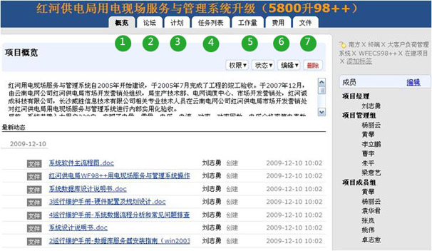

**说明**: 1) 项目概览，清晰查看项目最新动态和项目成员信息； 2) 论坛，方便发布帖子，使项目成员的团队沟通更简单方便、工作更高效；3）项目经理可有效监控项目计划，项目成员可以在线实时汇报自己的计划任务执行情况；4）任务列表，可以对各类问题（突发性）进行跟踪；5）项目经理可及时了解项目成员工作情况，量化项目人力资源。项目成员可以轻松汇报项目工时情况；6）可以轻松进行项目费用预算和考核费用情况；7）可以在线管理项目文档，强大的文档管理功能

---------------------------------

流程
===============
将企业管理的各种流程电子化、自动化，提高工作效率，提升管理水平。

流程中心
-------------------------------
这里分类汇聚了企业需要的各种流程。

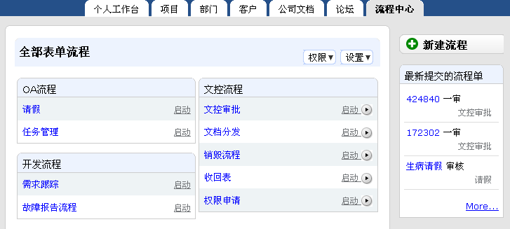

流程单
--------------------
系统支持复杂的流程定义，相关人员可根据流程的定义，相互配合完成工作

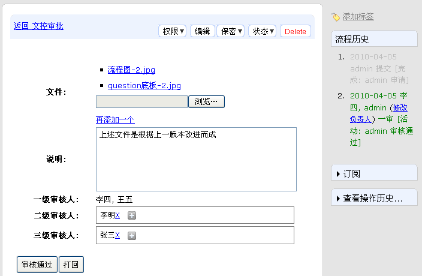

---------------------------------

客户
================

易用的CRM系统，科学管理客户资料，把握每一个销售机会，实现销售过程自动化。

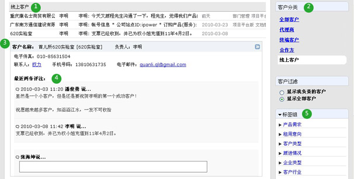

**说明**: 1) 显示所有客户，使用流畅，销售人员容易接受；2) 右侧客户分类方便查询各类客户信息；3) 所有客户相关的资料；4) 提供评注功能，进行信息沟通；5）分组标签分类从多个角度对客户分类，灵活的客户筛选

-------------------------------

文档
===================
文档，是企业知识资产的主要载体。文档在存储、分享、搜索、协作、使用、权限控制、审核流程等多个方面帮助企业提示知识管理水平。

文档是一个基础模块，被部门、项目等多个模块使用。

文件夹
---------------
文件夹是文件管理的基本单位，系统支持任意层次的树状文件夹结构。

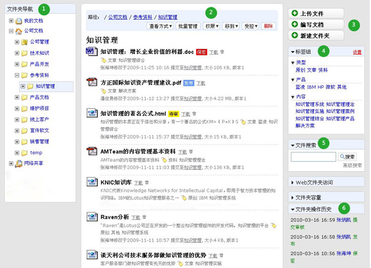

**说明**: 1). 分区管理，划分个人文档、公司文档和网络共享三个作用不同的文档存放区域； 2) 便捷的文件夹操作栏； 3) 快捷的文件上传、在线编写、新建文件夹按钮； 4) 标签组提供多维度、多层次的文档分类检索机制； 5) 搜索文件夹内的文件； 6) 记录文件夹所有文件的操作历史（上传、下载、删除等操作）

文件
-----------
系统对文件有强大的格式转换和预览功能，对多媒体文件能在线播放，支持文件版本管理。

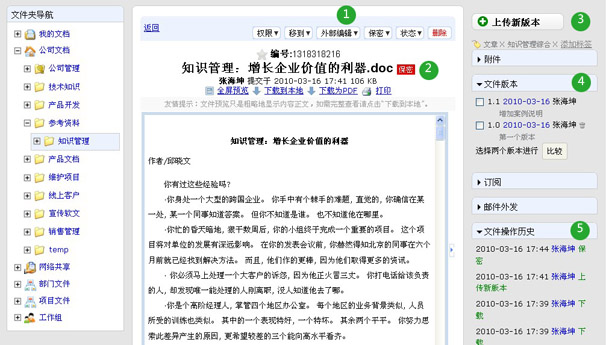

**说明**: 1). 控制文件的各种权限、进行外部编辑等；2). 保密文件，未授权用户无法进行查看；3). 文件版本上传和附件上传；4).文件版本管理。提供获取历史版本功能、支持版本差异比较、删除历史版本及定版功能；5).记录文件的所有操作记录（上传、下载、删除等操作）

-------------------------------

个人工作台 
==========================================
个人工作台是以个人为中心的，沟通、协作、执行、报告的核心工作平台，汇集了整个平台中，个人需要关注的内容。

工作台首页
-----------------------
首页是一个最新社会化网络的事件流界面，自动推送个人需要关注的消息。

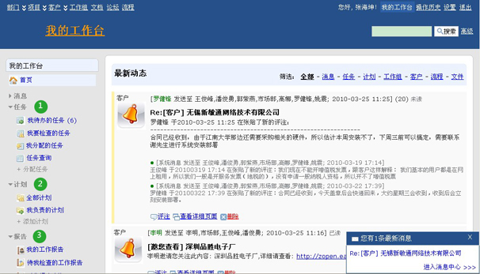

**说明**: 1) 任务管理，提供任务分配、检查、查询等； 2) 计划管理，提供计划制定、审核、分解执行以及计划周期结束后的总结报告；3）报告管理，汇报工作、反映情况、提出意见或建议等；

计划
----------
可以根据企业的目标，创建企业的各部门工作计划。计划可逐层分解成任务，分配给部门成员进行执行。某个关键子任务可设置里程碑节点，系统清晰展现滞后、即将完成、已完成的里程碑，而且里程碑负责人可汇报工作进度情况，便于管理者对照计划，检查贯彻落实的情况和效果，及时发现问题和总结经验。

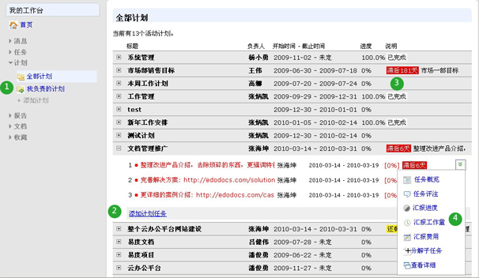

**说明**: 1) 可添加计划、查看个人和全部计划，便于管理； 2) 计划可逐层分解成任务，分配给部门成员执行。某个关键子任务，可设置里程碑节点，着重跟踪；3）计划会自动报警（以警示颜色标识），表明滞后的、即将到来的里程碑；4）计划的任务执行人员可报告工作进度，方便部门人员随时了解部门工作情况

任务
---------
从任务下达、处理、完成，到任务的检查评分都有一套体系，以此来促进企业的执行力。包括可以根据企业的目标计划，逐层分解成任务，分配给部门成员执行。系统在计划任务完成后，会自动提醒上级管理人员进行任务的检查，每一个任务必须检查和评分才真正完结；任务执行和完成过程中还提供了报告机制等。

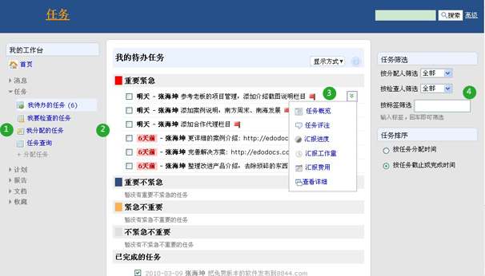

**说明**: 1) 任务管理，提供任务分配、检查、查询等，通过清晰的任务列表，对个人待办和待检查任务进行跟踪，有条不紊地进行工作； 2) 可按任务重要、紧急程度分别建立任务清单，分别包括重要紧急、重要不紧急、紧急不重要、不紧急不重要的任务，以警示颜色进行标识；3）提供任务的评注功能，报告任务的执行情况。提供任务汇报功能，进行工作量、费用分析；4）提供任务筛选和排序功能，便于进行个人任务管理

报告
----------
个人工作报告，以个人为中心，向上级汇报工作、反映情况、提出意见或者建议。支持日报、周报、月报，日报沟通、周报总结、月报考核，层层衍进，作为员工工作情况沟通和总结，领导可以对报告进行评价，评价结果，最终影响考核。可自动汇总计划任务执行情况。

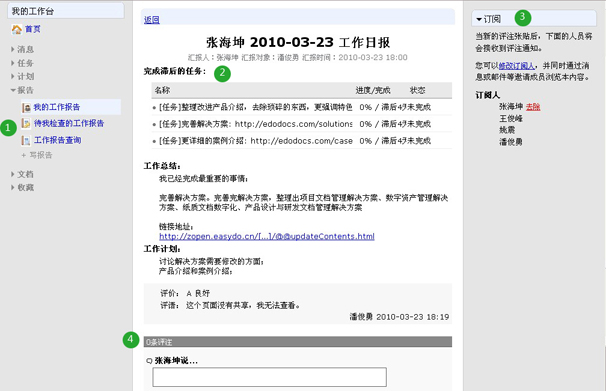

**说明**: 1) 提供报告填写、查询功能，报告支持日报、周报和月报； 2) 自动汇总计划任务执行情况，员工每天完成的工作，自动汇总进行报告，让报告更有根据；3）提供订阅功能，保证相关人员可及时接收到最新报告信息；4）提供评注功能，针对报告发表意见或看法，及时沟通；

