=========================
易度流程
=========================

.. sectnum::

解决什么问题
==========================
企业常用的流程，典型在财务、行政方面居多，例如请假、出差、派车、采购、等。需要系统每月定时将报表数据进行统计。

传统的传统流程手工推进，复杂且效率低下；流程进展情况不透明，流程申请人不方便查看了解流程进展情况；难以进行后续的统计分析。

易度流程，主要是解决的是企业流程自动化的问题，让企业的规章制度，通过软件来固化和自动化，简化工作、增加流程透明度、提高工作效率。

产品特色
======================
* 支持多个流程步骤的串行审核和并行审核流程
* 每个步骤支持多人审核，审核通过与否可设置灵活的投票策略，比如达到指定票数才能通过
* 完整的流程历史查看，了解流程滞后的原因
* 支持流程委托处理，解决流程异常的情况
* 通过表达式来定义流程执行人，更加灵活
* 脚本化流程编写，最灵活
* 采用短信或者邮件通知流程流转，加快流程进展
* 强大的流程表单自定义界面，自动生成流程图
* 流程执行可触发脚本，可定义几乎任意的逻辑
* 流程单处理提供反馈讨论机制，疏通流程沟通渠道
* 流程管理和文档管理紧密集成，文档自动存档
* 灵活易用的流程单查询，支持多维度分类

流程定义
=================

流程表单定义
--------------------
每个表单可定义一组辅助的脚本。流程表单的各个字段可进行添加、编辑和删除。

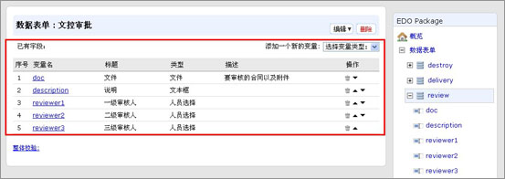

流程步骤定义
---------------------------------------
每个流程定义，包括一组状态、一组操作、和一组流程相关变量。操作的执行，引起状态和流程变量的变化。

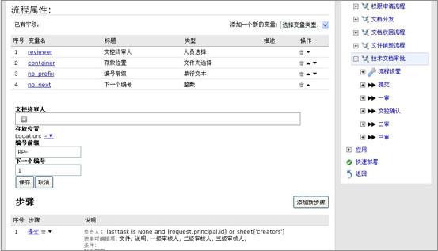

每个操作包括如下属性：

* 起始状态 (可选)
* 终结状态 (可选)
* 操作人 (可以是成组)
* 条件：（一个表达式）
* 触发动作：(如发通知、改变状态等)

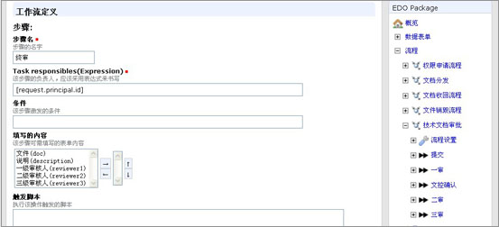

流程使用
========================

流程中心
-----------------------

这里可看到所有流程的分类汇总。

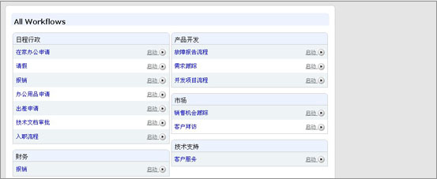

流程设置
---------------------
全部表单流程可根据用户实际需要进行自主定制，设置不同的流程分组。

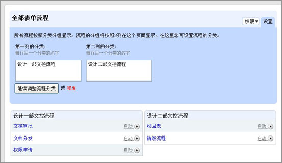

也可根据用户具体需要进行具体流程设置，包括统一指定流程终审人、流程文档的存放位置、文档编号等。

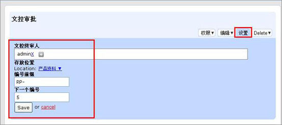

流程的提交
------------------------------------
支持多个流程步骤的串行审核和并行审核流程。每个步骤支持多人审核，审核通过与否可设置灵活的投票策略，比如达到指定票数才能通过

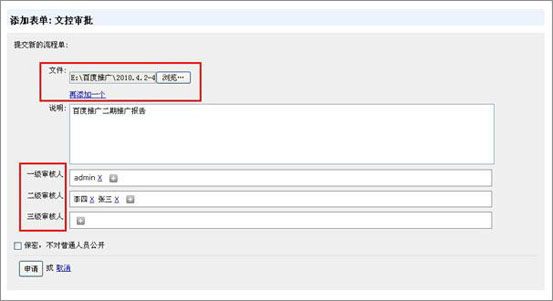

流程扭转
-------------------------

提交流程后，进入流程的流转，系统会使用短信、邮件或者系统消息，自动通知后续流程步骤的负责人及时处理。流程负责人根据通知的链接，可直接进入流程单。

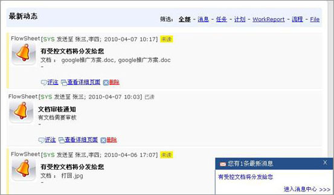

一旦提交流程流转表单，根据流程定义，可能自动执行如下操作：

1. 通过短信、邮件等，发送流程通知，通知后续的流程处理人员及时处理。

2. 设置权限，比如文档的修改权限

3. 自动编号

4. 发布流程中提交的文档。每个阶段/状态都可能通过附件的形式提交部分文档。

5. 设置流程单标签,方便查找，比如标定流程处于什么阶段

6. 创建项目...

流程历史
-------------------------

在流程单右侧可看到流程的操作历史。并可调整当前流程的执行人，在生病出差等意外情况下将工作转交给其他人。

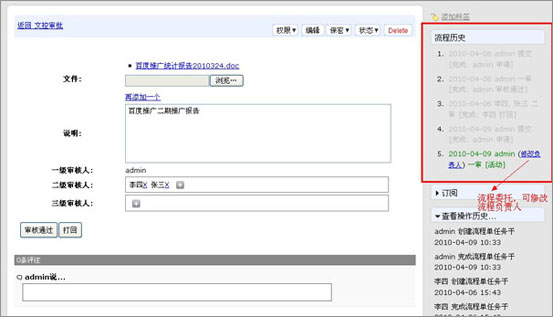

流程单的订阅和交流
--------------------------
每个流程单都可订阅，一旦订阅,流程进展都会自动发送通知消息给订阅人员。同时，流程可评注，建立互动沟通。

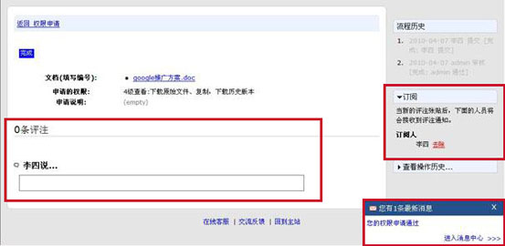

搜索流程单
-------------------
可根据文字、提交人、状态、提交时间搜索流程单，方便用户查找，提供工作效率。

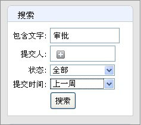

流程权限控制
----------------------
流程过程中系统自动给文档中的人员授予编辑人权限，需要设置查看和添加流程单、以及管理流程的权限，可在权限设置中进行修改。

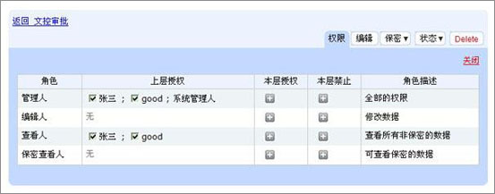

权限申请流程中也可以申请相关权限。用户填写文件的编号，需要的权限（1/2/3/4级查看编辑），以及原因。

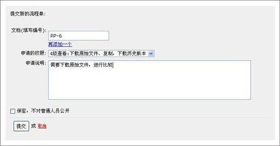

系统自动发消息通知文件夹直接拥有管理员权限的人去处理，同时分配任务给任何一个有权限的人。选择是否通过或者打回权限申请要求

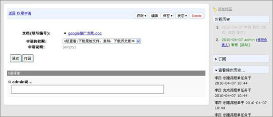

权限申请通过后，用户收到系统权限申请通过的消息通知，完成权限申请流程，拥有相关权限。