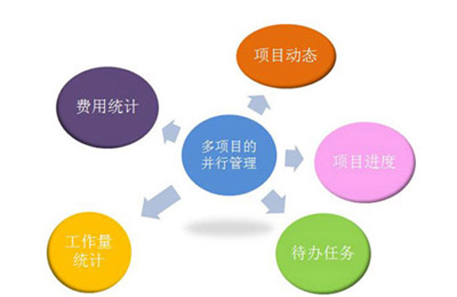
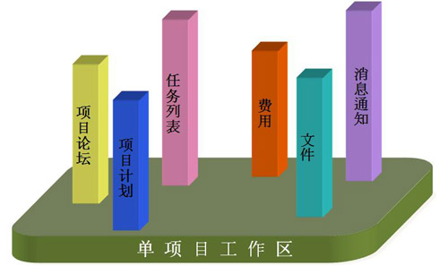
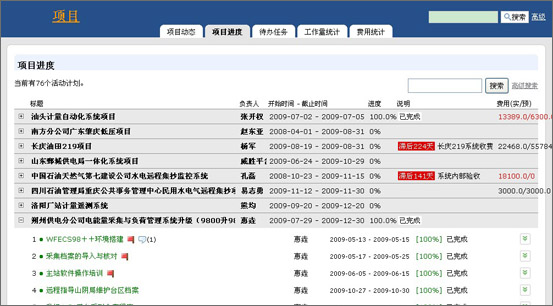
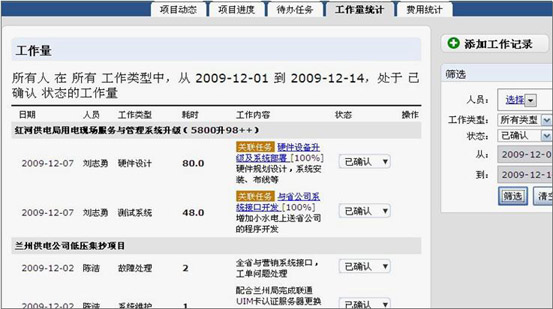
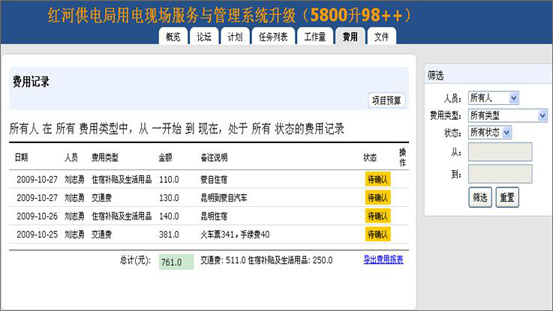
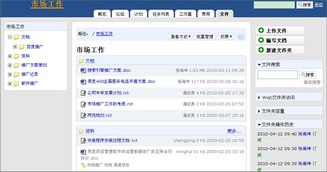

=================
项目
=================

.. sectnum::

易度项目管理软件是基于项目管理思想的、管理协作沟通融为一体的、可定制的具有行业特性的、创新实用的项目管理软件。帮助企业构建融通内外的协作平台，解决项目团队异地协作的问题；实时监控、跟踪项目进度的问题；项目知识管理和项目知识重用等问题

多项目管理
====================================
企业多项目并行启动，需要有效管理和清晰做事情吗？

使用易度项目，帮助您的企业跨项目的查看项目相关信息，做到多项目的并行管理。

首页提供有“项目动态”、“项目进度”、“待办任务”、“工作量统计”、“费用统计”模块，清晰了解所有项目的活动情况、所有项目成员的任务完成情况、各项目的人力资源状态、各项目费用情况等。

单项目工作区
====================================
项目复杂，多方异地项目沟通协作存在障碍？

项目经理希望及时了解项目实施人员的工作进展？

工程技术人员，希望得到更有效的配合和支持？

系统为每个项目团队构建虚拟的网上工作空间，提供了一组工具用来发布项目消息，管理项目计划和进度，分配、查询、管理任务，统计工作量和费用，进行共享文件及个人消息通知等，让整个项目过程更加有序。

实时监控，跟踪项目最新进度
===============================================
公司项目众多，难以及时获取项目最新进度和存在问题，更无法及时调整和应对？

通过易度项目管理平台，您可即时查看公司项目的进度情况、出现的问题、以及计划滞后的原因等。

项目管理尽在您的把控之中。

工作量管理，优化人力资源配置
===============================================
项目多、人手相对少，需要优化人力资源配置,确保及时完成工程项目？

使用易度项目，项目经理可以及时了解项目成员工作情况，量化项目人力资源；项目成员可轻松汇报项目工时。

轻松进行项目费用管理
===============================================
项目费用控制包括项目费用预算、项目费用统计、项目人员费用报销等，这些费用操作流程异常繁琐？

通过易度项目，可以轻松进行项目费用预算申请和费用报销，统计项目费用情况，量化项目成本。

有了易度项目，帮助企业轻松控制项目费用！

项目知识资料管理
====================================
还在为查找和重用以往项目所产生的知识、文档等资料而头疼吗？

易度可以将项目资料共享给相关人员，帮助企业把项目知识资料积累沉淀下来，在需要的时候，可以很方便地调出项目资料，作为参考使用。

