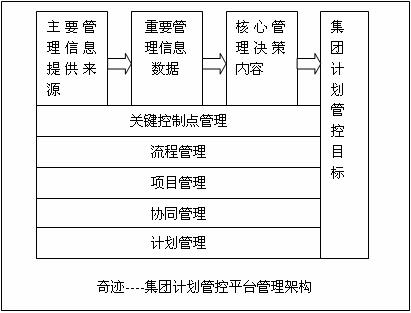
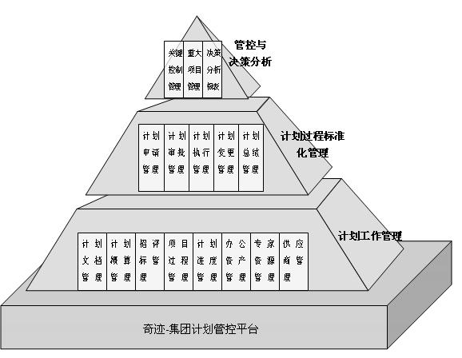
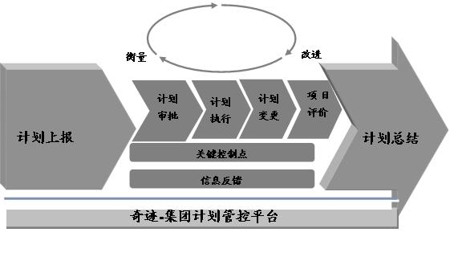

================================
易度企业计划管控平台
================================
**计划部门如何强化计划职能以满足长期发展的需要？**

**如何解决计划与执行不协同的问题，使为决策提供有效的支持，为战略目标的实现提供有力的支持？**

**如何通过有效的项目过程管理，实现项目结果的可控？**

**项目过程缺乏控制导致结果的不可预期（项目活动只有申请和结果汇报，缺少过程和阶段活动记录，无法判断项目成果真实性，项目动态信息（变更、需求等）不能及时掌握，信息单向上报缺乏监督核实机制）**

**......**

.. sectnum::

易度计划管控平台简介
===============================
易度计划管控平台是根据大型集团型企业的管理需求，在集团管控、项目管理、流程管理、时间管理、协同管理等管理理念指导下，凝聚了中国海洋石油总公司、三元集团等国内大型企业管理集团的诸多管理经验及其咨询成果的基础上总结提炼出来的领导决策支持系统。

该系统平台是润普公司历时三年时间研发而成，期间充分吸收和转换了国内大型企业集团在集团管控、项目管理、流程管理、协同管理等领域的管理经验和咨询成果，适时的转化为管理决策服务的工具，并不断改进完善。

润普公司将一直本着站在管理理念最前沿，通过先进成熟的技术手段，整合资源的理念，帮助集团企业从优秀走向卓越。

易度计划管控平台的理念
====================================
设计宗旨
------------------
深刻理解管理和IT之间的关系，牢牢把握着IT为管理服务的宗旨，采用先进、成熟的技术手段，为用户打造核心竞争力提供卓越的产品与服务。

核心思想
----------------
以企业战略目标为指引，体现集团管控思想，落实集团服务职能，以项目管理、流程管理为手段，细化关键控制点管理，实现集团计划管理的高效协同，为打造集团核心竞争力发挥最大价值。

 

 

管理架构
-------------------
 

 
易度计划管控平台由三个层面的管理内容组成；管控与决策分析，计划过程标准化管理，计划工作管理。涵盖了计划上报、计划确定、计划项目审查、大型项目批准、执行进度分析、大型项目的过程管理（项目设计方案的招评标、审查、项目投资概算管理、项目执行过程的管理、项目的竣工验收、项目的后评价）、供应厂家的管理、统计报表信息管理等计划管理的全过程。

 
计划管理过程标准化是一个不断积累、沉淀、规范提升的过程，需要持续不断的优化来

        

提升集团计划部门对长期发展方向的把握能力，增强项目结果的可预期性，使的计划变的更加可控，从而为管理决策提供有效的支持，保证企业朝着既定的战略目标方向发展。

    
.. image:: img/control-5.jpg

关键控制点管理
   （关键业务的流程管控和决策点分析）：对于跨部门跨区域的多组织机构的大型集团型企业来讲，无论是在上下级之间，各个独立的部门（机构）内部或者是部门（机构）之间都存在着非常重要的管理控制环节（点），比如需要加强部门沟通协作的环节、需要统计报表支撑管理考核的环节，争议较多，需要完善规范和领导处理的环节等）这些环节需要相关的决策点及其相关核心信息来支持决策，因此细化关键点管理并及时把相关决策信息准确传递到相关决策人意义非常重大。润普计划项目管控平台从一开始就是本着深刻的理解并贴合企业实际管理的需要，以流程管控体系贯穿项目的整个生命周期，设定关键控制点细化控制体系，同时，通过决策分析体系实时提取相关决策信息为决策者提供决策分析之用，从而，及时准确的实现关键控制点管理，为管理决策者提供及时、准确的决策信息。

流程管理
   流程管理是润普计划管控平台最核心的管理手段之一。以持续增强企业核心竞争力并创造更多价值为目标的管理体系中，不断规范、优化企业行为规则，并持续改进的管理要求，使得系统在必须具备非常灵活设置能力的基础上，能够体现出管控意图。奇迹集团计划管控平台通过融合项目管理、细化关键控制点体系等核心管控要求，把各项管理要求以相对固化的各项工作流程体现在平台之上，使得在下一次的持续改进之前能充分、严谨的体现现有管理要求，同时，系统还提供灵活的设置能力，为持续的流程管理改进保驾护航。

项目管理
    润普计划管控平台通过管理项目的启动、计划、执行、控制和结束，完成项目的申请、立项、计划、控制等一系列项目的整个生命周期过程管理，掌控所有的项目信息（计划，资金，物质，人员，进程），跟踪整个项目的生命周期，全程监控项目的进展。制定项目过程阶段判别和每阶段上报信息规范与模版，制定统一的项目管理规范，过程信息上报、审核、汇总的IT支撑，调整绩效体系，要求下属人员执行过程管理规范。管理与项目相关的活动和人员，并从项目矩阵视图中观察企业的效能。在此基础上，通过引入流程管控，并引入关键控制点管控体系，使得项目管理与流程管理、及其关键控制点管控体系融为一体，从而使项目管理变得更加立体和动态，也更加贴合企业实际管理需求。

协同管理
   润普计划管控平台从始至终贯穿协同管理思想，不仅体现在各功能模块的把各业务部门业务接口和相互信息需求实现多维度的相互关联上，更重要的是，把集团管控、流程管理、项目管理等思想与企业的实际管理过程有机的结合在一起，从而使得从集团管理角度更加体系的了解相关决策信息。

