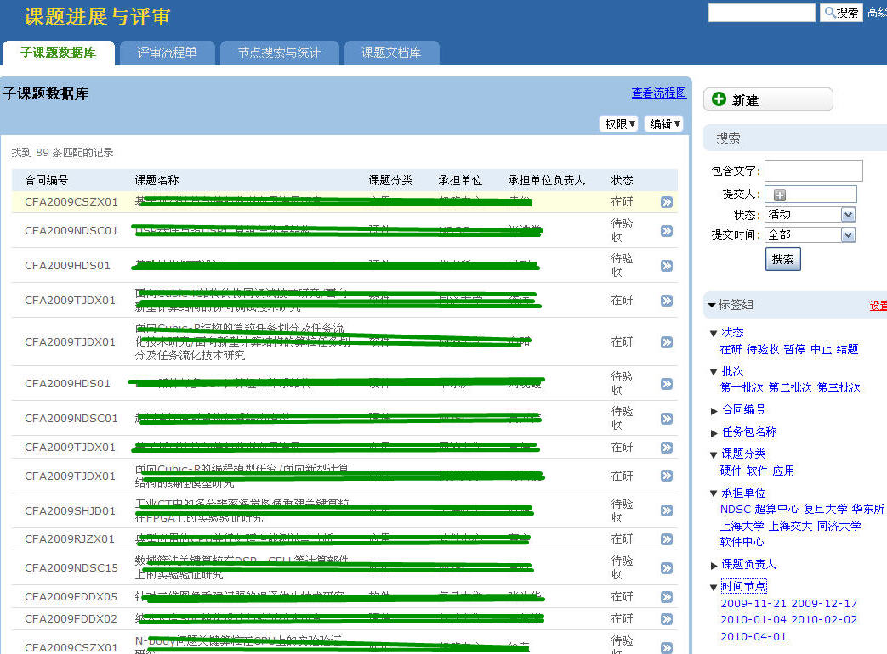
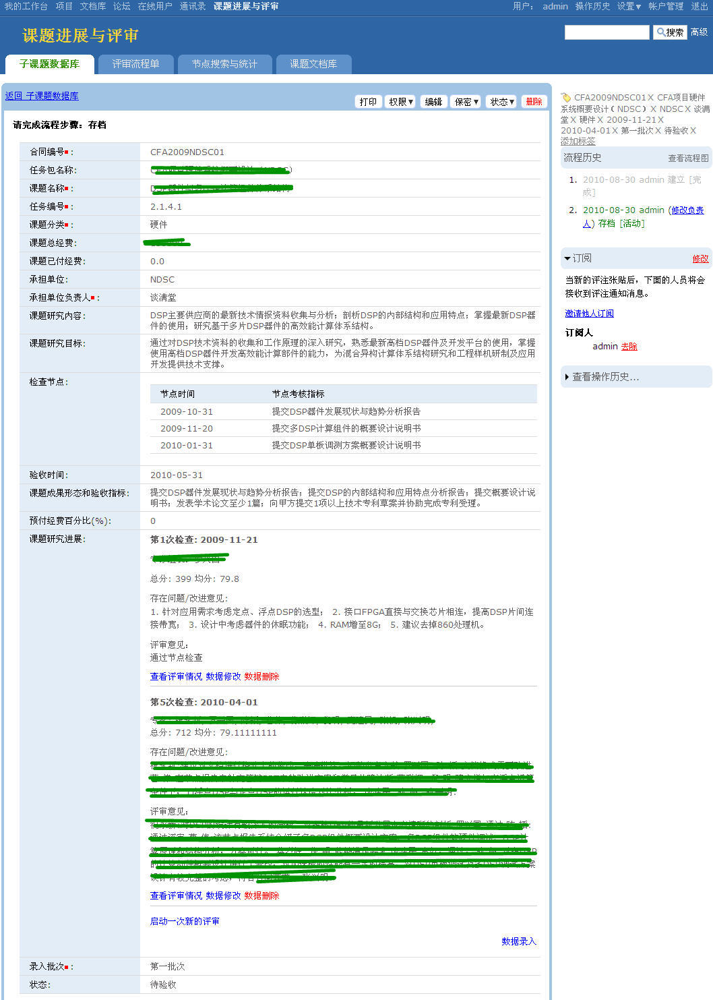
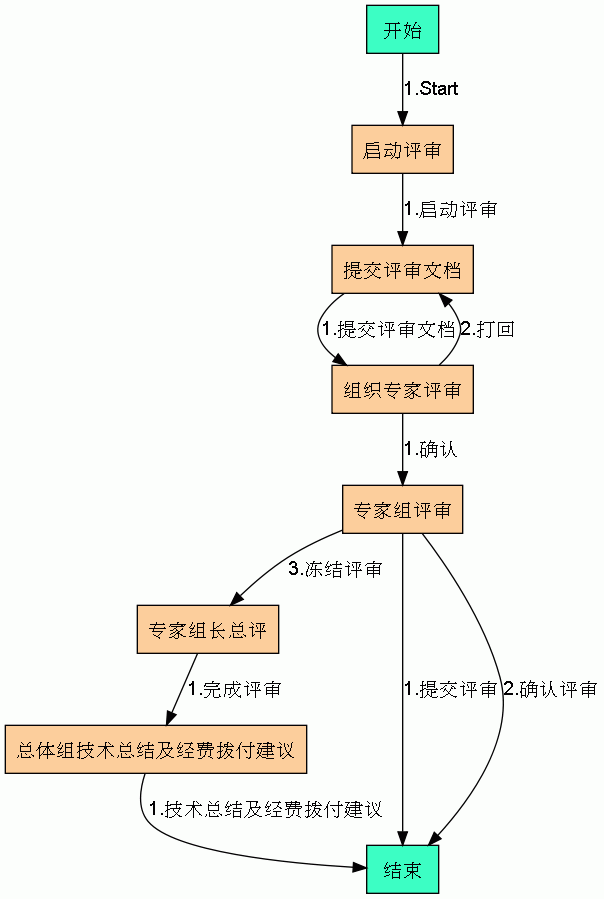
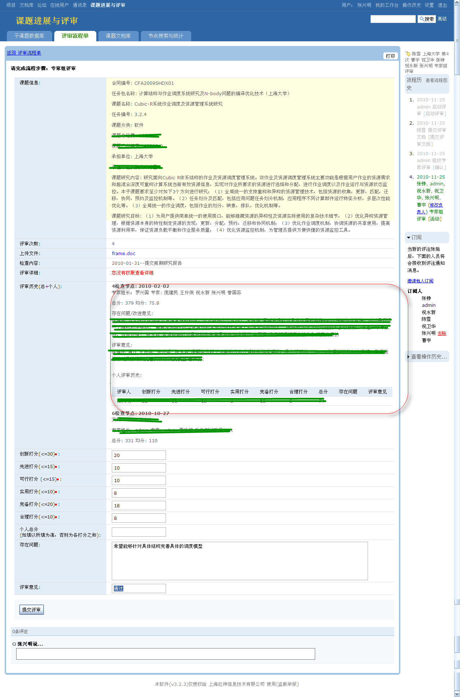

课题评审系统是为国家863某科研项目定制的课题评审系统。分到各高校的科研课题，会定期组织课题评审专家组来对指定的项目进行评审，是一个课题负责人、评审专家组、MT职能组、和管理信息部多方协作的评审协作系统。

子课题库，可从标签组多维多角度来查找课题库。

具体一子课题详细页面，显示出这个子课题的所有字段信息，包括历次的评审进展信息。

组织专家评审的流程图

专家评审界面，专家可看到他上次的评审记录，专家组长可看到所有专家评审信息。
