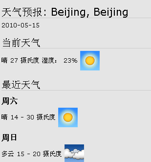

===================================
　天气查看
===================================

虽然人类很强大，但是在自然面前我们还很渺小。
我们必须关注天气，阴晴雨雪，衣裳雨具。好，来易度查看天气吧...

通过查看Google的天气API，了解指定区域的天气。

截图：
=============

设置说明：
=================
在此应用的设置界面，可设置需要查看城市的天气，必须使用城市的拼音。

比如：

- 北京： Beijing
- 上海： Shanghai
- 广州： Guangzhou

源代码
================
因为实在太简单，将源代码(只有一个view.py)帖在这里::

    #-*-encoding=utf-8-*-
    @script_attr(permission='zope.Public',use_template='blank')
    def index():
        """天气

    读取城市信息，显示城市的天气"""

        import urllib2
        location = appletsetting.get('location', 'Guangzhou')
        url = "http://www.google.com/ig/api?hl=zh-cn&weather=%s" % location
        result = urllib2.urlopen(url).read().decode('gb18030').encode('utf-8')
        obj = xmlObjectify(result)

        forecast_information = obj.weather.forecast_information
        print '<h1>天气预报: %s</h1>' % forecast_information.city.data
        print forecast_information.forecast_date.data, ' '
        current_conditions = obj.weather.current_conditions

        print '<h2>当前天气</h2>'
        print current_conditions.condition.data
        print current_conditions.temp_c.data, '摄氏度'
        print current_conditions.humidity.data
        print '' % current_conditions.icon.data

        print '<h2>最近天气</h2>'
        for forecast_conditions in obj.weather.forecast_conditions:
            print '<h3>%s</h3>' % forecast_conditions.day_of_week.data
            print forecast_conditions.condition.data
            print '%s - %s 摄氏度' % (forecast_conditions.low.data, forecast_conditions.high.data)
            print '' % forecast_conditions.icon.data
        return printed

