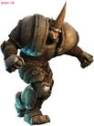

===========================================
游戏，软件
===========================================

最近听朋友在介绍游戏圈的故事，甚为羡慕。

游戏已经产业化了，已经赚钱赚翻了，已经火得不能再火了。

但我并不是羡慕这些，而是羡慕他们的生态圈。在游戏行业：

  **开发和运营是完全分离的**

美术，加策划，加开发，在一起，弄个工作室，花几个月，整出一款游戏。
然后送到专做运营的公司，比如送到腾讯之类的，挂牌运营，赚钱分成。

于是大赚，于是再投钱别的工作室做游戏开发。

多好的良性循环。超羡慕那些游戏工作室了，他们不必哪么关注后续的市场，他们只需要专注到他们的开发就行了。做运营的，也是有大量可选的产品。

这个其实是理所当然的。就如同没有哪个电信公司去生产交换机的，华为和中兴也不做运营。

同是运营模式的SaaS软件业，就差很多。

大部分的SaaS软件公司，在开发的同时，还要考虑整个市场推广和运营，这个太夸张了。

无论是电信的企业领航，还是阿里软件的软件超市，都是因为没有明星产品，多而不精，结果是大家都没有富起来，都是平民，是多输。

市场在等待精英产品，而精英产品的出现需要扶植，需要更多的爱。
这种良性的生态链，需要资本市场的勇敢付出，需要更多锐意创新的开发团队的出现。

应该是钞票的丰实，让游戏开发人员敢于走出来创业，让运营方敢于投资游戏。
似乎钞票还是很重要的，没有钞票，让人的思路狭窄了。

当年web 2.0的风行，让软件走向了用户体验的新时代。

这次web game的风行，能否让软件的开发运营模式也搭一次顺风车？让我们拭目以待。

