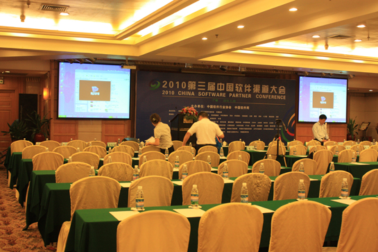
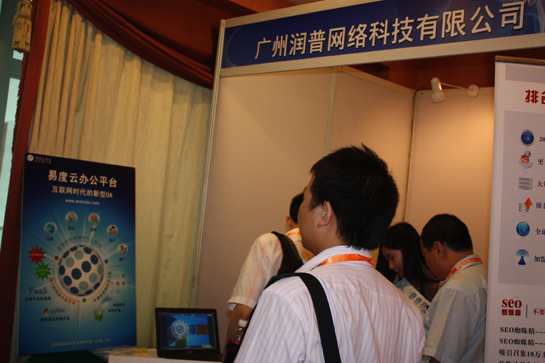
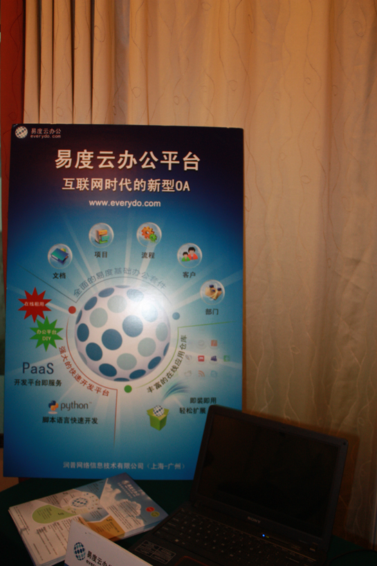
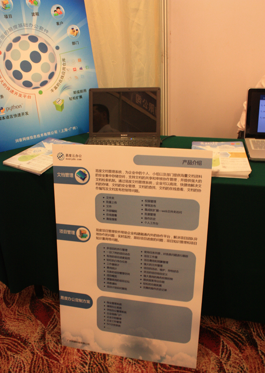
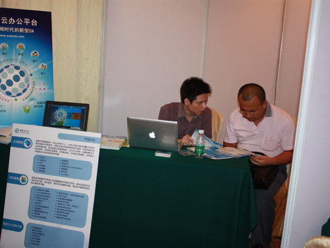

==============================================
易度参展第三届中国软件渠道大会备受关注
==============================================

2010年7月30日，广州润普易度网出席了中国软件网主办的第三届渠道大会，与多个软件名企进行
深度沟通交流，同时也跟众多的渠道商、代理商、分销商交流了关于易度产品定位、产品功能、
渠道建设、渠道推广等多方面的事宜。在这里，非常感谢大家所给润普易度提出的意见和建议。

现在易度网主要有5个基础产品，其中包括：文档管理、项目管理、部门管理、客户管理、流程管
理，还有PaaS的定制化开发平台。同时，还开发了一系列的企业应用以供大家拓展使用。

易度将继续完善其中的产品，把用户体验做到极致。同时，也以“海纳百川”的心态提供多种多
样的渠道策略，让渠道商和代理商可自由选择。

如果您想了解更详细的易度渠道代理内容，请与我们的渠道专员联系。易度将竭诚为您服务。

渠道专员：胡小姐  热线电话：18819273162  e-mail：hyj@zopen.cn

渠道天下，易商共赢
====================
附：本届渠道大会的照片

第三届软件渠道大会会场
----------------------------

润普易度的展台
----------------------------

润普易度的产品展示布景图
----------------------------

