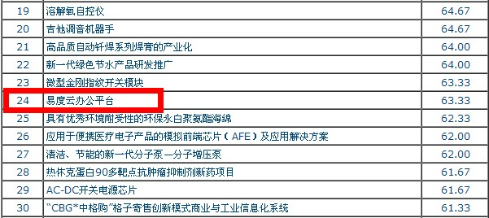
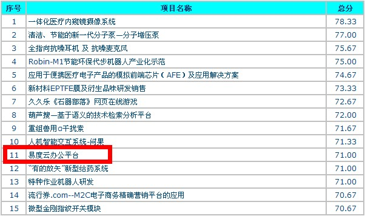

===================================================================
易度云办公平台获得广泛认同，顺利晋级深圳创新创业大赛决赛
===================================================================

自从第一届开始，深圳创新创业大赛就一直备受关注。目前第三届大赛已经进入到了决赛阶段，分为两大组别，并最终决出总计50个优胜项目。
其中，很多初创型企业成为了主角，包括 `易度云办公 <http://everydo.com>`_ 。

为时三日的初赛阶段，易度云办公初分到初创组，评审时间安排在9月2日下午。200多家企业团体参赛，在40个有限的晋级名单中，易度云办公以63.33分排第24位，有惊无险闯进次轮。

|

复赛于9月7日进行，同样是下午，不同的是，易度云办公吸取了初赛的经验，一举取得了71分的良好成绩，毫无悬念挤身决赛圈。

|

易度云办公的顺利晋级，有赖于易度云办公全员的努力和支持，证明了社会企业客户对云办公平台的肯定，云办公平台的理念得到了认同。决赛即将来临，易度云办公也必将更上一层楼，取得更高的荣誉。

