.. Contents::
.. sectnum::

易度文档管理系统支持将个人文档空间以及公司文档控件挂载到一个本地文件夹(WebDAV)。您可以象操作本地文件一样（新建、修改、删除）操作里面的文件，同时，在公司文档目录下，也会有相应的权限控制

在文档系统中，复制拷贝web文件夹目录的地址
==========================================
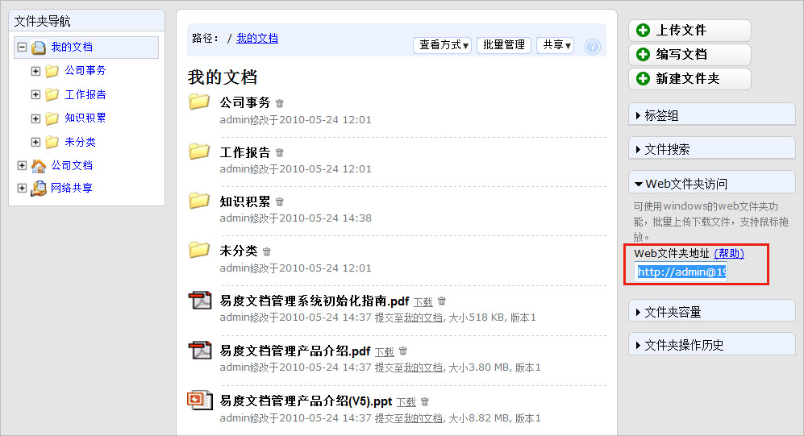

在使用web文件夹访问系统或者需要把系统映射到自己的电脑上时，请预先按照好系统补丁。可在微软官方站点中下载安装，进入 `补丁下载地址 <http://www.microsoft.com/downloads/details.aspx?displaylang=zh-cn&FamilyID=17c36612-632e-4c04-9382-987622ed1d64>`_

该页面截图如下

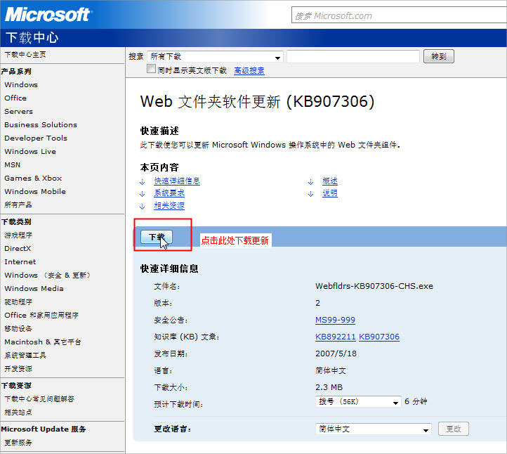

复制web文件夹地址
=======================
在易度系统的文件夹右侧，有一个“web文件夹访问”面板，点击展开复制web件夹地址。如下图所示:

.. image:: ../img/webdav_image3.jpeg

Windows XP/2003用户的设置
===============================

**下面即将介绍Windows XP/2003用户的设置方法，如果您使用的是Windows Vista或者是winows 7系统，请** 点击这里_

进入网络邻居界面，点击左侧菜单中的"添加一个网络邻居
--------------------------------------------------------

.. image:: ../img/webdav_image4.jpeg

点击下一步出现选择一个网络位置。
-------------------------------------

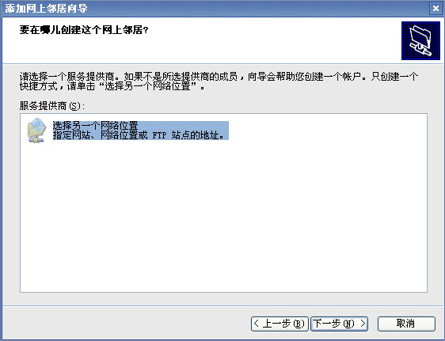

在地址栏输入文件夹网址，直接把2中的web文件夹地址拷贝过来即可
-----------------------------------------------------------------
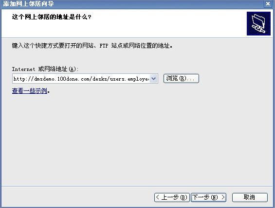

点击下一步，使用合适的名字
-----------------------------------

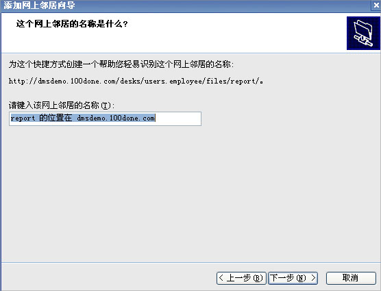

单击完成，输入用户名和密码即可访问
---------------------------------------

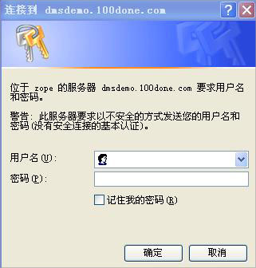

即会出现如下界面
------------------------

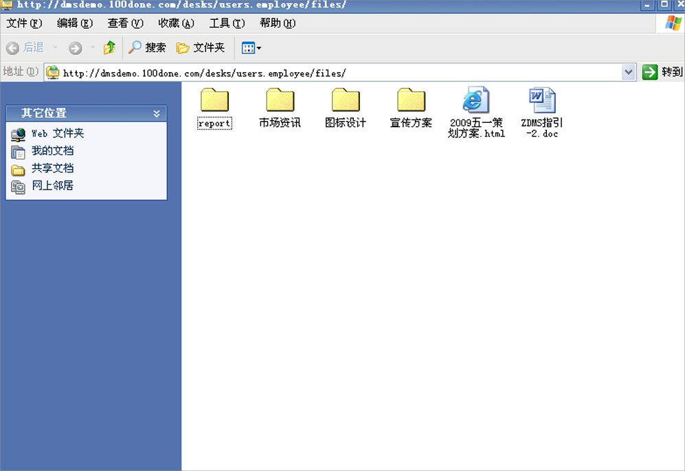

现在您可以通过资源管理器来上传，删除，管理您的文件了

.. _点击这里:

Windows Vista/WIN 7用户的设置
====================================

映射网络驱动器
-------------------
打开开始菜单，右键计算机--选择映射网络驱动器

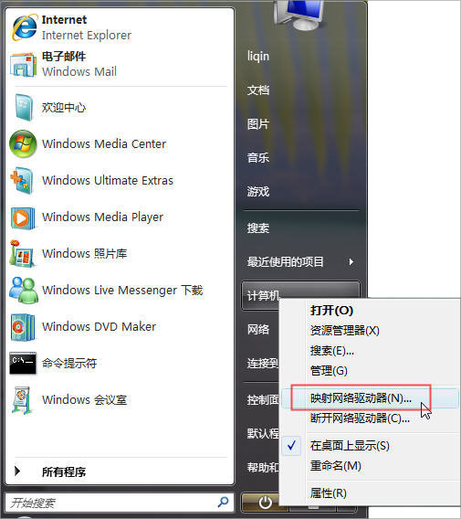

选择-连接到可用于存储文档和图片的网站
------------------------------------------

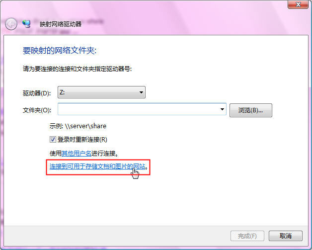

选择自定义网络位置
---------------------------

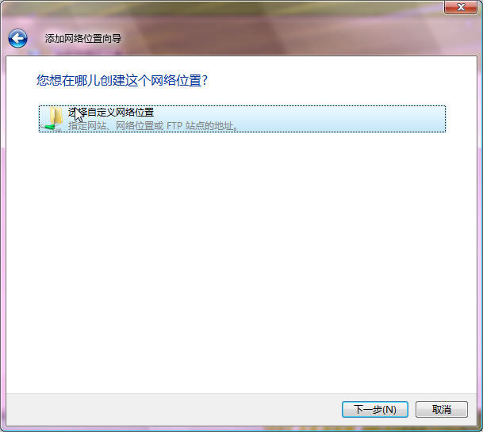

添加网络位置
--------------
粘贴之前拷贝的web文件夹目录地址

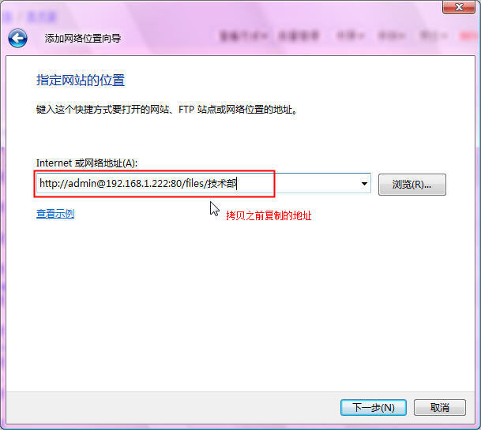

完成网络位置配置
-----------------------

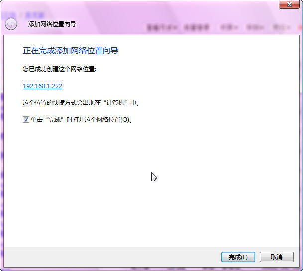

现在您可以通过资源管理器来上传，删除，管理您的文件了。

您可以通过复制/粘贴功能把本地文件复制到Web文件夹。这样也同时会将文档保存到您的个人文档空间。

使用MS Office等软件编辑Web文件夹中的文档，保存后将直接更新您在个人文档空间中的文档。 

.. note::

  注意：当您保存的文件超过个人文档空间大小时，保存将失败。

