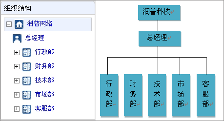
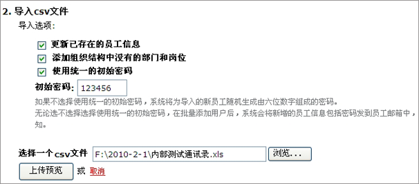
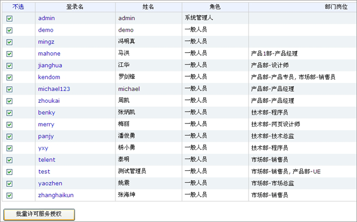
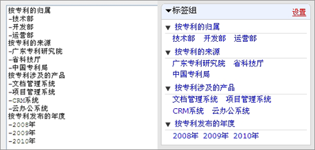
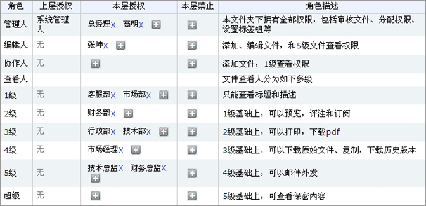

===========================
系统初始化指南
===========================

易度企业文档管理系统，是企业文档的专业保险箱，帮助企业进行文档全生命周期管理：文档的创建、修改、版本管理、审批程序、存储、协作、查询搜索、发布、权限控制等，全面管理好企业的知识资产。

本文是易度文档管理系统的初始化指南，可根据本文的步骤进行系统初始化设置，如在初始化过程和使用过程中有任何问题，可查阅润普公司提供的《易度文档管理系统用户手册》或致电：020-38055596。

以下是进行易度文档管理系统初始化设置的步骤和说明。

第一步：建立好组织架构
------------------------------------------

根据客户公司的实际情况，建立好公司的组织架构。

第二步：导入人员（用户）通讯录
------------------------------------------

使用excel编写准备好人员通讯录，进行匹配数据导入。通讯录的内容如下：登录名（或工号），姓名，邮箱，部门岗位，办公电话，移动电话。（一个用户可以设置多个岗位）。保存为csv文件，整理后批量导入。

第三步：为用户进行服务许可授权
------------------------------------------

只有授权后的用户（员工）才可以使用文档管理系统，可通过系统的批量服务许可授权功能实现用户服务许可授权。

第四步：建立公司的文件夹目录树

根据客户公司的实际情况，建立相应的文件夹目录树，目录树可一层层无限延伸。建立好相关的文档，例如：合同协议、宣传方案、公司制度等。

.. image:: img/image5.png

第五步：设置文件夹分类标签
------------------------------------------

根据文件夹的内容，配置好相应的分类标签，对文档进行多角度分类。

例如“产品专利”的文件夹,可以按照文档的归属：技术部、开发部、运营部等；也可按照文档的来源：广东专利研究院、省科技厅、中国专利局；可以按照文档涉及的产品：文档管理系统、项目管理系统、CRM系统、云办公系统等； 也可以按照文档发布的年度：2008年 2009年 2010年等；

第六步：初始化权限
------------------------------------------

1.谁是具备系统管理人的权限：一般来说，都是总经理和网络管理员才会有的。 如果以后平台信息交给某个人进行维护的话，必须明确指明。

2.主要的文件夹权限设置:根据部门或根据文件夹的属性进行授权管理。需要提供哪个人员或者岗位对这个文件夹具备管理权限 。哪些人具备协作权限，哪些人具备查看权限等 。

备注：以上有些信息并不是一定要提供，只是一般情况下这样去做。

1.例如，如果已经把其他系统通过AD目录集成了，那么组织架构，用户通讯录就不需要了。

2.如果已经了解了权限方面的设置，那么就不需要提供数据进行分配权限了。

