===============
产品介绍
===============

.. image:: img/tour.gif

易度项目管理软件是润普公司面向中小企业，针对项目沟通协作中存在的问题，包括项目计划进度、任务、沟通、工作量、文件共享等，而开发的一款大众型的、创新实用的项目管理软件。

易度项目管理系统产品帮助企业构建融通内外的协作平台，通过使用最新的互联网技术，为项目团队构建网上工作空间，提供了一组工具用来发布消息、共享文件、分配处理任务、跟踪进度，并通过邮件及时通知相关人员，实现了项目成员有效地沟通和协作，最终提升了工作效率，让整个项目过程更加有序。还可以帮企业把项目知识资料沉淀下来，当下次做类似项目的时候，就可以调出项目资料，作为参考使用。

-------------------------------

多项目的并行管理
==========================================
项目首页提供有“项目动态”、“项目进度”、“待办任务”、“工作量统计”、“费用统计”模块，可跨项目的查看相关信息。

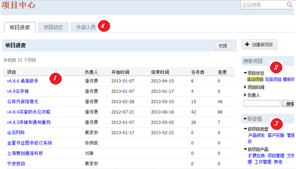

**说明**: 1). 全部项目清单，包括任务和进度情况。2). 可根据项目状态、时间、负责人等进行搜索；3). 自由对项目分类；4). 可查看项目动态、管理项目的外部人员

-------------------------------

管理公司外部人员
================================
可邀请公司外部人员参与项目，让项目打破公司疆界，更好的协作。

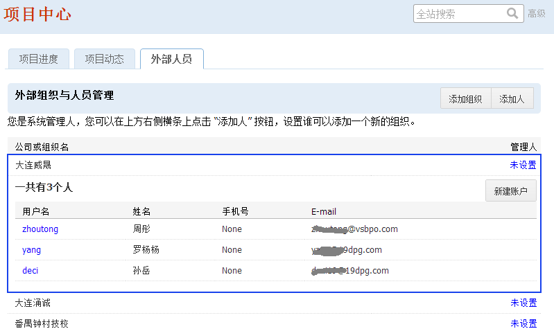

-------------------------------

每个项目的工作空间
==========================================
每一个项目独立分配一个工作空间。

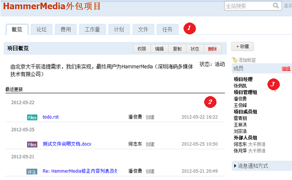

**说明**: 1). 每个项目提供一组管理工具。 2) 最近更新了解项目的最新动态。 3）项目组成员，包括外部人员可以参与。

-------------------------------

项目消息版替代项目邮件
==========================================
代替邮件，发布项目消息，进行项目沟通交流，所有沟通历史自动存档备查。

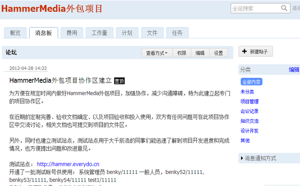

**说明**: 1). 方便进行项目团队沟通，论坛帖子可通过系统消息通知、邮件通知、短信通知等多种方式通知；2). 论坛帖子分类存放，方便查阅历史沟通记录。 3) 如果需要，可设置消息审核和置顶。

------------------------------------

好用的项目计划
======================
项目经理直接在线上制定项目计划，完成后自动分配给负责人执行，实时监督项目进展，对滞后节点进行告警。

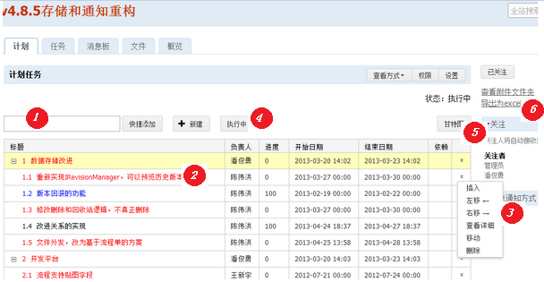

**说明**: 1) 快捷添加计划 2） 可分解的计划清单，滞后红色告警 3）计划编辑菜单 4）制定完毕，启动项目，进入执行状态 5）自动生成甘特图 6）可导出为excel

---------------------

项目甘特图
====================
项目计划，可自动生成甘特图

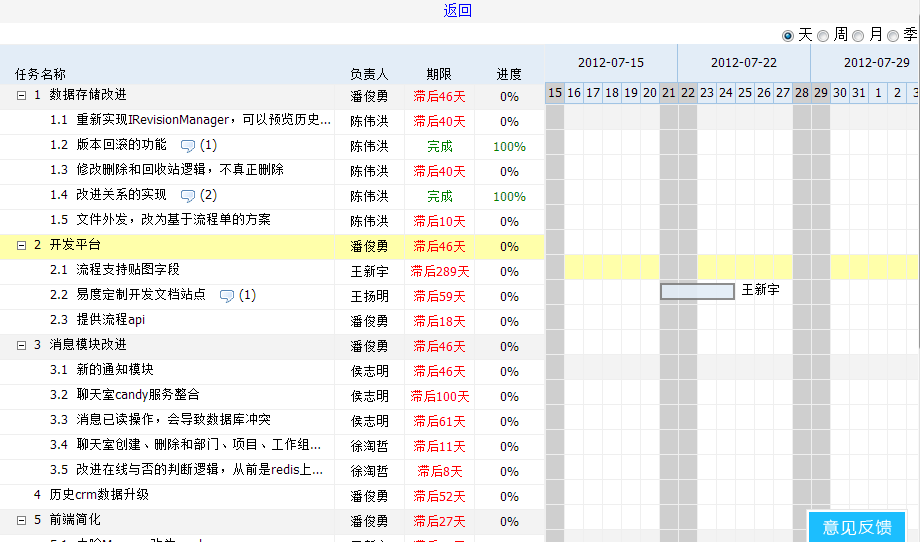

---------------------

项目任务
====================
项目计划执行过程中，一些突发异常，或者缺陷需要跟踪处理，可以直接报告项目任务，进行处理。

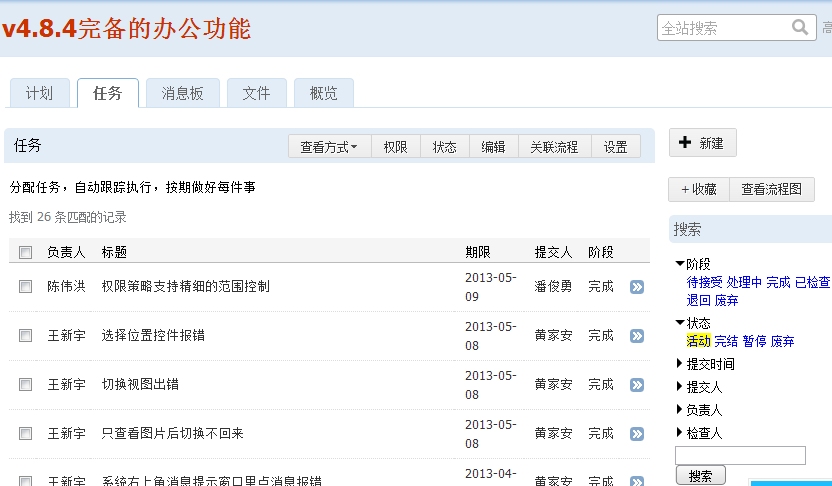

---------------------

工作量
====================
服务性项目，通常是按照工作量进行报价的。系统提供记录工作量的地方。

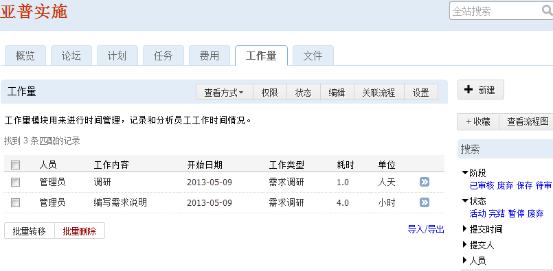

---------------------

项目费用
====================
项目中发生的费用，可以统一记录起来，方便之后核算，更可打印用于报销。

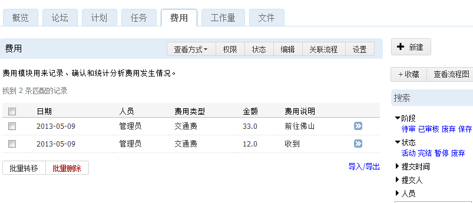

---------------------

项目文件
====================
集中存放项目中各种过程文档和成果文档，用于项目组成员之间共享。也用于项目文件的集中存档。

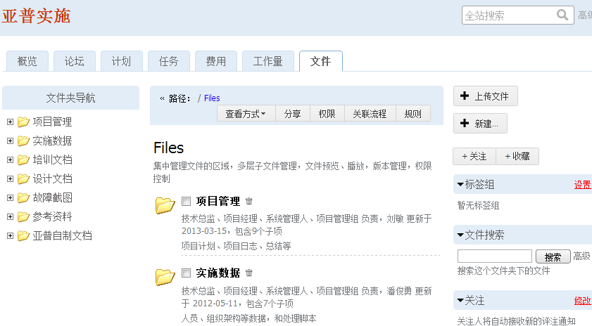

---------------------

我的工作台 - 消息
====================================================
查看所有项目推送的消息通知，可直接回复。

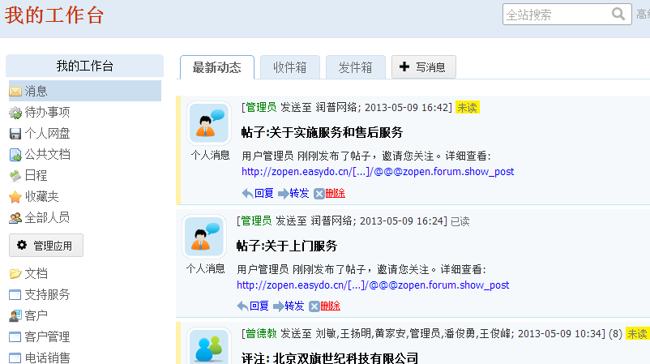

-------------------------------

我的工作台 - 待办事项
====================================================
汇总所有项目中，由我负责的工作，可自行安排每天的工作

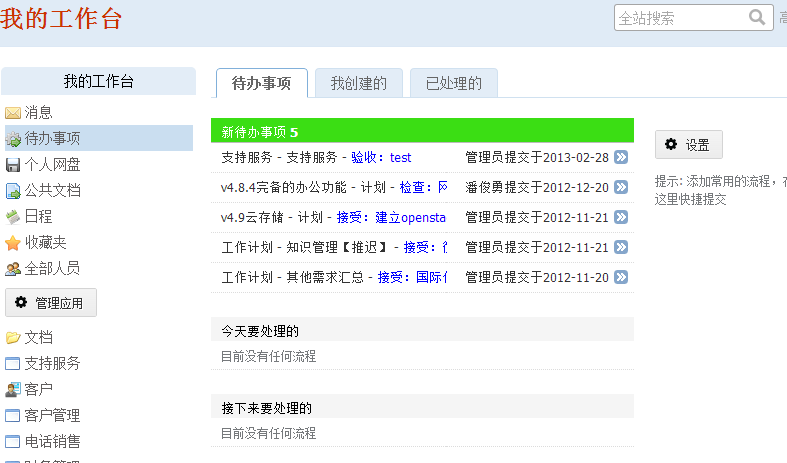

-------------------------------

我的工作台 - 日程
====================================================
日历的形式汇总所有项目中，由我负责的工作，方便每个人安排工作

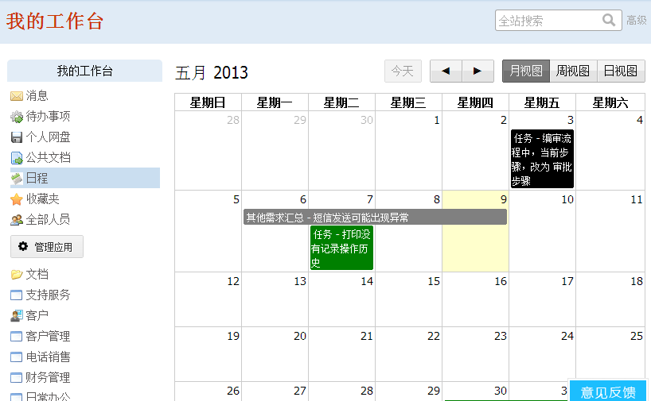

-------------------------------

我的工作台 - 个人档案和部门档案
====================================================
可方便查看其他人的档案，了解其他人的工作情况，方便安排工作。也可以以部门为单位查看部门所有人员的工作情况。

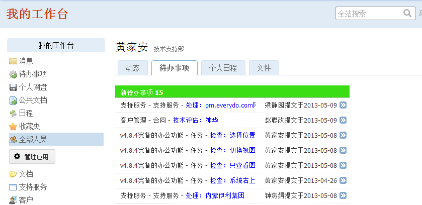

-------------------------------

项目模版
==============
可基于现有项目复制成新项目，也可以设置为模版，并根据模版创建项目，规范化和简化项目管理

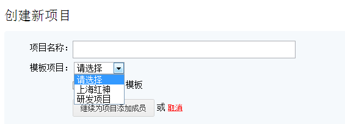

轻松的功能扩展
==============================================
易度是一个应用平台，可在易度应用市场上安装各种扩展应用，部署到项目中。

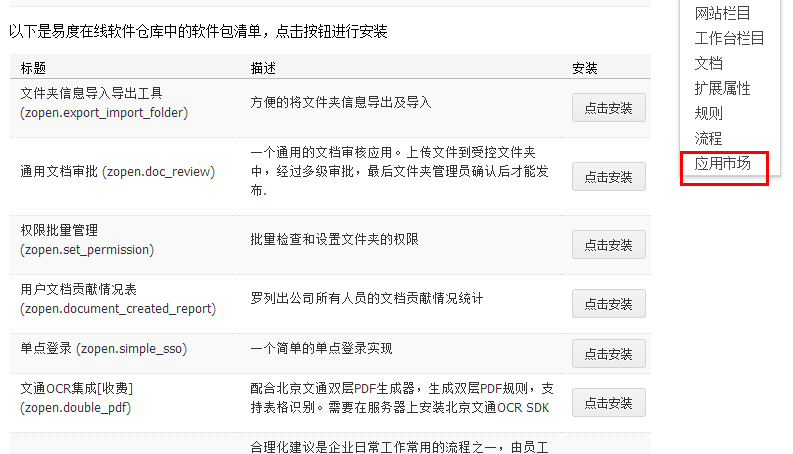

