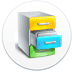
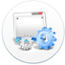

===========================
解决方案
===========================

易度办公平台，具备高度的可定制性，能够轻松定制出各种领域和行业个性化的办公解决方案。

`文档管理 edodocs.com <http://edodocs.com>`__

文档管理是知识型企业信息化的基础。

几乎任何一个业务系统都需要和文档管理集成。
易度文档管理，是和公司各种业务紧密集成的全面文档管理解决方案

`工作管理 pdca.everydo.com <http://pdca.everydo.com>`__ 

提升企业执行力，提升公司的管控能力。

基于戴明环，结合企业矩阵管理制度，建立以计划-任务-报告为核心的工作管理体系。

`项目管理 pm.everydo.com <http://pm.everydo.com>`__

多部门协作，地域分散，项目进度监控、费用工作量控制...

易度项目，包括项目流程控制、项目团队管理、项目执行力、项目资料管理等多方面的整体项目管理解决方案

`企业信息门户 <portal.rst>`__

领导、员工、客户、代理商、合作伙伴，各种应用需求，一个易度，一个入口

易度是一个套件产品，是一个可无限扩展的平台，因此非常适合用作企业信息门户

`企业流程自动化 <workflow.rst>`__

小到请假、报销，大至合同项目审批，您还在走低效的手工流程吗?

通过建立电子流程，让企业管理电子化、规范化，让企业高效顺畅运转。

