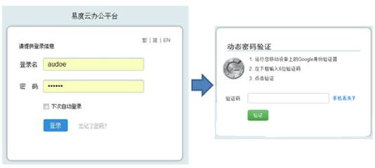
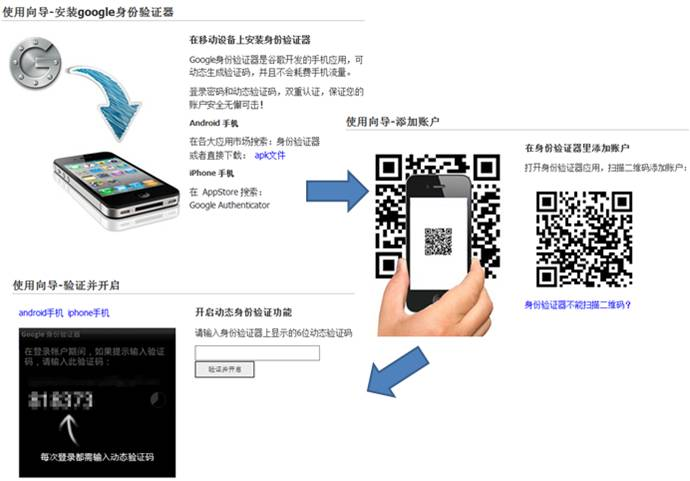

========================================
动态密码验证，新一层信息安全防护衣
========================================

信息系统的安全性，是企业关注的焦点之一。而登录密码作为安全之门，其控制更是重中之重。用户密码一旦泄露，将导致系统信息
安全受到危害，给公司或企业带来一定程度上的经济损失。

考虑到这些，易度在文档管理系统新版本中增加了动态密码登录验证功能。一旦开启这个功能，用户需要输入移动设备上的一个动态
附加密码才能登录，这样，给信息安全增加一层新的防护衣：即使登录密码泄露，攻击者由于没有您的移动设备，仍然无法登录，保证
您的数据安全。

用户可以在账户设置里面开启动态密码认证：首先要在手机上安装Google的身份验证器，扫描二维码和系统帐号绑定，便可生成登录使
用的动态密码。

在使用该功能之前，用户需要先在他的手机上安装一个Google 身份认证器，根据不同的平台的手机，可以根据下面的指引来安装：

1. Android移动设备：

   在手机的应用市场搜索“Google身份验证器”或“Google Authenticator”，下载安装即可。建议通过推荐的市场来安装： `Google Play <https://play.google.com/store/apps/details?id=com.google.android.apps.authenticator2&feature=search_result#?t=W251bGwsMSwxLDEsImNvbS5nb29nbGUuYW5kcm9pZC5hcHBzLmF1dGhlbnRpY2F0b3IyIl0.>`_ 、 `豌豆荚 <http://www.wandoujia.com/apps/com.google.android.apps.authenticator2>`_ 、 `腾讯应用宝 <http://android.myapp.com/android/appdetail.jsp?appid=30880&actiondetail=0&pageNo=1&clickpos=1&transactionid=1377854850182598&lmid=1022&softname=Google%E8%BA%AB%E4%BB%BD%E9%AA%8C%E8%AF%81%E6%97%97>`_ 、 `应用汇 <http://www.appchina.com/app/com.google.android.apps.authenticator2/>`_ 、 `百度移动应用 <http://as.baidu.com/a/item?docid=796992058>`_  等

2. iOS移动设备：

   进入 `iTunes商店 <http://itunes.apple.com/us/app/google-authenticator/id388497605?mt=8>`_ 或者在手机的应用商店搜索“Google Authenticator”，下载安装即可。

3. Windows Phone：

   `点击这里 <http://www.windowsphone.com/en-US/apps/021dd79f-0598-e011-986b-78e7d1fa76f8>`_ 进入window phone的应用市场根据提示安装。

4. 其他移动设备：  

   Symbian或者其他支持Java ME的设备： `点击下载 <http://code.google.com/p/lwuitgauthj2me/>`_   

常见问题：

1.   问：真的只需要安装一个手机应用吗？不需要硬件配合，不需要付费？

     答：是的，是需要安装Google 身份认证器。

2.   问：动态密码的验证，支持哪些手机系统？

     答：几乎所有的系统，包括iOS、安卓、win phone，还有赛班。

3.   问：加解密可靠吗？会不会被破解？

     答：底层技术就不说了，这个是谷歌开发的，是标准，值得信任的。

4.   问：开启动态密码验证，但如果手机丢失，或者没带在身边，我就无法登录系统了吗？

     答：没关系的，你可通过邮箱来重置密码，临时去除动态密码即可。

5.   问：为什么不使用短信，或者动态密码卡？

     答：短信也是一个方案，但手机应用更及时，更现代，更省钱；而动态密码卡涉及分发、维修，非常麻烦已经落后了。支付宝的手机宝令，以及网易的手机安全令牌，都是类似的产品。

6.   问：必须手机上网才能拿到动态密码吗？

     答：不需要的。

7.   问：能强制所有人都必须开启动态密码吗？

     答：不能，每个人可自由设置开启与否，但管理员可查看每个人的开启状态。

