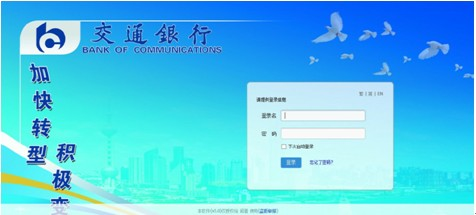

========================================
定制易度登录页面，秀出企业特色和风采
========================================

易度已经成为很多公司日常办公的主要入口，公司内部员工，甚至外部合作人员每天都会使用到。
越来越多的公司提出希望易度的界面能够更加个性化定制，和自己公司的VI形象统一，更好地树立公司的品牌形象。
而作为入口的登录界面，更成为首当其冲的改造焦点。

基于这些考虑，易度文档管理系统在新版本V3.0.50中增加了“用户登录页面定制”功能。下面先看看一个定制效果：

相信这样的一个登录界面，员工能够更快进入工作状态，增加他们的归属感；能让外部客户增强对公司的信心，加强公司软实力；
这种打上公司标签的个性化，也会让公司领导层觉得产品的确属于公司自己的，会更满意。

更重要的是，登录界面的定制非常简单易用，不需要开发人员参与，客户自己即可按需个性化定制。下面，让我们深入了解下： 

1. 首先以管理员身份登录后台，进入“账户管理-站点资料”，在网站LOGO图片的设置的下方，点击“登录界面定制工具”按钮，进入定制界面，

   .. image:: img/log-ui-02.jpg

2. 定制页面非常直观，可实时看到设置效果：

   .. image:: img/log-ui-03.jpg
      :width: 540

   在这里，你可以设置背景图片、背景色，设置是否显示网站标志，并可设置登录表单区域的位置（X/Y代表登录框的区域位置，默认X、Y都居中）
  
以上信息保存之后，你就可以在公司网站登录页面看到设置效果，下面是另外一个例子：
  

