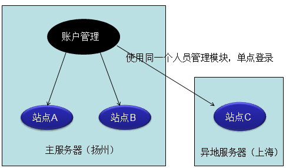
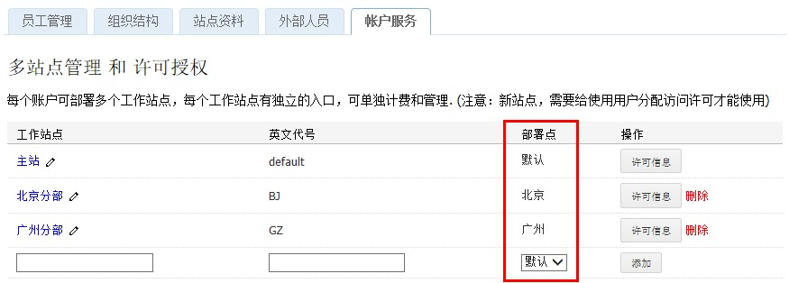
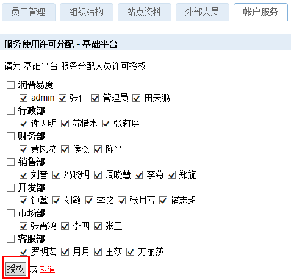

========================================
多站点部署
========================================

随着企业的发展，公司系统使用用户越来越多，内容越来越复杂，单一站点的组织形式，越来越不能满足需求：

- 异地访问的带宽瓶颈问题

  公司下属的分公司或者部门，可能分布异地，当多人并行上传或下载资料，会造成网络拥塞，网络带宽成为瓶颈，访问速度非常慢

- 复杂内容组织管理混乱
    
  各个分公司或者部门，存在个性化的内容展示需求，出于安全性、内容组织管理方面考虑，希望相互隔离，避免相互影响

易度多站点部署
===========================================
易度支持建立独立子站点，根据需要为分公司、部门等建立独立的站点，相互内容分离，并可部署到不同的地理位置。另外，各站点使用统一的账户中心，进行登录、账户和授权管理。

这样的好处是：

- 逻辑上站点完全分离，性能、安全性方面不会相互影响
- 每个站点独立管理，能更好的管理组织内容
- 异地多机分布式部署，就近访问站点更快速，避免带宽瓶颈 
- 使用统一的账户管理，有分有合，用户可以直接在授权的子站点之间进行切换

  .. image:: img/site-deployment02.png

创建子站点
===========================================
管理员需要在文档管理系统的“账户服务”中添加各个分站点，各站点可以部署在不同地区。

如何创建一个新的部署点，比如我希望在重庆分公司再创建一个部署点？
这需要对服务器的配置文件进行设置，操作比较复杂，具体可以和易度支持服务人员联系。

站点访问人员授权
===========================================
系统可对每个人能访问的站点进行限制。点击每个站点的“许可信息”按钮，可以指定站点的使用人员清单，以基础平台服务为例：

小结
===========================================
多站点部署特性，让系统在企业的实施非常灵活，可以不断适应企业发展的各个阶段，满足各种变化的需求，让企业文档和内容管理没有后顾之忧。

