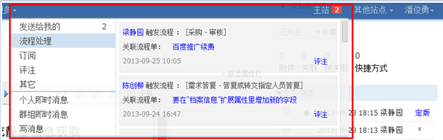
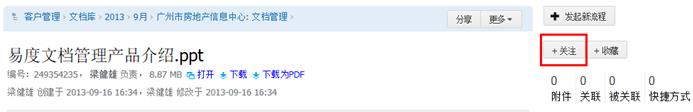
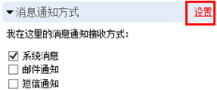
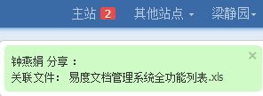
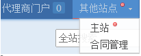

============================
易度消息中心 — 走向企业2.0
============================

传统的管理软件，如ERP、OA等，系统大量信息静态提供，需要员工主动去查询获取，软件显得傻大笨粗，员工使用软件不便，工作效率不高。

互联网上，微博等网络社交软件的普及，提出了基于订阅的个性化消息推送模式，已经成为新的交互标准。这些创新体验设计和理念，如今也逐步引入企业软件，这就是所谓的企业2.0。

.. sectnum::

消息中心概览
=================
易度消息中心，是在订阅的基础之上，对各种消息实时推送，提供分类查看、快速即时处理途径，让易度成为一个信息在员工之间不断流动、不断被处理的高效动态系统。

消息中心位于页面上方右侧，随时可以访问：
 

对收到的消息自动做了清晰的分类：

- 发送给我的：包括分享的文档、流程单通知和张贴帖子的通知信息；
- 流程处理： 新的流程单任务需要处理的通知；
- 订阅： 关注的文件夹上传新文件，或者关注的流程提交新流程单；
- 评论： 关注文档或流程有了新评论；
- 其它： 新版本等其他通知消息；

信息的流动和处理有多快，就意味着公司的工作效率有多高。新消息中心上线之后，很多用户感觉系统变得更轻、更智能、更友好了： “不断有新的消息飘过来，自动帮我分类整理好，消息直接附带着文件或者表单，完全不需要页面跳转，我就能处理好各个工作事项，比从前的邮件系统强大多了”。

通知消息的订阅
========================

大部分通知消息，用户需要预先订阅才可以收到。订阅是通过对内容的关注完成的。

 
如上图，关注的对象包括文档、文件夹或流程单流程等。一旦关注，新增评论会通知；如果关注对象是文件夹或流程，则会收到新文件或新流程单的通知消息。

技巧：如果接收过多，不想继续接收相关消息，取消关注即可，用户可自由掌控接收消息的数量。

通知途径
================
易度消息的通知途径包括系统消息、邮件通知和短信通知。默认采用系统消息通知方式，每个人可以根据自己的需要调整，非常灵活。如果是管理员，也可以调整默认的消息通知方式。

 
技巧：对于非订阅的通知消息，如果用户不希望被“骚扰”，去除内容所有的通知途径即可。

系统消息提示方式
=========================

系统消息是最基础的通知途径，提供两种消息提示方式：一种是消息实时“飘过”，如下图；另一种是红色数字提示具体消息数量，包括每个分类的消息数量。离线消息，在下次登录的时候也会相同的提醒。

 
通知的处理
====================
系统通知的处理，非常便捷，无需页面跳转，就可：

1. 快速评论回复，评注的内容也会实时回复给该消息的关注者。

   .. image:: img/notify-reply.png
 
2. 点击管理的内容（文档、流程单等），弹出详细页面进行处理，关闭后可继续处理其他消息。

   .. image:: img/notify-pop.png
 
跨站点实时通知
===============
对于规模比较大的公司，可以分不同站点管理公司业务。我们提供了跨站点实时通知功能，即便没有登录到其他站点，也可以接受到通知，这样确保消息即时收到不遗漏。其他站点如果有新消息会以红点提示，详细通知情况可以进入到具体站点查看。

