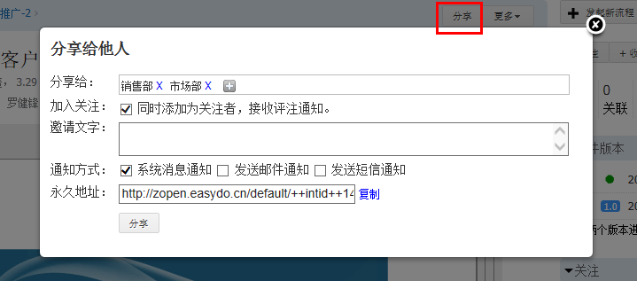
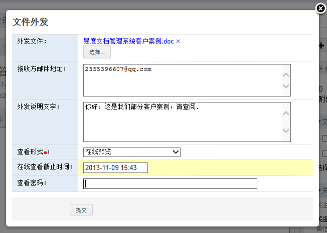
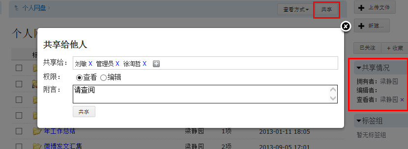
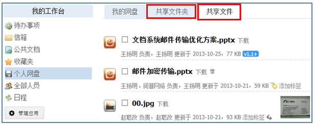
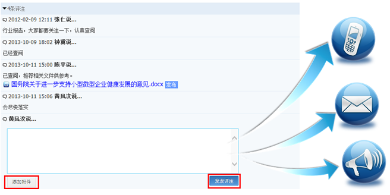

===============================
文档的分享和讨论
===============================

.. sectnum::

传统的文档分享、讨论，需要借助邮件、即时通讯等途径进行。这两种途径操作体验差，难以追查文档的讨论历史，容易形成文档分散泄密，而且很容易大量占用企业有限的网络带宽。

易度文档管理，建立了一套便捷、安全、可追溯的云端文档分享讨论机制。

文档分享
------------------------
在文档库中，看到一个文档，就可以快速分享给公司内的其他人：

分享一个文档，并不是将原始文件发给对方；而是发送文档链接，并授权。这样：

- 不会造成网络拥塞
- 即便分享之后有修改，也会立刻看到最新版本
- 如果仅仅允许在线查看，可避免接收者因下载而失控泄漏

通过文档分享，可确保文档分享之后仍然是集中存储和管理，避免文档分散。另外，系统还支持批量文件分享和文件夹分享。

邮件发送
---------------------------
通过文件外发流程可以把文件以邮件形式发给公司外部用户。

文件外发的时候，同样可以仅仅发送一个文档的链接。如果服务器在公网开放，他无需系统帐号，就可以在线查看。可设置“查看密码”和查看期限，保证文件安全性。如果接受方不能访问系统，也可支持直接邮件发送文件到用户。

有些公司对外发文件控制非常严格，可能需要专人审核才能外发。这样外发可以设置审批人，经过审批人通过之后才能外发。

个人网盘的共享
------------------------------
个人工作台的“个人网盘”用于存放个人的资料，在这里可以更简单的进行文件夹分享协作。

在个人网盘中，点击“共享文件夹”可以查看别人共享给我的文件夹，点击“共享文件”可以查看别人共享的文件：

文档的讨论
------------------------------------
系统支持评注功能，用户可直接在相关文档、论坛帖子、活动主题等下方进行评注讨论。

- 关注文档的用户，可收到评注信息 
- 一旦评论，自动关注文档
- 评注的同时，可以添加上文档相关附件

