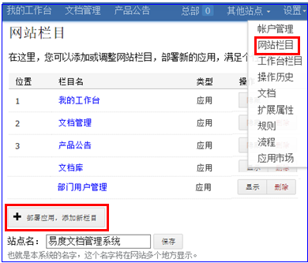
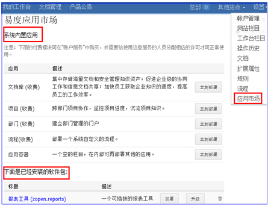
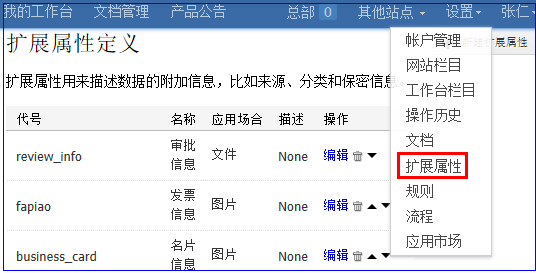
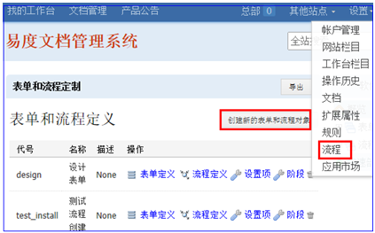
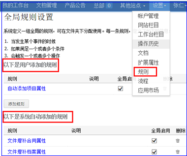

===============================
系统定制
===============================

.. sectnum::

每个企业的业务和管理都不同，对系统的定制扩展能力要求比较高。这是所有企业软件的一个共性。易度强大的可定制性，是易度与业内其他产品的重要区别。

易度的定制非常容易，普通用户就可以掌握。通过定制，易度产品会更加符合用户的实际需求和使用习惯，和企业的管理模式相融入，让软件更加“贴身合脚”。

主要包括定制系统栏目、扩展属性（元数据）、规则、表单和流程、以及开发易度扩展软件包。

栏目定制
-----------------------------------------------
网站栏目是网站功能的入口，一般位于网站左上方，包括顶层栏和当前应用栏。

系统可以方便地添加一个新栏目，或者删除现有的栏目，调整栏目的顺序。

大部分栏目都是一个应用，可在应用市场中部署新应用，来添加新栏目。

应用市场
-------------
易度在线应用市场包括近百种扩展应用，用户可以按需选择安装。

可部署的应用包括2种：

- 内置应用: 易度自身维护的，包括文档、项目、部门站点、工作组、流程、容器等。
- 扩展应用: 大量第三方者提交的应用。

  扩展应用是建立在易度在线开发平台基础上的。开发者可以利用易度的开发平台方便的开发新应用。

扩展属性的定制
--------------------------------------
扩展属性即元数据，是用来说明一个对象（文件、文件夹）的额外属性。通过记录这些属性，可更全面的描述对象和更方便的检索对象。具体会在文档、文件夹、系统扩展设置三个地方使用。

表单和流程定制
-----------------------------------------
流程是一个重要的定制模块，使用该模块，可将日常办公流程电子化。典型的比如请假、会议室申请、文档审批等。用户在系统中定制的流程表单，会根据预先设定的流程逐层审批确认。通过流程部署，将预先定义的流程投入使用。

任何流程，都会附加一个表单，表单的内容要求自定义。

规则定制
------------------------------------------
使用规则，可将一些特殊的逻辑附加到系统中。目前仅文件夹支持规则的控制。只要文件夹中有对应的事件被触发，就会自动执行相应规则。例如：

- 某个文件夹不能上传.exe的文件
- 某个文件夹的总容量不能超过1G
- 某个文件夹上传文件，自动变成保密
- 某个文件夹上传图片后，需要自动进行OCR扫描识别

具体来说：由系统管理员预先定义一组规则或通过扩展软件包来安装，然后各个文件夹的管理员，将规则分配到文件夹下。

