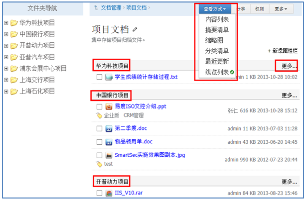
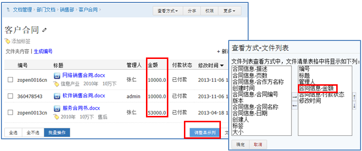

===============================
文件夹管理
===============================

.. sectnum::

系统文件存放在云端服务器，文件夹是文件的基本组织和管理单位，系统中所有文档都存放在文件夹内。

不同的内容，有不同的组织和管理需求。比如项目文件、图片、音视频、合同等，管理和展示方法都不相同。系统文件夹可以很好的适应这些内容的管理。

创建文件夹
-------------------------------------
系统支持几乎无限层次树状文件夹结构： 

.. image:: pic/folders-show01.png
   :width: 450

某些文件夹，比如项目文件夹，可能企业对文件夹结构、授权等有明确的规范。这些文件夹，可以预先设置为模版，这样可以基于模版进行创建文件夹。新建文件夹会直接继承模板文件夹的结构和权限等设置。大大简化文件夹的创建，并减少出错可能。

文件夹的查看方式
----------------------------------
系统提供多种文件夹查看方式：

多样化的查看方式满足不同客户的多种需求：

- 内容列表: 经典的文件夹表格查看方式，功能最全，可对文件夹排序
- 摘要清单：展示文件更多信息
- 缩略图：适合图片的查看
- 分类清单：按照标签组分类一目了然的查看所有文件，并可拖放进行分类，适合数量不多的文件。
- 最新更新：查看文件夹下所有文件的最新更新。
- 纵览列表：分子文件夹查看最近更新文档。

文件夹排序
------------------------------
如果用户觉得现有文件夹顺序不合理，那么可以直接拖动文件夹进行上下移动。

定制显示列
--------------------------------------
内容列表查看方式，可以定制显示列。比如，存放合同的文件夹，可以直接展示合同金额等信息：

文件夹批量操作
-----------------------------
文件夹批量操作是对文件夹进行管理的重要方式。先选中需要操作文件夹，然后进行重命名、移动、复制、创建快捷方式、删除、打包下载或批量编辑扩展属性。不但节省时间，而且大大提高工作效率。

.. image:: pic/folders-show05.png
   :width: 530

文件清单导入导出
----------------------------------------------
每个文档包括大量的扩展属性信息。传统使用excel来管理文件这个清单，
这样方便进行批量更新，方便进行统计分析和报表制作。

易度可方便导出和导入xls格式的文件清单：

如果需要批量修改扩展属性，可先导出xls文件，批量修改属性后再导入系统。

如果只有一个文件清单，但是文档还没有电子化，也可以修改为这个格式后直接导入。
这样可以自动创建空文件，日后再逐个补充电子化版本。

