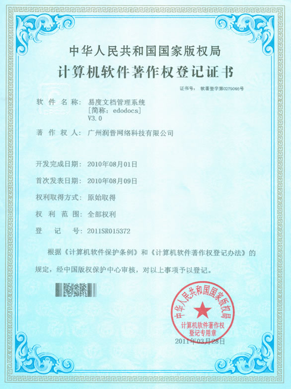
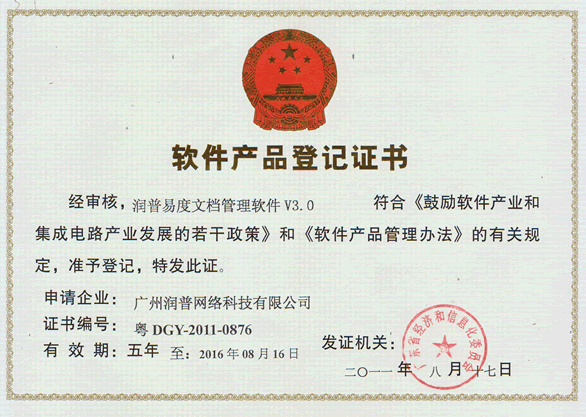

========================
资质荣誉
========================

.. raw:: html

	
	

`易度文档管理系统 <http://www.edodocs.com>`_ 向企业提供了一个实用，安全，高效的文档管理软件。企业可以集中存储和管理海量的文档和知识资产，解决企业文档管理6大基础难题。

通过易度文档管理系统，全过程地管理文档的编写、审批、协作等流程；企业可以实施严格而灵活的权限设置；各类文档在线预览和下载，快捷方便；系统地管理文档，快速查找，轻松使用......

获得认证证书，肯定了易度，这是一种信任和认可，易度文档管理系统将会更加精细，更加强大！

文档管理软件著作权登记证书
============================

易度文档管理系统，通过了中华人民共和国国家版权局登记认证，获得了计算机软件著作权登记证书。

文档管理软件产品登记证书
============================

易度文档管理系统，通过了广东省经济和信息化委员会登记认证，获得了软件产品登记证书。

