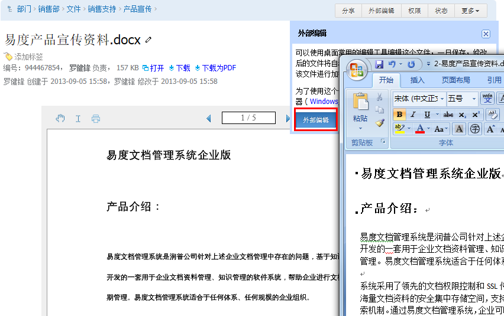

---
created:
creator: ''
description: ''
title: 功能总览
---

==========
功能总览
==========

随着企业发展，企业存在大量业务文档、知识资料，这是企业重要的知识资产。通常这些文档分散存放在共享硬盘、移动硬盘或者员工的自己的电脑中，通过邮件、即时通讯工具来传播和协作，文档版本混乱、不易查找，审批效率低，而且人为或者磁盘故障容易导致文档丢失和泄漏。

`**观看视频: 《易度快速入门》** <flash/>`__ 

-------------------------------

文档云端集中管理
================================
易度文档管理系统，将文档集中安全存储在文档服务器上，建立一套以服务器为中心的文档组织、使用、协作、监管机制，并支持文档的安全和流程管控，让企业文档管理更方便、更高效、更安全、更规范。

.. image:: picture/tour-arch.png
   :alt: 云端的文档协作和管控

-------------------------------

个人网盘和公共文档
================================
每个用户在服务器上分配一个个人网盘，可以相互共享文档；公司的公共文档，可分多个栏目来组织，通过权限来控制用户的使用。

-------------------------------

文件夹
================================

管理文档的基本单位，文件夹支持任意层级，提供文件夹结构模版。

**说明**: 1) 便捷的文件夹操作栏； 2) 快捷的文件上传、在线编写、新建文件夹按钮； 3) 标签组提供多维度、多层次的文档分类检索机制； 4) 搜索文件夹内的文件； 5) 记录文件夹所有文件的操作历史（上传、下载、删除等操作）

-------------------------------

文档
==========================================

强大的文件管理，包括上传、下载、修改、权限管理、保密管理及评注订阅等

**说明**: 1). 控制文件的各种权限、进行外部编辑等；2). 保密文件，未授权用户无法进行查看；3). 文件版本上传和附件上传；4).文件版本管理。提供获取历史版本功能、支持版本差异比较、删除历史版本及定版功能；5).记录文件的所有操作记录（上传、下载、删除等操作）

-------------------------------

文档在线查看
==========================================
无需安装任何插件，系统除支持文档预览外，也支持图纸、压缩包在线预览，支持音频、视频的在线播放；

**说明**: 1).PDF在线翻页预览；2).表格文档在线预览；3). 图纸在线预览；4).视频在线播放；5).音频在线播放

-------------------------------

文档搜索
====================================================
支持中英文全文搜索，直接搜索常见文档(包括CAD图纸)中的文字.  基于位置、时间、人员、包含文字、标签等多条件组合搜索。 配合OCR组件，可对识别图片中的文字进行搜索

.. image:: picture/tour-img013.png
   :alt: 高级搜索

-------------------------------

文档云端创建
==========================================
直接创建各种格式的文档，也可选择公司内部的文档模版进行创建。直接支持HTML、Markdown、reST等格式化文档的在线编写。

-------------------------------

文档在线编辑
==========================================
提供在线编辑功能，实现文档编辑和桌面编辑器(如word、Excel等)的无缝集成。编辑完成后，外部编辑器会自动在后台将文件上传到服务器

**说明**: 1). 直接进行在线编辑，自动管理文档的修改锁；2). 编辑完成后，外部编辑器自动在后台将文件上传到服务器

-------------------------------

文档版本
==========================================
文档可以保存文档的多个版本，并可比较文档版本之间的差异。

.. image:: picture/tour-versions.png
   :alt: 文档版本比较

-------------------------------

自定义属性(元数据)
==========================================
用户可以自定义文档的属性、更完整的描述文档

-------------------------------

文档分享和讨论
==========================================
替代笨重的邮件，直接可以对文档进行分享和讨论. 可分享到公司内外人员，使用内部消息、邮件、短信进行通知。

-------------------------------

文档发布
=================================================
三种文档发布状态: 编写、待审、发布。一旦发布，禁止对文档的修改，实现文档保护。

-------------------------------

文档关联流程
========================================================
系统提供一组文档关联的流程，如审批、借阅、分发、收回、废止、回顾等，通过流程实现文档管理的规范化。流程可以灵活定制。

-------------------------------

个人工作台: 个人的工作中心
==================================
以个人为中心，组织系统内容。 不用离开个人工作台，快速定位需要的内容。

**说明**: 1).个人工作台—消息；2).个人工作台—文档，包括待我审核的文件、最近提交和共享的文件；3).个人工作台—收藏；

-------------------------------

文件夹和文档授权
========================================================
提供精细、易用的权限控制，可进行授权委托管理、权限继承、成组授权、和7级查看人机制

**说明**: 1). 7级查看，控制预览、添加、编辑、移动、复制、下载等权限；2). 可针对某个部门、某个岗位进行成组授权，；3). 禁止某人权限

-------------------------------

操作历史
==========================================
每一个文档的所有操作都会记录进操作历史，方便进行安全检查. 同时，删除的文档，在这里可以还原。

-------------------------------

系统安全策略
==========================================================
系统管理员更加灵活的设置系统安全策略： 1)公司外访问禁止下载 2) 屏蔽系统外发功能 3) 技术资料，仅仅在技术部门的网段可以访问

-------------------------------

桌面防泄密 – 离线文档安全管控
==========================================================
文档下载到桌面后，仍然可以进行安全管控，原理如下：

-------------------------------

开放API：连接各种软件和设备
==========================================================
易度提供FTP、WebDAV等标准文档访问接口，并支持IMAP邮件附件的读取，和扫描仪、传真等设备直接连接，并可和企业OA、ERP、CRM、项目管理软件集成，直接将易度和各种文档来源进行连接。

-------------------------------

全终端全平台终端随时随地访问
==========================================================
支持各种浏览器，支持Mac、Windows客户端，支持各种只能手机和平板电脑的访问。不论你在哪里，都可以快速访问易度文档管理。

-------------------------------

近百种扩展插件
==========================================================
易度文档管理系统提供完整二次开发平台，可根据需要自由安装和定制插件，扩展系统功能。在易度应用市场中有近百种插件供选用。查看文档相关的 `扩展插件 <apps.rst>`__

**说明**: 1).选择“设置”-“扩展应用”；2).可对已经安装的扩展插件部署到系统当中；3).插件会不断升级完善；

-------------------------------

成熟的领域应用方案
==========================
针对不同的文档管理需求场景，易度提供定制的文档管理应用.
具体包括：1）部门文档共享 2）企业档案管理 3）技术文档和图纸管理 4）项目文档管理 5）ISO质量体系文件管控 6) 合同管理 7) 进出口网关 8) 无纸化办公 9) 文档影像管理 10) 企业知识库 等

-------------------------------

灵活的部署架构
==========================
随着公司业务和规模的成长，系统能不断调整适应. 系统支持部门级、公司级、集团等多种组织的使用。

--------------------------------

`**观看视频: 《易度快速入门》** <flash/>`__ 
