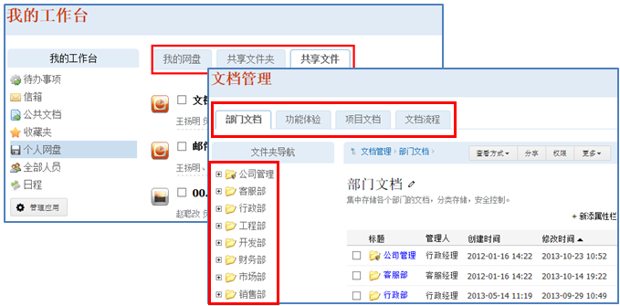
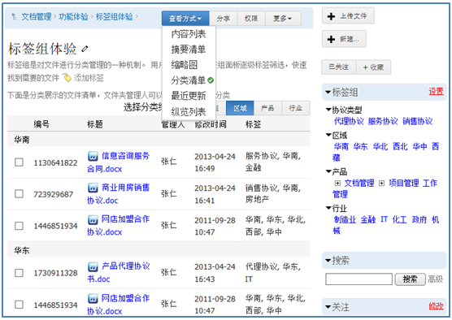
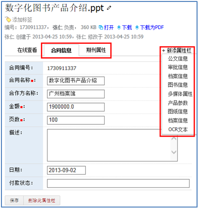
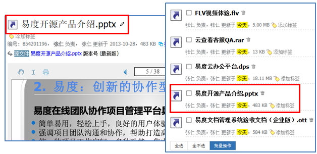
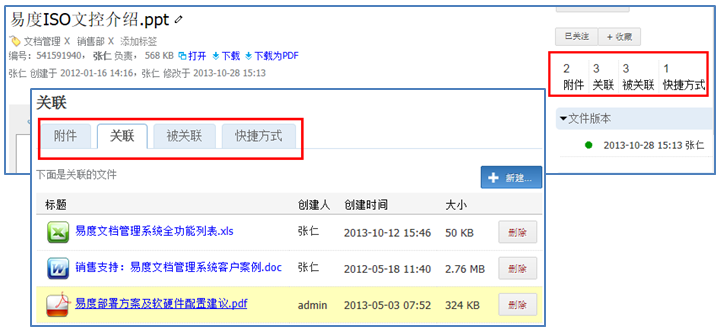

===============================
云端文档的组织
===============================

.. sectnum::

系统中所有文档集中安全存放在云端服务器上。服务器上的文档组织，除了常见的文件夹、快捷方式等功能外，还可以方便进行分类、关联、记录文件属性。

个人网盘和公共文档
-------------------------------------
所有文档存放在文件夹中，支持任意层级，总体分 “个人网盘”和“公共文档”2类：

- 个人网盘：每个用户一个，自行负责管理，用户相互之间可以共享文档。
- 公共文档：系统初始化的时候统一规划，是整个企业公共的文档存放区域。公共区的文档，可以多栏目形式组织。

对于文件夹有固定的结构，可以使用系统的文件夹模板功能，成批创建。

标签组和分类清单
----------------------------------
所有文档都可以通过标签组来设置所属分类。标签组用作对文件夹下文档的分类设置。文件夹的分类清单查看页面中，可以按多个分类维度，分组查看文件清单；查看同时，可拖动文件，调整文档分类。

文档扩展属性（元数据）
------------------------------------------
系统提供多组文档扩展属性。用户可按需自定义文档扩展属性附加在文档之上，让文档更容易分类、检索和实现规范化管理。

快捷方式
-------------------------------------------
快捷方式主要是将一个文件或文件夹放置到多个地方，可批量打包下载。方便用户更灵活的组织内容。

快捷方式可以执行到文件的最新版本，或者指向到文件的某一个特定版本。

文档之间的关系
-----------------------------------
文档可以相互关联，可自由设置文档的关系：

- 附件关系：附件是主文件的一部分
- 关联和被关联：通常指文档参考的其他文档清单
- 快捷方式：文档的快捷方式

另外，在同一文件夹下，相同标签的文档会自动关联。

存储和备份
---------------------

简单存储
.....................
文件存储越复杂，获取文件依赖的组件越多，导致文件获取失败的风险就越大。

易度采用简单文件存储，文件直接存放在文件系统上，其存放结构和通过浏览器所管理的文件结构完全相同。

与传统其他供应商的存取方式相比，易度这种存储方式可保证文档存储的风险最低：

- 文档的存取不依赖于任何数据库系统，不会因数据库系统的故障而导致数据丢失；
- 文档的存取不依赖易度文档管理系统，即便易度系统出现故障，仍然可通过传统的途径管理文档库。

自动增量备份
.....................
易度默认采用rsync备份软件，通过定时脚本，对文件进行自动增量备份。数据库的备份，也是通过定时脚本，自动增量备份。系统默认可恢复至最近2周任何一天的数据。

