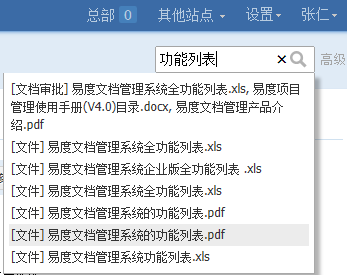
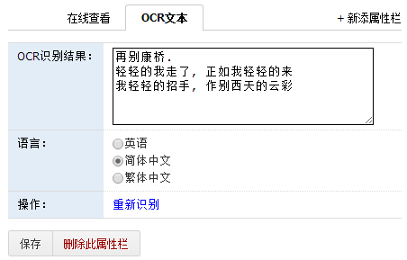
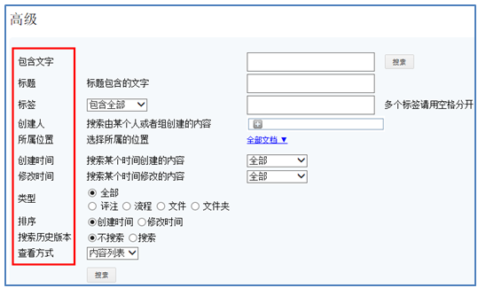
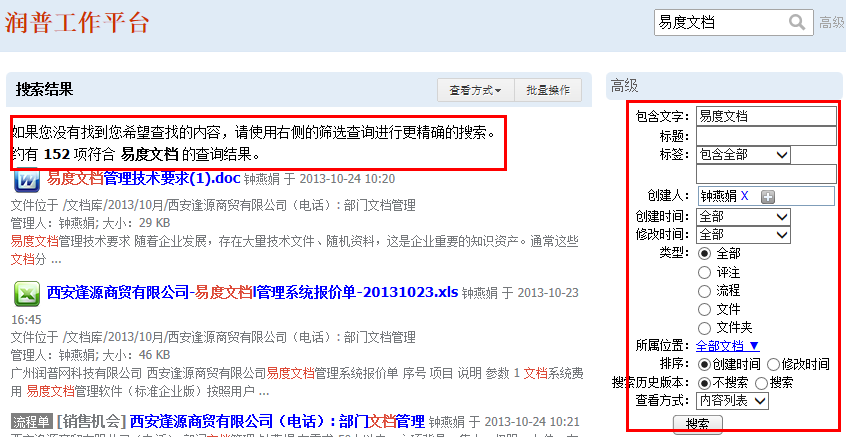
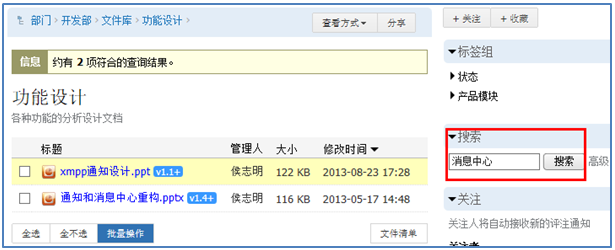
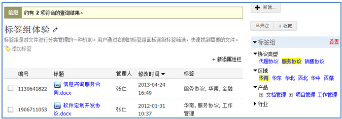
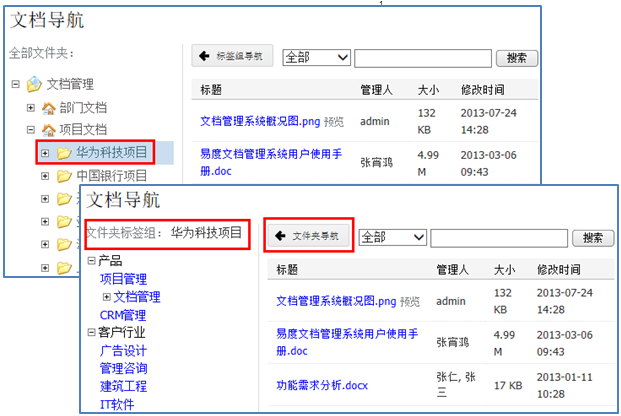

==================================================
搜索查找
==================================================
.. sectnum::

谷歌、百度等互联网搜索引擎，已经成为互联网上内容获取最有效的途径。企业的海量文档，同样需要提供类似便捷的搜索途径。企业文档搜索在安全性、搜索精确性、可搜索文档类型方面有更高的要求。

针对这些需求，易度系统提供了强大的文档搜索查找功能，包括：实时搜索、全文搜索、高级搜索、标签组搜索、文档地图等。

实时搜索
===========================================
实时搜索功能让用户在输入搜索内容的同时，自动根据标题匹配显示搜索结果。这样无须页面切换，便可找到自己想要的内容。

实时搜索，主要对标题进行搜索，更可对标题中的英文字母进行搜索匹配（如搜索works，可搜索到solidworks）。

全文搜索
===========================================
在网站右上角实时搜索，如果得不到结果，回车可进行全文搜索。全文搜索除了搜索文件标题，还会对文件内容中包含的文字，以及文件描述等其他属性进行搜索。

所有能够在线预览的文件，现在基本上都能够进行全文搜索，包括：

- 文本文件
- Office文件、PDF文件
- CAD文件的文字
- 压缩包包含文件的文件名

全文搜索支持全世界各种语言，如：中、日、韩、英语、日语、俄语等。

OCR图像文字的识别搜索
==========================================
文件夹一旦设置OCR文字识别规则，会自动将文件夹内上传图片中的文字识别处理，存放到图片扩展属性中，并可用于全文搜索。

系统OCR识别，支持中文、繁简体以及英文的文字识别。

高级搜索
==========================================
利用高级搜索可以进行更精准的搜索查找，包括位置、时间、人员、包含文字、标签等多条件组合搜索。

搜索结果展示和过滤
==========================================
搜索结果中会展示文档匹配的相关文字信息，匹配词飘红，让用户无需打开文档就能识别文档的基本信息。

如果搜索出的内容太多，可用高级搜索条件，继续对搜索结果进行筛选过滤。

文件夹内的搜索
==========================================
某些文件夹内文件数量非常多，可直接在文件夹内进行搜索，快速定位到要找的文件。

标签组搜索
==========================================
文档可通过打标签进行分类，方便之后的查找。企业的标签设置通常有特定的规范，可以通过标签组，来定义某个区域的可选标签。

特点如下：

- 多维度：从多个不同的维度来设置多组标签，比如区域、产品、行业。
- 多层次：某个标签可分多个子标签，比如“华南”标签可包括“广东”、“福建”等子标签。这样搜索华南，可搜索出广东、附件等标签内容。
- 单选控制：可指定同一维度只能打一个标签。
- 必填控制：可要求某些文档的标签必须填写。

标签组实际上是将类似百度百科的一种可管理方式带入企业，从而解决传统的标签过多缺乏管理、不方便查找等问题。

文档地图
===========================================
在“个人工作台”中的公共文档部分提供文件夹、标签组二级导航，更便捷的搜索所需文档。

文档地图，自动汇总站点所有栏目的文档，让用户不出个人工作台，对系统所有文档进行查找和使用，大大方便用户对文档的操作。

个人收藏夹
===========================================
收藏个人常用文档，自行分类管理。帮助用户从海量文档中，建立属于自己的知识库。
   

搜索安全性
===========================================
系统只能搜索出自己有查看权限（1级以上）的文档，对于没有权限的文档，无法查出。这样可确保文档的安全性。

