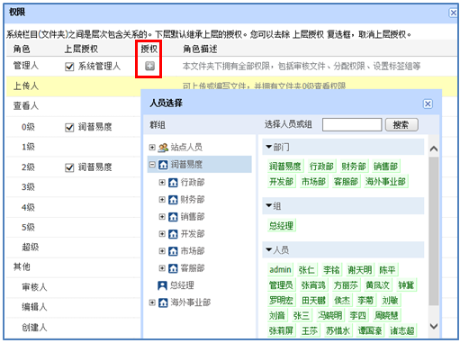
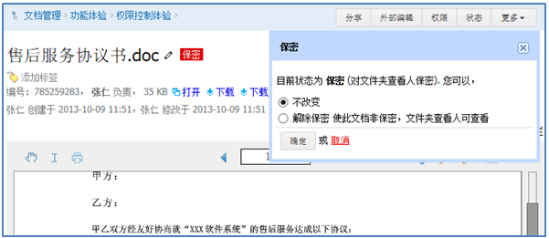
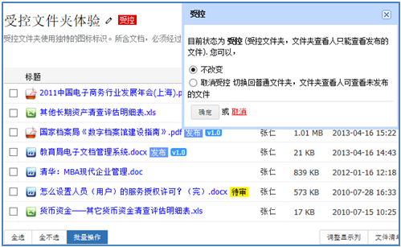
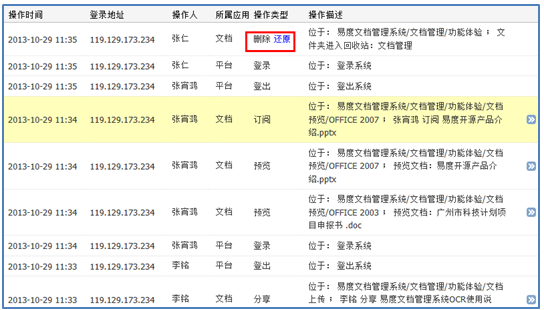
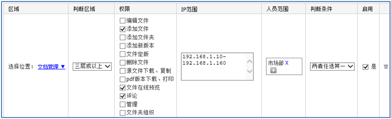
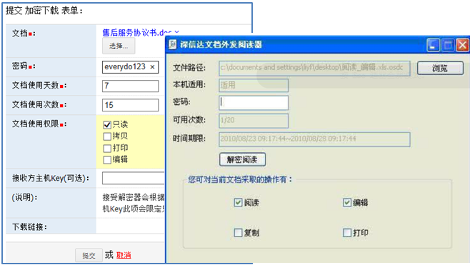

===========================
安全控制
===========================
.. sectnum::

随着公司企业的不断发展，日积月累产生大量有价值文档，而凝聚了知识财富和智力资源的文档是最基本也是最重要的信息载体。同时，也是企业最宝贵的知识财富。
普通形式的电脑锁定及共享很难让文档得到行之有效的保护，通过邮件、U盘拷贝等方式将文件外泄情况时有发生。怎样才能避免因为机密文档外泄而造成的重大经济损失呢？

基于这些，易度提供了一整套的文档安全管控体系，为企业知识管理保驾护航。

文件夹和文件授权
----------------------------------------
系统可以为人员、部门或者组，针对单个对文件或文件夹，分配不同的角色权限，控制文档的预览、添加、编辑、移动、复制、下载等权限。

权限分配比较简单，特点如下：

- 权限继承

  为文件夹授权，子文件夹和文件也自动继承这个授权，无需逐一分配。当然子文件夹下可以取消上级文件夹授予的权限，包括取消系统管理人的管理权限。

- 成组授权

  只需在权限操作中按群组、部门或岗位进行权限设置，这样新人到公司，只需指定其所在部门或群组即可。

- 委托管理

  一旦授予文件夹管理员权限，就拥有文件夹下的所有管理权限，无需系统管理员参与。

- 6级精细查看权限

  为了更好的防止泄密，系统分为6级查看权限。其中2级查看权限只能在线查看，确保用户能够查看到最新文档，同时又避免因为下载不当导致文档泄密。

- 单文件授权

  不仅仅可以针对文件夹授权，更可针对单个文件授权

保密文件
------------------------------
文件夹中可能个别文件特别保密，不希望文件夹查看人查看。这样，可以设置文件处在保密状态。想再查看该保密文件，需要单独为其进行授权。

未发布的文件
-------------------------
文档在编写阶段，由于还未正式成稿，应该禁止文件夹查看人查看。可将该类文档存放的文件夹设置为受控状态。受控文件夹下的未发布文档，和保密文档类似，只有针对文档授权的人员才能看到。这些受控文档一旦发布，文件夹查看人自动能看到。

安全检查：操作历史记录
----------------------------
系统提供完整的操作历史记录，记录每个员工对系统的任何操作。这样，出现问题时可追溯问题源头。另外，操作历史中，可对误删除的文档进行还原。

一般人员仅可查看自己的操作历史，系统管理员可查看系统所有用户的操作记录。

系统安全策略
-------------------------------
系统管理员可利用IP安全策略灵活控制用户对系统的访问，从更高层面管控系统的安全。

典型用途：

- 公司外访问禁止下载 
- 屏蔽系统外发功能 
- 技术资料，仅仅在技术部门的网段可以访问 

文档加密下载
-----------------------------
文档加密下载主要是对离线文件防泄密，用户需要提交下载申请流程。

这样可以：防U盘拷贝、防光盘刻录、防打印、防止网络传递、防止截屏拷贝。让文档共享同时更加的安全，避免机密文件的扩散流失。

终端文档防泄密
-------------------------

企业通常使用断网、禁用U盘这类方式来控制个人电脑的防泄密，但这样同时也影响了日常办公和学习，并且难以控制外部电脑的网络接入

一旦服务器端设置防泄密安全防护模式，普通的web浏览器无法访问，必须通过防泄密浏览器才能访问. 这时从服务器下载的文件可以得到全面的保护: 防U盘拷贝、防光盘刻录、防打印、防止网络传递、防止截屏拷贝

服务端防泄密
------------------------------
文档存放在服务器端，服务器成为防泄密的高危点。

易度提供专业的服务器端防泄密软件，提供服务器端防泄密控制。

.. image:: ../solutions/img/leakprotect-img006.png
   :alt: 服务端防泄密

具体功能：

- 禁止用户访问关键数据区
- 屏蔽U盘拷贝
- 双密码2层保护: IT人员拥有服务器进入密码, 业务领导应用数据访问密码

