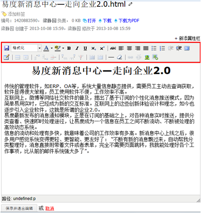
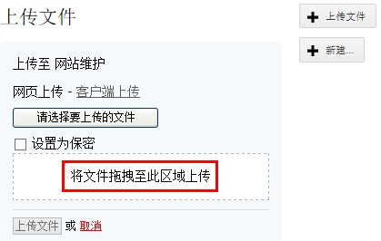

==============================
　文件上传和编写
==============================

上传文件和编写文件，是文档管理系统最基本的操作。

易度建立了以服务器为中心的文档编辑协作环境，根本上避免文档管理的分散性。这种新的工作模式，取代以个人电脑为中心的文档管理习惯。系统支持文档模板、批量拖放上传、在线文档编辑、MarkDown/reST格式文档支持等。

新建文件和文档模版
===========================
易度系统直接可以在服务器上新建文件。这样避免了先本机新建，然后上传文件的复杂操作。

新建文件可以选择常用的文档格式创建。除此之外，系统提供了“文档模板”功能：可以选择预先设置的文档模板作为新文档初始内容。
按照文模板规范编写文档，有助于企业文档的规范化管理。

在线编写文件
===========================
html、txt、md（MarkDown格式）、rst(reStructuredText)等格式文档直接在浏览器上就可编写和预览：

外部编辑 
===========================
对于复杂格式的文档（如office、dwg图纸等），系统提供文档外部编辑功能。安装“外部编辑器”插件后，可直接使用桌面编辑器(如word、Excel等)编辑服务器上的文档。
一旦保存，文件会自动上传到服务器，简化了传统的下载、编辑、上传过程。

.. image:: img/upload03.png
   :width: 480

编辑冲突检查
===========================
无论是在线编写，还是外部编辑，系统都能够自动管理文档的修改锁，避免多人同时修改同一文件发生冲突。自动解锁管理，让普通编写人员无需理解专业“checkin/checkout”词汇，便可方便的进行编辑操作。

批量选择文件上传
===========================
对于已经存在的文件，批量上传到系统：

文件拖放上传
===========================
使用现代浏览器(chrome/FF/IE9)，可直接拖放文件到网页上传。如果使用chrome浏览器，可以直接拖放整个文件夹。

上传结果处理
===========================
系统能够自动判断出同一个文件夹下的重名文件，用户可根据提示进行改名、保存新版本或删除操作。

文件上传后，可快速分享给其他用户，分享同时可以对文件进行授权。

