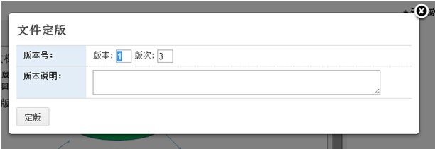

===============================
版本管理
===============================
.. sectnum::

任何文档的编写都不可能一蹴而就，而是需要反复修改，甚至多人修改。特别是法律文书、制度、合同这些要求比较高的文件，对文档的版本管理要求更高。

文档历史版本如何保存，如何了解版本差异，如何适时回滚到旧版本，传播过程中如何避免新旧版本使用混乱，这些都是文档版本管理需要解决的常见问题。

易度文档管理，可自动保存文档所有的历史版本，版本之间可以比较差异，并可对任意版本在线查看、下载、评论，或者回滚操作，操作简单但功能强大。

查看文档版本历史
====================================

系统中，每个文档右侧，可直观的查看文档的版本历史：

文件修改自动保存历史版本
====================================
在易度中打开一个文档，默认看到的是最新版本，这也就是工作版。可以对工作版本进行编辑修改等操作。

文档内容一旦修改、或者上传新版本，旧的文档会自动保存为历史版本。这样文档的所有修改历史，都可以在历史版本中找到。历史版本可以在线查看，但不能被修改，默认情况不能被搜索到。

文件定版
====================================
每次修改都会保存历史版本，这样会导致大量的历史版本。对于重要的版本，我们需要清晰标识；对于不重要的版本，则需要清理，以减少空间占用和避免干扰版本查找使用。

可以对工作版本执行定版操作，给予该版本明确的版本版次和说明信息，这个版本会长期保留。

定版版本和临时版本
====================================
临时版本是没有定版的历史版本。每个文件最多保留最近15个次临时版本，多余15个会自动清除，管理员可以根据需要在系统"文档-设置"中调整临时版本的保存数量；临时版本也不会记录文件关联关系。

定版的历史版本，可以建快捷方式、附件、关联；可以添加关注、进行收藏、查看或进行评论、分享、外发、发起流程。

.. image:: pic/banbenqubie.jpg
   :alt: 定版版本和临时版本

版本比较
====================================
所有可在线预览的文档，均支持在线版本差异比较，用户可任选两个版本进行比较，比较结果会自动显示。

版本差异比较，对法务工作者，可方便比较各种法律文书的差异，尤其有用。

 
版本删除
=======================

无需保留的历史版本，可以删除。被删除的版本进入回收站，可以事后从系统操作历史中恢复，避免误操作丢失数据。

版本回滚
======================

如果发现需要使用之前的一个历史版本，点击该版本的回滚菜单项，将该版本保存为文档的最新工作版本。

文档发布和分支版本
====================================
文档包括草稿、待审、发布三种状态。可以改变文档的状态：

文档一旦发布，表示文档从编写阶段进入正式使用阶段：

- 任何人，禁止对工作版本进行修改、删除
- 如果工作版本没有定版，会自动定版该文档
- 如果需要更新，可以上传新分支版本，上传的分支版本是独立的新文件，只是记录了分支关系。

分支版本一旦发布，自动合并到原始发布的文件上。

技巧：产品的版本
====================================
通常一个产品由多个文档的特定版本组成。每个产品可创建一个文件夹，里面通过快捷方式，指向文档特定版本即可。

