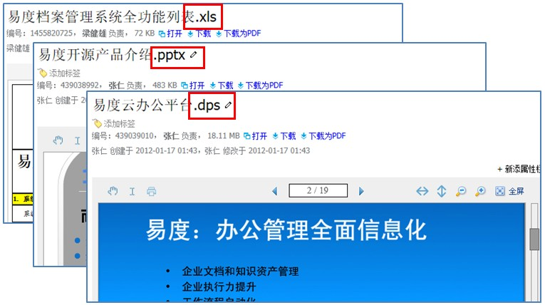
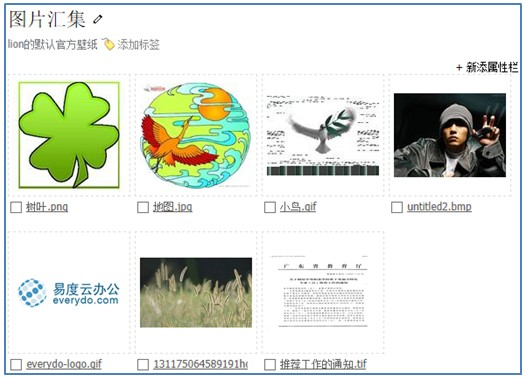
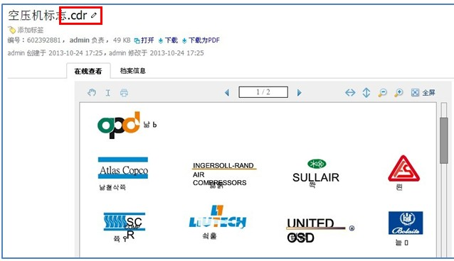
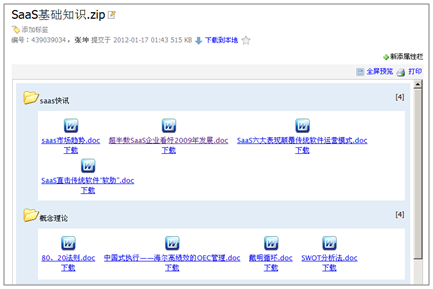
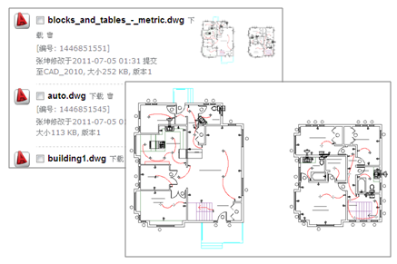
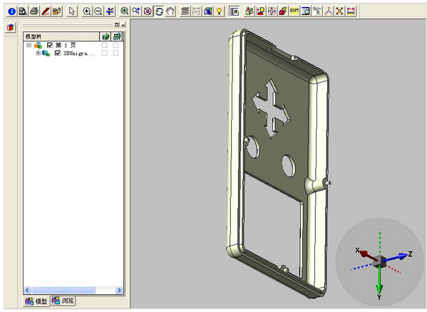
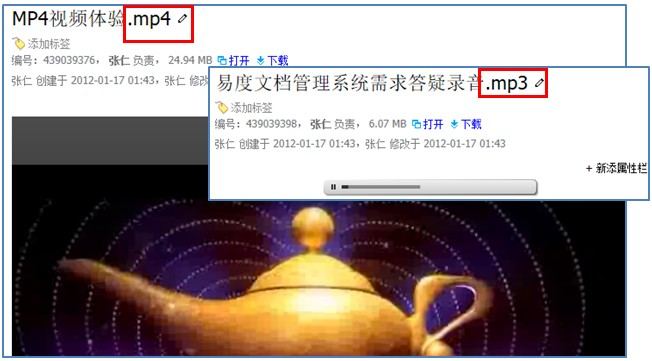
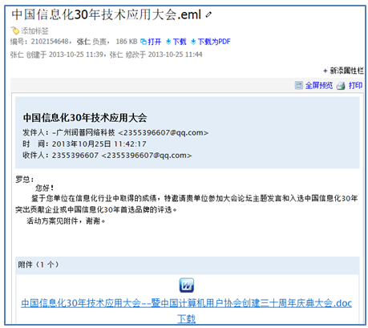

============================
文档在线查看
============================

互联网的各种视频分享、图片分享、文档分享网站，提供了良好的内容阅读体验，用户已经形成固有使用习惯。企业办公也有类似的需求。

易度提供了文档云端查看功能，支持办公文件、图片、设计文件、图纸、压缩包、归档邮件网页、多媒体等各种文件在线查看，支持桌面、手机、平板多种浏览器环境，速度甚至比本地打开更快、体验更友好。

常见办公文档查看
====================================
系统支持常见办公文档格式文件内容的直接在线查看，无须安装任何插件。

由于使用了边看边下载的文档流式播放技术(类似视频播放)，不论文档多大，都能够瞬间打开阅读。

另外，所有可在线预览的文档，都能够自动生成PDF形式。这样无需另行转换、保存和更新，管理更轻松。

系统支持常见办公文档：

- Office2003/2007: doc/docx、xls/xlsx、pptt/pptx、pps、pot
- viso格式：vsd/vss/vst
- WPS2009: wps、et、dps
- openoffice: .odt,ods,odp,ott,ots,otp
- PDF: pdf
- 文本：.txt、.html
- 格式化文本： MarkDown(.md), reStructuredText(.rst)
- 代码：.java,.c,.cpp,.jsp,.asp,.py,.as,.h

图片缩略预览
====================================
用户上传的图片，可以自动生成缩略图形式，避免图片过大导致下载速度缓慢，影响查看效果。

系统支持各种图片格式：bmp、jpg、png、gif、tiff、pcx等。

矢量图在线预览
=================================
对于设计类型的公司，大量存在的是矢量图格式，系统提供快速预览的功能，大大方便了这些设计稿件的查找。

格式包括：CoralDraw(.cdr)、PhotoShop(.psd)、AI(.ai)、svg/wmf

压缩包文件查看
====================================
系统支持压缩包文件的直接在线查看。无须安装插件即可查看压缩包内的文件清单，同时支持下载压缩包内文档。

支持rar、zip、tar、tgz等

2D/3D图纸在线预览
====================================
系统可自动将AutoCAD图纸生成图片形式，用户可以快速在线预览查看。同时采用插件架构，可方便扩展支持其他的格式。

安装 eDrawing 或者 autovue，可实现2D/3D图纸的在线查看:

具体支持的格式包括： 

- 电路板：Protel/PCB
- 2D图纸：dwg、dfx
- 3D格式: Pro/ENGINEER: PRT 、CALCOMP: PLT、 Protel: PCB、 IIIustrator: AI、Unigraphics: PRT catia/cati5:
  CATPart、Inventor: IAM、SolidEdge: ASM, ASM、SolidWorks: SLDASM, SLDPRT EDA: PCB,SCH, STP等

流媒体在线播放
====================================
系统支持音频和视频等各式的流媒体文件在线播放，无需安装任何插件。

具体支持的格式包括：

- 音频: mp3、wma、rm、wav、mid
- 视频: avi、rmvb、mov、mp4、swf、flv、mpg、ram

存档邮件/页面查看
====================================
存档邮件(.eml)和存档页面(.mht)是用来保存邮件和页面内容的2种重要格式. 易度可以直接在线预览这些内容，包括邮件附件和页面内嵌图片。

