=======================
文档的流程控制
=======================

.. sectnum::

易度文档管控系统遵循国际文档质量体系标准，对文档的编制、修改、审核、分发、收回、借阅、废止、回顾等流程进行全生命周期的电子化管理。

易度文档管控系统主要侧重于对文档文件的全面控制和流程化管理，提供一组文档相关流程。通过流程全面控制文档的正确性、安全性，实现对企业文档的规范化管理。

文档和流程的关联
=============================
系统提供一组文档相关流程，用户对当前文档每发起一个流程，都会有一个相应流程单自动和文档相关联，方便查看对相关文档做了哪些操作：编审、归档、借阅、分发、收回、废止等。

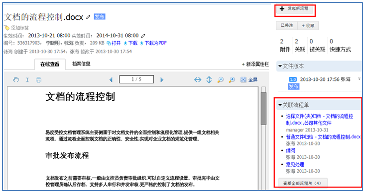

文档关联流程单的查看：

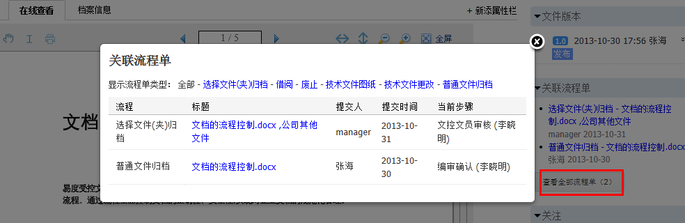

管理员可查看所有的文档相关流程，而普通用户只能看到需要自己审核的。

流程催单
====================
如果用户想尽快完成当前任务，可以给任务执行人发起催单提醒。任务执行人会在个人消息中心收到相应消息提示。

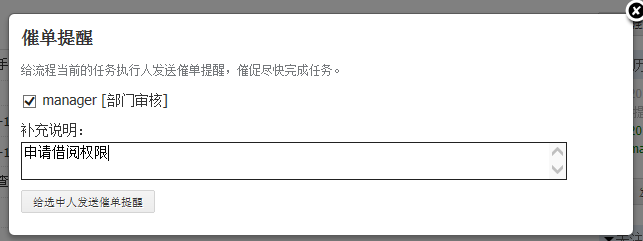

流程历史记录
===================
流程历史清晰记录每一步流程，包括申请人，提交时间等信息。用户可查看自己提交流程进度情况，出问题可追溯，保证流程的顺利进行。

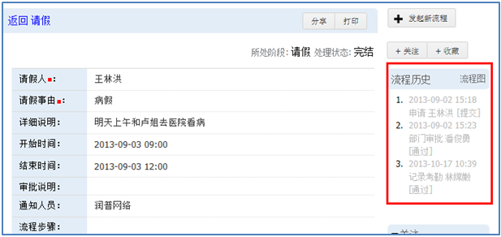

待办事项
==================
在个人工作台中的“待办事项”，对任务做了详细分组，用户可以清晰查看到自己每天需要处理的任务。这样确保了任务的不遗漏，工作效率更高。

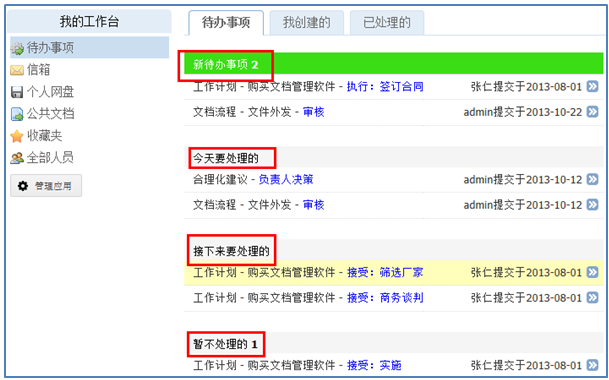

常用文档流程介绍
========================

审批发布流程
---------------------
文档发布之前需要审核，一般由文控员负责审批组织，可以自定义流程设置。审批完毕由文控管理员确认后存档。支持多人串行和并发审核，更严格的控制了文档的发布。

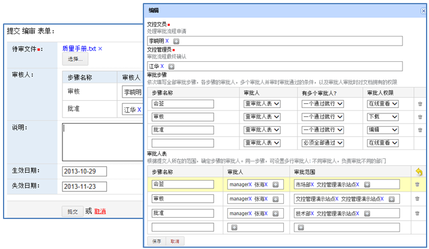

借阅流程
-----------------
易度受控文档管理系统中有严格的权限控制，当没有权限查看或下载文档时，可通过借阅流程临时申请相应的权限。

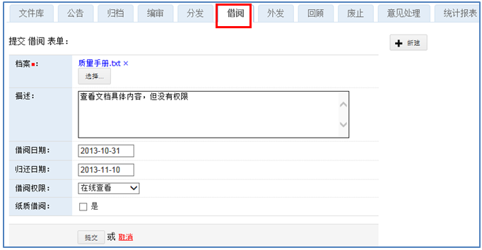

意见审批流程
----------------------
文档查看人可对文档的内容提出新的修改意见，由文档负责人决定采纳或者拒绝。

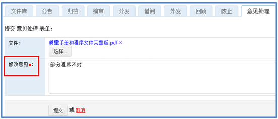

权限申请流程
----------------------
申请对某个文件或者文件夹的特定权限，由文件或者文件夹的管理人负责授权

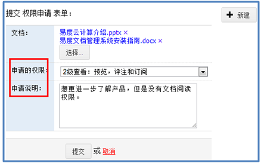

文档分发流程
-----------------
系统以电子分发形式，将文档分发给指定人员，分发同时可设定查看权限。相关人员需要对文件进行签收，确保文件已经发放到位。

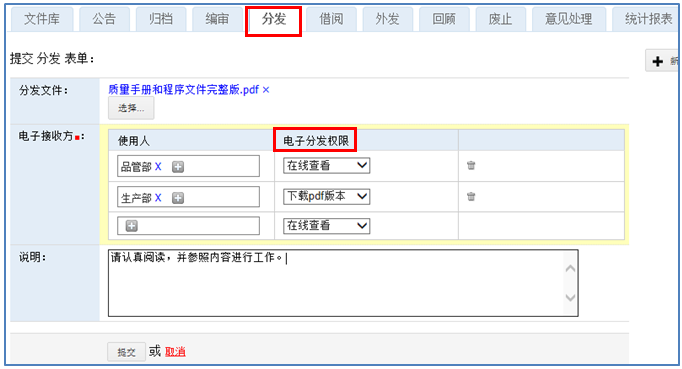

文档收回流程
------------------
系统采用电子收回形式，告知相关负责人文档已经不再使用，收回查看权限，相关人员需要签收知会。

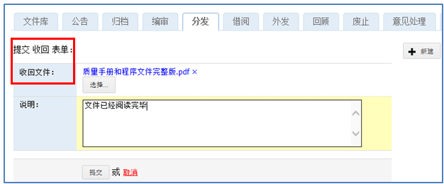

文档回顾流程
------------------------
文档一旦到期，需要重新进行评定是否需要进行延长使用期限。否则就要进行作废处理。

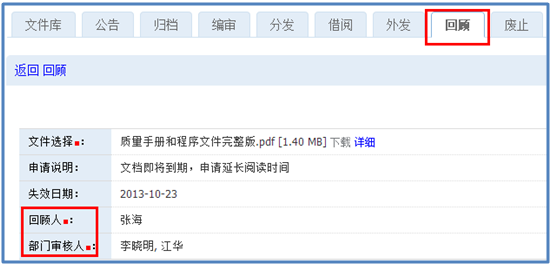

文档作废流程
-------------------------
过时文档或手册可通过废止流程将文档作废，放入专门的存储区域，并去除查看权限。

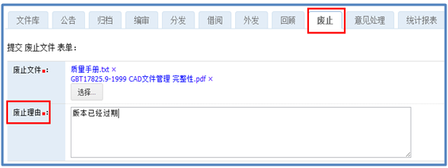

