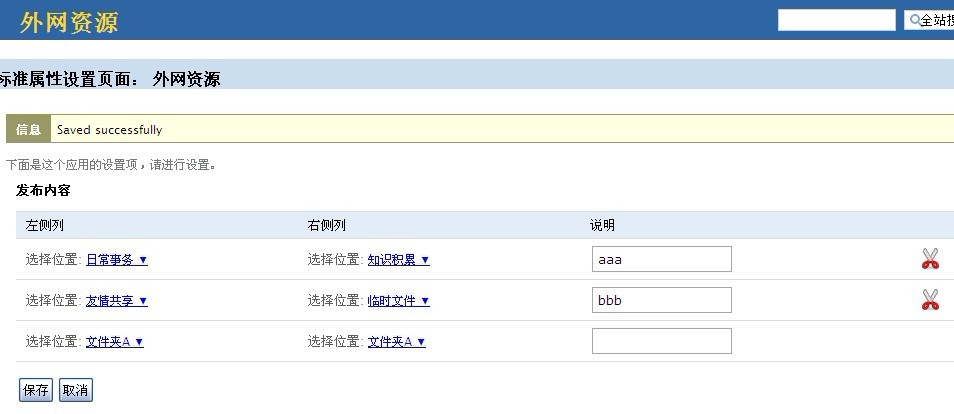
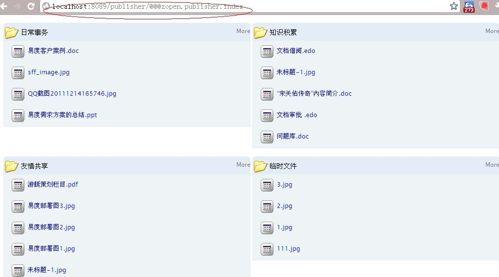
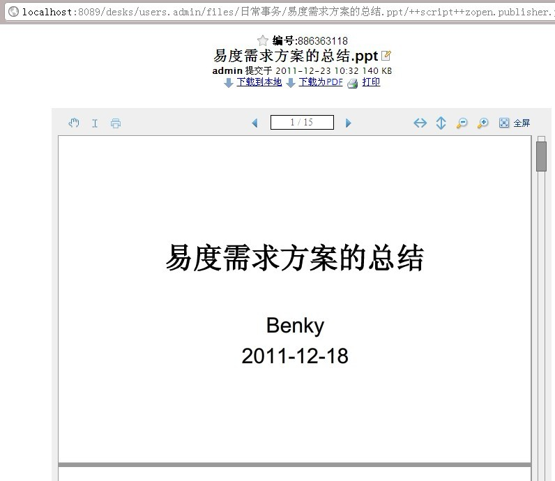

=====================
易度文件夹外围发布
=====================

易度文件夹外网发布可将易度文档管理文件库中指定的若干个文件夹，利用内嵌帧IFrame集成到外网站点的某个页面中，实现外网匿名用户可动态的看到文档管理中相关文件夹的内容。

装好应用后，可从应用设置中设置外网使用的文件夹，如下图：

|

这样就设置好了，这个应用的链接便是可以不用登录的情况看下如下界面，这个链接可以用Iframe集成到外网站点，或直接做为外网资源

|

以下是不用登录的情况直接访问某个页面，如下图，可以直接浏览和下载这份文档：

