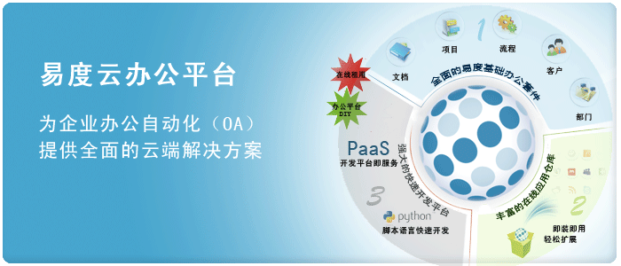
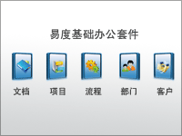
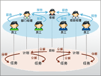
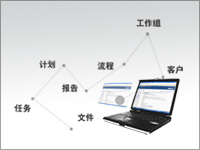

易度云办公平台
==================

无可改变的是，互联网正在改变我们生活的各个环节。
在这个互联网的新时代，企业该如何办公？

还在无穷无尽的邮件里挖掘有效信息吗，还在为执行力的问题困扰吗，
还在为信息的共享和安全烦忧吗，还在为流程的低效迟钝而无奈吗?

易度云办公平台，利用最新的互联网技术，针对国内中小企业的市场的需求，为企业办公提供全面的云端解决方案。

办公平台 DIY
=========================

企业业务的多样性，决定了需求的多样性，这要求办公软件具备个性化定制的能力。易度办公平台提出办公平台DIY的概念，整个平台由多种来源的应用按需选配组装而成，真正实现“贴身定制”的企业办公平台。

易度成熟的定制办公方案，包括 律师办公系统、 物业管理系统、学校办公管理系统、企业信息门户、 企业文档管理、 企业工作管理
、ISO文控系统 等。

具体来说，易度办公平台的应用来源包括基础办公套件、在线应用仓库和自行定制三部分。

成熟的易度基础办公套件
=======================

易度工作平台包括一组精心设计的 `基础办公套件 <edoapps.rst>`__ ， 
包括消息、任务、文档、项目、流程、个人工作台等模块，满足企业日常的办公需求。

- `易度文档 <http://docs.everydo.com>`__: 文档的存储、查找、权限、分发，管理好企业的知识资产

- `易度项目 <http://pm.everydo.com>`__: 项目团队多方沟通、异地协作，把控项目进度，高效做好每一个项目

- `易度流程 <flow.rst>`__: 建立电子化的工作流程，实现企业流程自动化，规范管理，提升效率

   
丰富的易度在线应用仓库
==============================

易度云办公平台，提供了一个在线应用仓库，有大量的扩展应用可供选用，
几乎可以满足任意的企业办公需求。

易度在线应用仓库已经包括一组非常创新的产品，从会议室预订、用车管理等企业日常管理，到农历、天气等一些小工具，以及包括一些在行业领域特殊需要的应用，比如ISO文控流程等。

易度的在线应用仓库，未来发展将参考iphone的应用程序商店，将引入应用交易机制，鼓励更多的人在易度上开发有价值的创新应用。

在线开发: PaaS
=======================
易度提供了直接在浏览器上进行快速扩展开发，
构建和部署个性化应用的能力，使得易度不能限于传统OA的功能，有极大的可扩展性。

易度的扩展开发，是站在易度平台强大功能的基础之上，因此应用开发效率非常高，可快速完成应用的开发。

和Google App Engine一样，易度扩展开发采用Python作为开发语言。
支持浏览器在线开发和离线开发2种开发模式。

`详细请访问 <http://developer.everydo.com/>`__

工作管理: 计划-任务-报告
====================================
易度工作管理，是易度核心的企业管理理念。

易度工作管理，基于PDCA戴明环管理思想，结合企业常用的部门和项目矩阵管理制度，建立以计划、任务、报告为核心工作管理体系，层层分解、层层反馈，将工作落实落实到个人日常工作。

易度工作管理，旨在提升企业执行力，增强企业管控力，最终达成企业的战略和目标。

融通企业内外
===========================
分工的细化，是市场竞争的结果。另外一方面，企业之间的相互协作比历史任何时候都来得密切。

易度能够加入公司外部人员进入公司内部协作，跨越公司鸿沟，建立无障碍的企业协作平台。

不论是多方项目协作，还是代理商沟通协作、客户服务，易度都能够提供支持。

   
移动办公
===========================
特别最新智能手机的发展，手机功能日益强大和易用。
手机已经成为人人都离不开的新的平台。手机在很大程度上正在取代电脑的很多工作。

易度重视手机的可访问性，可直接通过手机浏览器来访问易度，让您在出差在外，也能通过易度获得所需信息。

另外，易度也可通过短信发送通知消息，加快企业信息的传递。

   
社会化办公
===============
Facebook、Twitter这些新一代SNS网站的风行，给组织内个人协作交互体验，建立了新的标杆。

易度个人工作台，提供了类Facebook的协作交互界面(个人工作台)。一经Follow，各种应用的各种任务、消息、通知、流程，会自动汇集到个人，彻底解决企业的沟通协作问题，最大限度的简化个人的工作界面。

易度个人工作台，提供了个人一个简洁、高效的工作中心。

互联网在线租用
=================================

整个易度云办公平台，包括扩展开发的功能，均在互联网上以服务的方式提供，企业只需注册订购后按月支付使用费用。

传统途径下，企业购买软件，除了软件自身，其实整体的成本非常大。
比如：硬件采购、网络费用、软件升级、需要招聘专人进行软件维护等。而且存在软件诸多风险，比如可能实际用不起来、硬盘崩溃、病毒攻击等。

使用易度新的云端服务模式，企业无需支付高额的软件、硬件成本，无需专业的IT维护人员，
以较低的风险，快速实现企业办公的信息化。

易度的云办公平台，数据存放在电信和联通4星级IDC机房的多台服务器上的冗余磁盘阵列上，定时多机备份，由快速的故障恢复机制。企业无需增加任何人力成本，便可享受专业级的软件服务。

